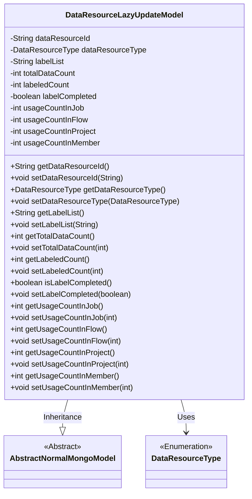

# Basic Information

|      |      |
|------|------|
| Name | DataResourceLazyUpdateModel |
| Language | .java |
| Code Path | WeFe/common/java/common-data-mongodb/src/main/java/com/welab/wefe/common/data/mongodb/entity/union/DataResourceLazyUpdateModel.java |
| Package Name | com.welab.wefe.common.data.mongodb.entity.union |
| Dependencies | ['com.welab.wefe.common.data.mongodb.constant.MongodbTable', 'com.welab.wefe.common.data.mongodb.entity.base.AbstractNormalMongoModel', 'com.welab.wefe.common.wefe.enums.DataResourceType', 'org.springframework.data.mongodb.core.mapping.Document'] |
| Brief Description | The DataResourceLazyUpdateModel class is used to record lazy update information of data resources, including resource ID, type, tag list, total data volume, marked quantity, marking completion status, and usage counts in jobs, workflows, projects, and members. |

# Description

The DataResourceLazyUpdateModel is a MongoDB collection model that inherits from AbstractNormalMongoModel. It includes attributes such as data resource ID, type, label list, total data volume, labeled quantity, labeling completion status, and records the usage counts in tasks, processes, projects, and members. It provides getter and setter methods for all attributes.

# Class Summary

| Name   | Type  | Description |
|-------|------|-------------|
| DataResourceLazyUpdateModel | class | MongoDB Data Resource Lazy Update Model Class, including resource ID, type, tag list, total data volume, marked volume, marking completion status, and various usage counts. |

## Class DataResourceLazyUpdateModel

|      |      |
|------|------|
| Access Modifier | @Document(collection = MongodbTable.Union.DATA_RESOURCE_LAZY_UPDATE_MODEL);public |
| Type | class |
| Name | DataResourceLazyUpdateModel |
| Description | MongoDB Data Resource Lazy Update Model Class, including resource ID, type, tag list, total data volume, marked volume, marking completion status, and various usage counts. |

### UML Class Diagram

This class diagram illustrates the implementation details of DataResourceLazyUpdateModel as a MongoDB data model. It inherits from the AbstractNormalMongoModel abstract class, containing core fields such as data resource ID, type, label list, and various counting states, with complete access control provided through getters/setters. The enumeration type DataResourceType is used to identify resource types, and the overall design complies with encapsulation specifications for the data persistence layer.

### Internal Method Call Graph

```mermaid
graph TD
    A["Class DataResourceLazyUpdateModel"]
    B["Inheritance: AbstractNormalMongoModel"]
    C["Annotation: @Document(collection=MongodbTable.Union.DATA_RESOURCE_LAZY_UPDATE_MODEL)"]
    D["Field: String dataResourceId"]
    E["Field: DataResourceType dataResourceType"]
    F["Field: String labelList"]
    G["Field: int totalDataCount"]
    H["Field: int labeledCount"]
    I["Field: boolean labelCompleted"]
    J["Field: int usageCountInJob"]
    K["Field: int usageCountInFlow"]
    L["Field: int usageCountInProject"]
    M["Field: int usageCountInMember"]
    N["Method: get/setDataResourceId"]
    O["Method: get/setDataResourceType"]
    P["Method: get/setLabelList"]
    Q["Method: get/setTotalDataCount"]
    R["Method: get/setLabeledCount"]
    S["Method: is/setLabelCompleted"]
    T["Method: get/setUsageCountInJob"]
    U["Method: get/setUsageCountInFlow"]
    V["Method: get/setUsageCountInProject"]
    W["Method: get/setUsageCountInMember"]

    A --> B
    A --> C
    A --> D
    A --> E
    A --> F
    A --> G
    A --> H
    A --> I
    A --> J
    A --> K
    A --> L
    A --> M
    A --> N
    A --> O
    A --> P
    A --> Q
    A --> R
    A --> S
    A --> T
    A --> U
    A --> V
    A --> W
```

This flowchart illustrates the complete structure of the DataResourceLazyUpdateModel class, including inheritance relationships, class annotations, 9 private fields, and corresponding 16 getter/setter methods. This MongoDB document model tracks lazy update states of data resources, containing resource ID, type, label list, total data volume, labeled quantity, completion status, and usage counts in jobs/flows/projects/members. All fields follow standard JavaBean specifications for database operations and state tracking.

### Field List

| Name  | Type  | Description |
|-------|-------|------|
| usageCountInFlow | int | Private integer variable that records the number of uses in the process. |
| labelCompleted | boolean | The boolean variable labelCompleted is used to mark whether the labeling is completed. |
| usageCountInJob | int | Private integer variable, recording the number of uses within the job. |
| usageCountInProject | int | Project Internal Usage Counter |
| labelList | String | The private string variable labelList is used to store the list of labels. |
| dataResourceType | DataResourceType | The variable for private data resource type is `dataResourceType`. |
| dataResourceId | String | The private string-type variable `dataResourceId` is used to identify the data resource. |
| usageCountInMember | int | The member variable `usageCountInMember` is used to record the number of uses, with a private integer type. |
| totalDataCount | int | Private integer variable used to store the total count of data. |
| labeledCount | int | The private integer variable labeledCount is used to record the number of labels. |

### Method List

| Name  | Type  | Description |
|-------|-------|------|
| getDataResourceId | String | Methods to obtain the data resource ID, returning the data resource ID as a string type. |
| setDataResourceId | void | The method for setting the data resource ID assigns the input parameter to the class member variable `dataResourceId`. |
| getUsageCountInJob | int | Get the number of uses in the assignment. |
| isLabelCompleted | boolean | Check if the label is completed boolean method, returns the labelCompleted status. |
| setUsageCountInJob | void | Set the usage count variable value in the assignment. |
| getLabeledCount | int | Methods to obtain the labeled count, returns an integer value labeledCount. |
| setUsageCountInFlow | void | Set the public method for the number of uses within the flow, with the parameter being an integer usageCountInFlow. |
| setUsageCountInProject | void | The method to set the usage count within the project, with the parameter being usageCountInProject. |
| setTotalDataCount | void | Set the total data counting method and assign the input parameter to the class variable totalDataCount. |
| getUsageCountInProject | int | Get the integer value of the usage count within the project. |
| getLabelList | String | This is a Java method that returns a string variable named labelList. |
| setLabelCompleted | void | Method for setting label completion status, with a boolean parameter used to update the internal variable labelCompleted. |
| getDataResourceType | DataResourceType | This method returns a data resource type object, dataResourceType. |
| setDataResourceType | void | The method for setting the data resource type assigns the input parameters to the member variables of the class. |
| getTotalDataCount | int | The method returns the total data count. |
| setUsageCountInMember | void | This is a Java method used to set the value of the member variable `usageCountInMember`. The method accepts an integer parameter and assigns it to the `usageCountInMember` property of the current object. |
| getUsageCountInMember | int | The public method to retrieve the member's usage count, which returns the integer value usageCountInMember. |
| setLabelList | void | Defines a public method `setLabelList` for setting the value of the `labelList` property. The parameter is a string `labelList`. |
| getUsageCountInFlow | int | Get the usage count in the process. |
| setLabeledCount | void | Method to set the labeled count, which assigns the input parameter to the member variable labeledCount. |

