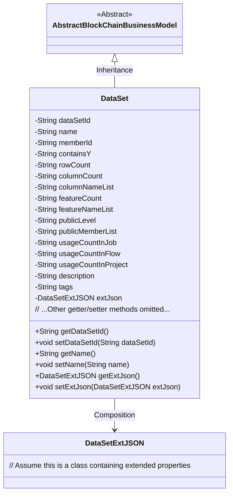

# Basic Information

|      |      |
|------|------|
| Name | DataSet |
| Language | .java |
| Code Path | WeFe/common/java/common-data-mongodb/src/main/java/com/welab/wefe/common/data/mongodb/entity/union/DataSet.java |
| Package Name | com.welab.wefe.common.data.mongodb.entity.union |
| Dependencies | ['com.welab.wefe.common.data.mongodb.constant.MongodbTable', 'com.welab.wefe.common.data.mongodb.entity.base.AbstractBlockChainBusinessModel', 'com.welab.wefe.common.data.mongodb.entity.union.ext.DataSetExtJSON', 'org.springframework.data.mongodb.core.mapping.Document'] |
| Brief Description | Dataset class, containing attributes such as ID, name, member ID, row and column count, features, public level, usage statistics, description, tags, and extended JSON fields. |

# Description

The DataSet class is a MongoDB document model that inherits from AbstractBlockChainBusinessModel, corresponding to the Union.DATASET collection. This class contains core attributes of a dataset: unique identifier dataSetId, name name, owning member memberId, and whether it contains Y values containsY. Structural information includes row count rowCount, column count columnCount, column name list columnNameList, feature count featureCount, and feature name list featureNameList. Public attributes consist of public level publicLevel and public member list publicMemberList. Usage statistics include reference counts for tasks usageCountInJob, workflows usageCountInFlow, and projects usageCountInProject. Auxiliary information comprises description description, tags tags, and an extended JSON object extJson. All fields provide standard getter/setter methods.

# Class Summary

| Name   | Type  | Description |
|-------|------|-------------|
| DataSet | class | Dataset class, containing attributes such as ID, name, member ID, row and column count, features, public level, usage statistics, description, and tags, with extended JSON fields. |

## Class DataSet

|      |      |
|------|------|
| Access Modifier | @Document(collection = MongodbTable.Union.DATASET);public |
| Type | class |
| Name | DataSet |
| Description | Dataset class, containing attributes such as ID, name, member ID, row and column count, features, public level, usage statistics, description, and tags, with extended JSON fields. |

### UML Class Diagram

Class Diagram Description:  
The DataSet class inherits from the AbstractBlockChainBusinessModel abstract class, representing a dataset entity in a blockchain business model. It contains 15 private String-type fields that record metadata such as dataset ID, name, member ID, whether it contains Y values, etc., along with a DataSetExtJSON-type extended property object. Public getter and setter methods provide access and modification capabilities for these attributes. The class diagram clearly illustrates the inheritance and composition relationships, reflecting the core attributes and associated objects of the dataset entity.

### Internal Method Call Graph

```mermaid
graph TD
    A["Class DataSet"]
    B["Inheritance: AbstractBlockChainBusinessModel"]
    C["Annotation: @Document(collection = MongodbTable.Union.DATASET)"]
    D["Property: String dataSetId"]
    E["Property: String name"]
    F["Property: String memberId"]
    G["Property: String containsY"]
    H["Property: String rowCount"]
    I["Property: String columnCount"]
    J["Property: String columnNameList"]
    K["Property: String featureCount"]
    L["Property: String featureNameList"]
    M["Property: String publicLevel"]
    N["Property: String publicMemberList"]
    O["Property: String usageCountInJob"]
    P["Property: String usageCountInFlow"]
    Q["Property: String usageCountInProject"]
    R["Property: String description"]
    S["Property: String tags"]
    T["Property: DataSetExtJSON extJson"]
    U["Getter/Setter Methods: All properties"]

    A --> B
    A --> C
    A --> D
    A --> E
    A --> F
    A --> G
    A --> H
    A --> I
    A --> J
    A --> K
    A --> L
    A --> M
    A --> N
    A --> O
    A --> P
    A --> Q
    A --> R
    A --> S
    A --> T
    A --> U
```

This code defines a DataSet class that inherits from AbstractBlockChainBusinessModel and is marked with the @Document annotation for MongoDB collection. The class contains 16 String-type properties and 1 DataSetExtJSON-type property, each with corresponding getter and setter methods. It primarily represents dataset-related metadata, including business attributes such as dataset ID, name, member ID, row/column statistics, feature information, public level, usage counts, etc.

### Field List

| Name  | Type  | Description |
|-------|-------|------|
| rowCount | String | The private string variable rowCount is used to record the number of rows. |
| memberId | String | Declare a private string variable memberId. |
| columnNameList | String | The private string variable columnNameList is used to store the list of column names. |
| usageCountInJob | String | Private string variable, recording the number of uses in the job. |
| tags | String | Private string variable tags, used to store tag information. |
| publicLevel | String | The private string variable publicLevel is used to store public level information. |
| containsY | String | The variable containsY, of type String, with private access. |
| name | String | Declare a private string variable named name. |
| usageCountInFlow | String | Private string variable, recording the number of uses in the process. |
| extJson = new DataSetExtJSON() | DataSetExtJSON | Define a private variable extJson, initialized as an instance of the DataSetExtJSON class. |
| featureNameList | String | Defined a private string variable featureNameList. |
| publicMemberList | String | private String variable publicMemberList |
| usageCountInProject | String | Usage count field in the project. |
| columnCount | String | The private string variable columnCount is used to store column count information. |
| dataSetId | String | Declare a private string variable dataSetId. |
| featureCount | String | The private string variable featureCount is used to store the number of features. |
| description | String | Private string type variable description. |

### Method List

| Name  | Type  | Description |
|-------|-------|------|
| getName | String | This is a Java method that returns the value of the member variable "name" of type String. |
| setFeatureNameList | void | Method for setting the feature name list, which assigns the input string to the class member variable featureNameList. |
| getContainsY | String | This is a Java method that returns the value of the member variable `containsY` of type String. |
| getUsageCountInProject | String | Get the usage count in the project. |
| setFeatureCount | void | Set the feature count method by assigning the input parameter to the class member variable `featureCount`. |
| setPublicMemberList | void | This is a Java method used to set the value of the publicMemberList variable. The method takes a string parameter and assigns it to the class's member variable. |
| setUsageCountInJob | void | Set the value for the number of uses in the assignment. |
| setMemberId | void | The method to set the member ID assigns the input parameter memberId to the memberId property of the current object. |
| getPublicLevel | String | Public method to obtain the publicLevel value. |
| setColumnCount | void | The method `setColumnCount` is used to set the value of the `columnCount` property, with the parameter being of string type. |
| getUsageCountInJob | String | Get the string method for counting usage within an assignment. |
| getRowCount | String | Methods to obtain the number of lines, returning the line count value as a string type. |
| setColumnNameList | void | Methods for setting the column name list, assigning the input parameters to the member variable columnNameList of the class. |
| getColumnCount | String | Methods to obtain the number of columns, returns the value of the columnCount variable. |
| setPublicLevel | void | This is a Java method used to set the value of the publicLevel property. The method accepts a string parameter and assigns it to the class's member variable publicLevel. |
| setContainsY | void | This is a Java method used to set the value of the class member variable containsY. The method accepts a string parameter and assigns it to the containsY property of the current object. |
| getMemberId | String | This is a Java method that returns the member ID string memberId. |
| getFeatureCount | String | Public method to obtain the featureCount value. |
| getDataSetId | String | Methods to obtain the dataset ID, returning a dataSetId string. |
| getColumnNameList | String | Methods to obtain the column name list, returning a string-type variable `columnNameList`. |
| setUsageCountInFlow | void | Method for setting string values of usage counts within a process. |
| getUsageCountInFlow | String | Get the usage count in the process. |
| setUsageCountInProject | void | Set a public method for the usage count within the project, with the parameter being of string type. |
| getDescription | String | Methods to obtain descriptive information, returning the description content as a string type. |
| setDescription | void | This is a Java method used to set the description information of an object. The method takes a string parameter, description, and assigns it to the description property of the object. |
| getTags | String | The method getTags returns the value of the member variable tags of type string. |
| setTags | void | Set the label string. |
| getExtJson | DataSetExtJSON | Methods for obtaining external JSON datasets, returning the extJson object. |
| setExtJson | void | The method `setExtJson` is used to set the `extJson` property value of type `DataSetExtJSON`. |
| getPublicMemberList | String | The method to obtain the public member list returns a string-type variable named publicMemberList. |
| setName | void | The method to set the object name assigns the parameter `name` to the `name` property of the object. |
| setRowCount | void | The method to set the number of rows assigns the parameter `rowCount` to the member variable of the same name in the class. |
| getFeatureNameList | String | Methods to obtain the feature name list, directly returning the member variable featureNameList. |
| setDataSetId | void | The method to set the dataset ID assigns the input parameter to the class's dataSetId member variable. |

