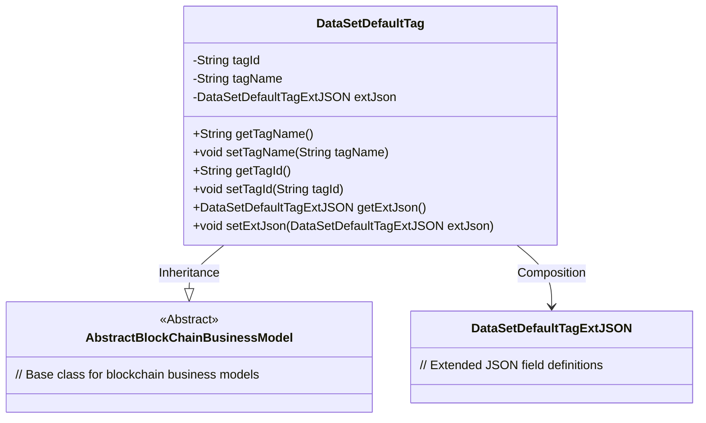

# Basic Information

|      |      |
|------|------|
| Name | DataSetDefaultTag |
| Language | .java |
| Code Path | WeFe/common/java/common-data-mongodb/src/main/java/com/welab/wefe/common/data/mongodb/entity/union/DataSetDefaultTag.java |
| Package Name | com.welab.wefe.common.data.mongodb.entity.union |
| Dependencies | ['com.welab.wefe.common.data.mongodb.constant.MongodbTable', 'com.welab.wefe.common.data.mongodb.entity.base.AbstractBlockChainBusinessModel', 'com.welab.wefe.common.data.mongodb.entity.union.ext.DataSetDefaultTagExtJSON', 'org.springframework.data.mongodb.core.mapping.Document', 'java.util.UUID'] |
| Brief Description | The DataSetDefaultTag class extends AbstractBlockChainBusinessModel and includes the attributes tagId, tagName, and extJson, providing corresponding getter and setter methods. The tagId is generated as a UUID by default with hyphens removed. |

# Description

The `DataSetDefaultTag` class is a MongoDB document model that inherits from `AbstractBlockChainBusinessModel`, corresponding to the collection `MongodbTable.Union.DATA_SET_DEFAULT_TAG`. This class includes three main attributes: `tagId` (an auto-generated UUID with hyphens removed), `tagName` (the tag name), and `extJson` (an object of type `DataSetDefaultTagExtJSON`). It provides getter and setter methods for these attributes to access and modify field values. This model is used to handle data related to default dataset tags in blockchain business.

# Class Summary

| Name   | Type  | Description |
|-------|------|-------------|
| DataSetDefaultTag | class | The DataSetDefaultTag class is used for storing default tags of MongoDB datasets, containing attributes such as tagId, tagName, and extJson, and providing getter and setter methods. It inherits from AbstractBlockChainBusinessModel. |

## Class DataSetDefaultTag

|      |      |
|------|------|
| Access Modifier | @Document(collection = MongodbTable.Union.DATA_SET_DEFAULT_TAG);public |
| Type | class |
| Name | DataSetDefaultTag |
| Description | The DataSetDefaultTag class is used for storing default tags of MongoDB datasets, containing attributes such as tagId, tagName, and extJson, and providing getter and setter methods. It inherits from AbstractBlockChainBusinessModel. |

### UML Class Diagram

This class diagram illustrates the structure of the DataSetDefaultTag class, which inherits from the AbstractBlockChainBusinessModel abstract class and contains three main private fields: tagId, tagName, and extJson. The extJson is an object of type DataSetDefaultTagExtJSON, associated with the main class through a composition relationship. The class provides standard getter/setter methods for field access and modification, reflecting a typical Java Bean design pattern. This model is used for MongoDB database storage, with annotations specifying the collection name, and the tagId field automatically generates and formats a UUID upon object creation.

### Internal Method Call Graph

```mermaid
graph TD
    A["Class DataSetDefaultTag"]
    B["Inheritance: AbstractBlockChainBusinessModel"]
    C["Annotation: @Document(collection = MongodbTable.Union.DATA_SET_DEFAULT_TAG)"]
    D["Property: String tagId = UUID-generated"]
    E["Property: String tagName"]
    F["Property: DataSetDefaultTagExtJSON extJson"]
    G["Method: getTagName()"]
    H["Method: setTagName(String)"]
    I["Method: getTagId()"]
    J["Method: setTagId(String)"]
    K["Method: getExtJson()"]
    L["Method: setExtJson(DataSetDefaultTagExtJSON)"]

    A --> B
    A --> C
    A --> D
    A --> E
    A --> F
    A --> G
    A --> H
    A --> I
    A --> J
    A --> K
    A --> L
```

This flowchart illustrates the structure of the DataSetDefaultTag class, which is a MongoDB document entity class inheriting from AbstractBlockChainBusinessModel. The class contains three core properties: an auto-generated tagId, a configurable tagName, and an extJson object, along with corresponding getter/setter methods. The annotation indicates that this class maps to the DATA_SET_DEFAULT_TAG collection in MongoDB, reflecting the integrated design of blockchain business models with database systems.

### Field List

| Name  | Type  | Description |
|-------|-------|------|
| tagId = UUID.randomUUID().toString().replaceAll("-", "") | String | Generate a random UUID as the label ID and remove the hyphens. |
| tagName | String | The private string variable tagName is used to store the tag name. |
| extJson = new DataSetDefaultTagExtJSON() | DataSetDefaultTagExtJSON | Define a private variable extJson, initialized as a new instance of the DataSetDefaultTagExtJSON class. |

### Method List

| Name  | Type  | Description |
|-------|-------|------|
| getExtJson | DataSetDefaultTagExtJSON | The method getExtJson returns an extJson object of type DataSetDefaultTagExtJSON. |
| setTagId | void | The method to set the tag ID assigns the parameter tagId to the tagId property of the current object. |
| setExtJson | void | The method `setExtJson` is used to set the `extJson` property, with the parameter being an object of type `DataSetDefaultTagExtJSON`. |
| setTagName | void | This is a Java method used to set the value of the tagName property of an object. The method takes a string parameter tagName and assigns it to the property of the same name in the current object. |
| getTagName | String | Methods to obtain the tag name, returning the tagName as a string type. |
| getTagId | String | Methods to obtain the tag ID, returns the tagId as a string type. |

