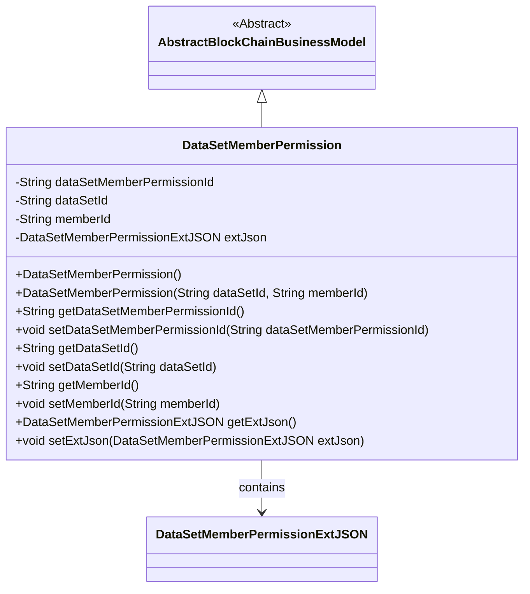

# Basic Information

|      |      |
|------|------|
| Name | DataSetMemberPermission |
| Language | .java |
| Code Path | WeFe/common/java/common-data-mongodb/src/main/java/com/welab/wefe/common/data/mongodb/entity/union/DataSetMemberPermission.java |
| Package Name | com.welab.wefe.common.data.mongodb.entity.union |
| Dependencies | ['com.welab.wefe.common.data.mongodb.constant.MongodbTable', 'com.welab.wefe.common.data.mongodb.entity.base.AbstractBlockChainBusinessModel', 'com.welab.wefe.common.data.mongodb.entity.union.ext.DataSetMemberPermissionExtJSON', 'org.springframework.data.mongodb.core.mapping.Document'] |
| Brief Description | Dataset member permission class, containing permission ID, dataset ID, member ID, and extended JSON fields, inheriting from the blockchain business model base class. |

# Description

The `DataSetMemberPermission` class is a MongoDB document model that inherits from `AbstractBlockChainBusinessModel`, corresponding to the dataset member permission table. This class contains four main attributes: dataset member permission ID, dataset ID, member ID, and an extended JSON object. It provides a no-argument constructor and a constructor with dataset ID and member ID parameters. Standard getter and setter methods are implemented for each attribute, supporting read and modify operations on the properties. This class is used to manage permission relationships between datasets and members.

# Class Summary

| Name   | Type  | Description |
|-------|------|-------------|
| DataSetMemberPermission | class | Dataset member permission class, including permission ID, dataset ID, member ID, and extended JSON fields, providing constructors and getter/setter methods. |

## Class DataSetMemberPermission

|      |      |
|------|------|
| Access Modifier | @Document(collection = MongodbTable.Union.DATASET_MEMBER_PERMISSION);public |
| Type | class |
| Name | DataSetMemberPermission |
| Description | Dataset member permission class, including permission ID, dataset ID, member ID, and extended JSON fields, providing constructors and getter/setter methods. |

### UML Class Diagram

This code describes a dataset member permission class (DataSetMemberPermission), which inherits from the abstract blockchain business model (AbstractBlockChainBusinessModel). The class includes core attributes such as dataset member permission ID, dataset ID, member ID, and an extended JSON object (DataSetMemberPermissionExtJSON). The class diagram clearly illustrates the inheritance and composition relationships, demonstrating the entity's core functionality in managing dataset member permissions within a blockchain system, while providing flexible extensibility through the extended JSON object.

### Internal Method Call Graph

```mermaid
graph TD
    A["Class DataSetMemberPermission"]
    B["Annotation: @Document(collection=MongodbTable.Union.DATASET_MEMBER_PERMISSION)"]
    C["Inheritance: AbstractBlockChainBusinessModel"]
    D["Property: String dataSetMemberPermissionId"]
    E["Property: String dataSetId"]
    F["Property: String memberId"]
    G["Property: DataSetMemberPermissionExtJSON extJson"]
    H["Constructor: DataSetMemberPermission()"]
    I["Constructor: DataSetMemberPermission(String dataSetId, String memberId)"]
    J["Method: getDataSetMemberPermissionId()"]
    K["Method: setDataSetMemberPermissionId(String)"]
    L["Method: getDataSetId()"]
    M["Method: setDataSetId(String)"]
    N["Method: getMemberId()"]
    O["Method: setMemberId(String)"]
    P["Method: getExtJson()"]
    Q["Method: setExtJson(DataSetMemberPermissionExtJSON)"]

    A --> B
    A --> C
    A --> D
    A --> E
    A --> F
    A --> G
    A --> H
    A --> I
    A --> J
    A --> K
    A --> L
    A --> M
    A --> N
    A --> O
    A --> P
    A --> Q
```

This code defines a class named DataSetMemberPermission, which inherits from AbstractBlockChainBusinessModel and uses MongoDB's @Document annotation to specify the collection name. The class contains four private properties: dataSetMemberPermissionId, dataSetId, memberId, and extJson, where extJson is an object of type DataSetMemberPermissionExtJSON. The class provides two constructors (a no-argument constructor and a constructor with dataSetId and memberId parameters), as well as getter and setter methods for each property. This class is primarily used to represent dataset member permission information and can be stored in a MongoDB database.

### Field List

| Name  | Type  | Description |
|-------|-------|------|
| memberId | String | Member ID string type private variable. |
| dataSetMemberPermissionId | String | Private string type variable, representing the dataset member permission ID. |
| dataSetId | String | The private string variable of the dataset ID. |
| extJson = new DataSetMemberPermissionExtJSON() | DataSetMemberPermissionExtJSON | Define a private variable extJson, initialized as a new instance of the DataSetMemberPermissionExtJSON class. |

### Method List

| Name  | Type  | Description |
|-------|-------|------|
| setDataSetId | void | The method to set the dataset ID involves assigning the input parameter to the class's `dataSetId` member variable. |
| getDataSetId | String | Methods to obtain the dataset ID, which returns the dataSetId. |
| getDataSetMemberPermissionId | String | Methods to obtain dataset member permission IDs, returning a string-type permission ID value. |
| getMemberId | String | This is a Java method that returns the member ID string memberId. |
| setDataSetMemberPermissionId | void | The method for setting dataset member permission IDs involves assigning the passed parameters to the class member variables. |
| setMemberId | void | The method to set the member ID assigns the input parameter memberId to the property of the same name in the current object. |
| getExtJson | DataSetMemberPermissionExtJSON | The method returns an extJson object of type DataSetMemberPermissionExtJSON. |
| setExtJson | void | The method for setting extended JSON data, with the parameter of type DataSetMemberPermissionExtJSON. |

