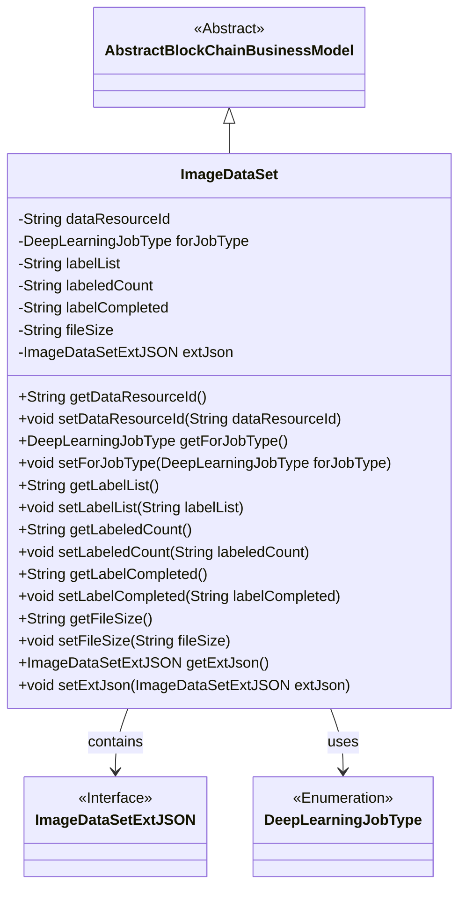

# Basic Information

|      |      |
|------|------|
| Name | ImageDataSet |
| Language | .java |
| Code Path | WeFe/common/java/common-data-mongodb/src/main/java/com/welab/wefe/common/data/mongodb/entity/union/ImageDataSet.java |
| Package Name | com.welab.wefe.common.data.mongodb.entity.union |
| Dependencies | ['com.welab.wefe.common.data.mongodb.constant.MongodbTable', 'com.welab.wefe.common.data.mongodb.entity.base.AbstractBlockChainBusinessModel', 'com.welab.wefe.common.data.mongodb.entity.union.ext.ImageDataSetExtJSON', 'com.welab.wefe.common.wefe.enums.DeepLearningJobType', 'org.springframework.data.mongodb.core.mapping.Document'] |
| Brief Description | The ImageDataSet class represents an image dataset in MongoDB, containing the data resource ID, task type, label list, annotation count, completion status, file size, and extended JSON information. |

# Description

The `ImageDataSet` class is a MongoDB document model that inherits from `AbstractBlockChainBusinessModel` and corresponds to the `IMAGE_DATASET` collection. It includes fields such as data resource ID, deep learning task type, label list, annotated count, annotation completion status, file size, and extended JSON information. It provides getter and setter methods for each field to manipulate these attributes.

# Class Summary

| Name   | Type  | Description |
|-------|------|-------------|
| ImageDataSet | class | The `ImageDataSet` class represents an image dataset in MongoDB, containing the data resource ID, task type, label list, annotation count, completion status, file size, and extended JSON information. |

## Class ImageDataSet

|      |      |
|------|------|
| Access Modifier | @Document(collection = MongodbTable.Union.IMAGE_DATASET);public |
| Type | class |
| Name | ImageDataSet |
| Description | The `ImageDataSet` class represents an image dataset in MongoDB, containing the data resource ID, task type, label list, annotation count, completion status, file size, and extended JSON information. |

### UML Class Diagram

This diagram illustrates that the ImageDataSet class inherits from AbstractBlockChainBusinessModel and contains multiple private fields along with their corresponding getter/setter methods. ImageDataSet has associations with the ImageDataSetExtJSON interface and DeepLearningJobType enumeration, representing extended JSON data and deep learning job types respectively. The class diagram clearly presents the inheritance and dependency relationships between classes, as well as the member structure of the classes.

### Internal Method Call Graph

```mermaid
graph TD
    A["Class ImageDataSet"]
    B["Annotation: @Document(collection = MongodbTable.Union.IMAGE_DATASET)"]
    C["Inheritance: AbstractBlockChainBusinessModel"]
    D["Property: String dataResourceId"]
    E["Property: DeepLearningJobType forJobType"]
    F["Property: String labelList"]
    G["Property: String labeledCount"]
    H["Property: String labelCompleted"]
    I["Property: String fileSize"]
    J["Property: ImageDataSetExtJSON extJson"]
    K["Method: getDataResourceId()"]
    L["Method: setDataResourceId(String)"]
    M["Method: getForJobType()"]
    N["Method: setForJobType(DeepLearningJobType)"]
    O["Method: getLabelList()"]
    P["Method: setLabelList(String)"]
    Q["Method: getLabeledCount()"]
    R["Method: setLabeledCount(String)"]
    S["Method: getLabelCompleted()"]
    T["Method: setLabelCompleted(String)"]
    U["Method: getFileSize()"]
    V["Method: setFileSize(String)"]
    W["Method: getExtJson()"]
    X["Method: setExtJson(ImageDataSetExtJSON)"]

    A --> B
    A --> C
    A --> D
    A --> E
    A --> F
    A --> G
    A --> H
    A --> I
    A --> J
    A --> K
    A --> L
    A --> M
    A --> N
    A --> O
    A --> P
    A --> Q
    A --> R
    A --> S
    A --> T
    A --> U
    A --> V
    A --> W
    A --> X
```

This flowchart illustrates the complete structure of the ImageDataSet class, including class annotation, inheritance relationship, 7 private properties and their corresponding getter/setter methods. As a MongoDB document model, it specifies the collection name through the @Document annotation and inherits from the blockchain business model base class. All properties are either String or custom types, with encapsulation implemented through standard accessor methods, making it suitable for image dataset management scenarios.

### Field List

| Name  | Type  | Description |
|-------|-------|------|
| forJobType | DeepLearningJobType | Private deep learning task type variable forJobType. |
| labelList | String | Private string variable used to store the list of tags. |
| extJson | ImageDataSetExtJSON | Extending JSON Objects for Private Image Datasets. |
| fileSize | String | Define a string variable for file size. |
| dataResourceId | String | Private string type variable dataResourceId |
| labelCompleted | String | Private string variable used to mark completion status. |
| labeledCount | String | Private string variable used to store tag counts. |

### Method List

| Name  | Type  | Description |
|-------|-------|------|
| getLabelList | String | Method to obtain the labelList string. |
| getForJobType | DeepLearningJobType | Methods to obtain the current deep learning task type. |
| getDataResourceId | String | Methods to obtain the data resource ID, returning a string-type value dataResourceId. |
| setLabelList | void | Java Method: Set label list string. Assign the parameter labelList to the class member variable this.labelList. |
| setLabelCompleted | void | This is a Java method used to set the value of the labelCompleted property. The method accepts a string parameter and assigns it to the class's member variable labelCompleted. |
| setForJobType | void | The method for setting the type of deep learning task involves assigning parameters to class member variables. |
| getLabelCompleted | String | Get the string value of the completed label. |
| setFileSize | void | Java method: Set file size attribute, with the parameter as a string fileSize. |
| getExtJson | ImageDataSetExtJSON | Get the extJson object of type ImageDataSetExtJSON. |
| setLabeledCount | void | Set the label counting method by assigning the parameter labeledCount to the class member variable labeledCount. |
| getLabeledCount | String | Public method to obtain the labeledCount value. |
| setDataResourceId | void | The method to set the data resource ID assigns the input parameter to the class member variable dataResourceId. |
| getFileSize | String | Methods to obtain the file size, returning a fileSize value of string type. |
| setExtJson | void | This method is used to set the extended JSON data of the image dataset, assigning the passed extJson parameter to the extJson member variable of the class. |

