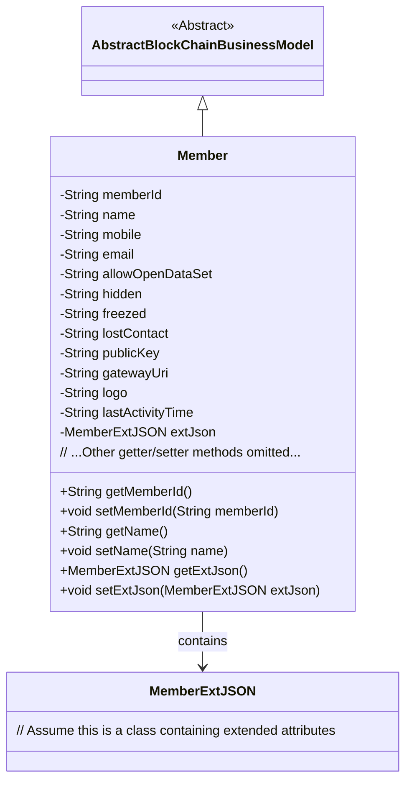

# Basic Information

|      |      |
|------|------|
| Name | Member |
| Language | .java |
| Code Path | WeFe/common/java/common-data-mongodb/src/main/java/com/welab/wefe/common/data/mongodb/entity/union/Member.java |
| Package Name | com.welab.wefe.common.data.mongodb.entity.union |
| Dependencies | ['com.welab.wefe.common.data.mongodb.constant.MongodbTable', 'com.welab.wefe.common.data.mongodb.entity.base.AbstractBlockChainBusinessModel', 'com.welab.wefe.common.data.mongodb.entity.union.ext.MemberExtJSON', 'org.springframework.data.mongodb.core.mapping.Document'] |
| Brief Description | The Member class represents a blockchain member, containing attributes such as ID, name, contact information, status flag, public key, gateway URI, LOGO, last activity time, and extended information. |

# Description

The code defines a Java class named `Member`, which represents member data in MongoDB. This class extends `AbstractBlockChainBusinessModel` and includes basic information such as member ID, name, phone number, and email, as well as status fields like whether open datasets are allowed, whether the member is hidden, frozen, or disconnected. Additionally, it contains extended information such as public key, gateway URI, logo, and last activity time, with extra JSON data stored in a `MemberExtJSON` object. Each field has corresponding getter and setter methods. This class is mapped to the `MEMBER` collection in MongoDB.

# Class Summary

| Name   | Type  | Description |
|-------|------|-------------|
| Member | class | The Member class represents a blockchain member, containing attributes such as ID, name, contact information, status flag, public key, gateway URI, LOGO, last activity time, and extended information. |

## Class Member

|      |      |
|------|------|
| Access Modifier | @Document(collection = MongodbTable.Union.MEMBER);public |
| Type | class |
| Name | Member |
| Description | The Member class represents a blockchain member, containing attributes such as ID, name, contact information, status flag, public key, gateway URI, LOGO, last activity time, and extended information. |

### UML Class Diagram

This code demonstrates the core class structure of a blockchain member management system. The Member class inherits from AbstractBlockChainBusinessModel, containing fields such as member ID, basic information, status flags (e.g., frozen/lost contact), blockchain-related attributes (public key/gateway), and stores extended attributes via the MemberExtJSON object. The class diagram clearly reflects inheritance and composition relationships between entities, suitable for a MongoDB-persisted blockchain member data model.

### Internal Method Call Graph

```mermaid
graph TD
    A["Class Member<br/>Extends AbstractBlockChainBusinessModel"]
    B["Annotation: @Document(collection=MongodbTable.Union.MEMBER)"]
    C["Attribute: String memberId"]
    D["Attribute: String name"]
    E["Attribute: String mobile"]
    F["Attribute: String email"]
    G["Attribute: String allowOpenDataSet"]
    H["Attribute: String hidden"]
    I["Attribute: String freezed"]
    J["Attribute: String lostContact"]
    K["Attribute: String publicKey"]
    L["Attribute: String gatewayUri"]
    M["Attribute: String logo"]
    N["Attribute: String lastActivityTime"]
    O["Attribute: MemberExtJSON extJson"]
    P["Getter/Setter Method Pairs (13 pairs)"]
    Q["Special Methods: getExtJson/setExtJson"]

    A --> B
    A --> C
    A --> D
    A --> E
    A --> F
    A --> G
    A --> H
    A --> I
    A --> J
    A --> K
    A --> L
    A --> M
    A --> N
    A --> O
    A --> P
    A --> Q
```

This flowchart illustrates the complete structure of the Member class, which inherits from AbstractBlockChainBusinessModel and uses MongoDB document annotation. The class contains 13 String-type attributes and 1 MemberExtJSON-type attribute, each with corresponding getter/setter method pairs. It specifically highlights the special handling methods for the extJson attribute, clearly reflecting the data storage design pattern of this entity class.

### Field List

| Name  | Type  | Description |
|-------|-------|------|
| hidden | String | Private string variable hidden. |
| extJson = new MemberExtJSON() | MemberExtJSON | The member variable extJson is initialized as an instance of MemberExtJSON. |
| mobile | String | Define a private string variable mobile. |
| gatewayUri | String | Declare a private string variable gatewayUri. |
| allowOpenDataSet | String | The private string variable `allowOpenDataSet` is used to control dataset access permissions. |
| lostContact | String | The private string variable `lostContact` is used to store lost contact information. |
| lastActivityTime | String | Private string variable to record the last activity time. |
| publicKey | String | The private string variable publicKey is used to store the public key. |
| name | String | Declare a private string variable name. |
| logo | String | The private string variable logo is used to store identification information. |
| email | String | Declare a private string variable email. |
| freezed | String | Declared a private string variable freezed. |
| memberId | String | Member ID string variable |

### Method List

| Name  | Type  | Description |
|-------|-------|------|
| getGatewayUri | String | Methods to obtain the gateway URI, returning the value of the gatewayUri variable. |
| getAllowOpenDataSet | String | This is a Java method that returns the value of the string-type variable allowOpenDataSet. |
| setPublicKey | void | The method to set the public key assigns the input string to the `publicKey` member variable of the class. |
| setName | void | This is a Java method used to set the name property of an object. The method takes a string parameter name and assigns it to the name field of the current object. |
| getLogo | String | Methods to obtain the logo string. |
| getEmail | String | Methods to obtain the email string. |
| getHidden | String | Methods to obtain the hidden string, returns the value of the private variable hidden. |
| setAllowOpenDataSet | void | Set parameters for allowed datasets to be opened. |
| getMemberId | String | Methods to obtain member ID, returns a memberId of string type. |
| getName | String | This is a Java method that returns the value of the string variable named "name". |
| setFreezed | void | Defined a public method setFreezed for setting the value of the freezed property. |
| setLostContact | void | Set the method for lost contact information by assigning the parameter `lostContact` to the class member variable `lostContact`. |
| setMemberId | void | The method to set the member ID assigns the input parameter memberId to the memberId property of the current object. |
| getPublicKey | String | Methods to obtain the public key, returning a string-type publicKey. |
| setMobile | void | This is a Java method used to set the mobile property value of a class. The method accepts a string parameter named mobile and assigns it to the member variable of the same name in the class. |
| setHidden | void | This is a Java method used to set the value of the hidden property. The method accepts a string parameter named hidden and assigns it to the hidden property of the current object. |
| setEmail | void | The method to set the email attribute assigns the passed email parameter to the email field of the current object. |
| getLastActivityTime | String | Methods to obtain the last activity time, returning a string-type `lastActivityTime` value. |
| setLastActivityTime | void | Method for setting the last activity time, with the parameter being of string type. |
| getExtJson | MemberExtJSON | Method to retrieve member extension JSON data, returns the extJson object. |
| setExtJson | void | The method to set member extended JSON data assigns the parameter extJson to the extJson property of the current object. |
| setLogo | void | Methods for setting the logo string. |
| getMobile | String | The method returns the value of the string-type variable mobile. |
| getLostContact | String | Methods to retrieve lost contacts, returning the `lostContact` string. |
| setGatewayUri | void | Methods for setting the gateway URI, assigning the input parameter to the class's gatewayUri variable. |
| getFreezed | String | Methods to obtain a freezed string. |

