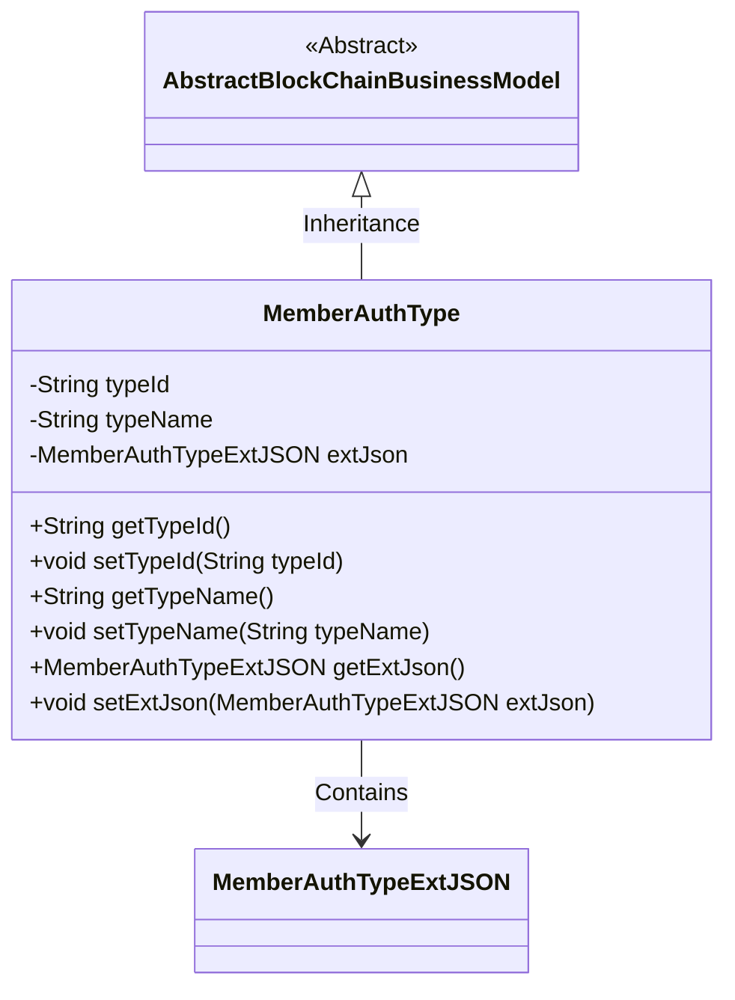

# Basic Information

|      |      |
|------|------|
| Name | MemberAuthType |
| Language | .java |
| Code Path | WeFe/common/java/common-data-mongodb/src/main/java/com/welab/wefe/common/data/mongodb/entity/union/MemberAuthType.java |
| Package Name | com.welab.wefe.common.data.mongodb.entity.union |
| Dependencies | ['com.welab.wefe.common.data.mongodb.constant.MongodbTable', 'com.welab.wefe.common.data.mongodb.entity.base.AbstractBlockChainBusinessModel', 'com.welab.wefe.common.data.mongodb.entity.union.ext.MemberAuthTypeExtJSON', 'org.springframework.data.mongodb.core.mapping.Document', 'java.util.UUID'] |
| Brief Description | Java class MemberAuthType, stored in the MEMBER_AUTH_TYPE table of MongoDB, contains fields typeId (auto-generated UUID), typeName, and extJson, with getter/setter methods provided. It inherits from AbstractBlockChainBusinessModel. |

# Description

The content describes a Java class named MemberAuthType, which represents member authentication types. This class inherits from AbstractBlockChainBusinessModel and uses the @Document annotation to specify the MongoDB collection name. It contains three main attributes: typeId (default value is a UUID string with hyphens removed), typeName (type name), and extJson (extended JSON object, initialized as an instance of MemberAuthTypeExtJSON). Getter and setter methods for these attributes are provided.

# Class Summary

| Name   | Type  | Description |
|-------|------|-------------|
| MemberAuthType | class | The Java class MemberAuthType, stored in the MEMBER_AUTH_TYPE table of MongoDB, includes fields such as typeId (automatically generated UUID), typeName, and extJson, and provides getter/setter methods. |

## Class MemberAuthType

|      |      |
|------|------|
| Access Modifier | @Document(collection = MongodbTable.Union.MEMBER_AUTH_TYPE);public |
| Type | class |
| Name | MemberAuthType |
| Description | The Java class MemberAuthType, stored in the MEMBER_AUTH_TYPE table of MongoDB, includes fields such as typeId (automatically generated UUID), typeName, and extJson, and provides getter/setter methods. |

### UML Class Diagram

This class diagram illustrates that the MemberAuthType class inherits from the AbstractBlockChainBusinessModel abstract class and contains a member variable of type MemberAuthTypeExtJSON. The MemberAuthType class represents member authentication types, with three private fields: typeId, typeName, and extJson, which are accessed and modified through getter and setter methods. The typeId is generated by default using UUID with hyphens removed, and the extJson field is instantiated upon initialization. The class is marked as a collection document via MongoDB's @Document annotation, mapping to a specified database table.

### Internal Method Call Graph

```mermaid
graph TD
    A["Class MemberAuthType"]
    B["Annotation: @Document(collection = MongodbTable.Union.MEMBER_AUTH_TYPE)"]
    C["Inheritance: AbstractBlockChainBusinessModel"]
    D["Field: String typeId = UUID.randomUUID().toString().replaceAll('-', '')"]
    E["Field: String typeName"]
    F["Field: MemberAuthTypeExtJSON extJson = new MemberAuthTypeExtJSON()"]
    G["Method: String getTypeId()"]
    H["Method: void setTypeId(String typeId)"]
    I["Method: String getTypeName()"]
    J["Method: void setTypeName(String typeName)"]
    K["Method: MemberAuthTypeExtJSON getExtJson()"]
    L["Method: void setExtJson(MemberAuthTypeExtJSON extJson)"]

    A --> B
    A --> C
    A --> D
    A --> E
    A --> F
    A --> G
    A --> H
    A --> I
    A --> J
    A --> K
    A --> L
```

This flowchart illustrates the complete structure of the MemberAuthType class, which is a MongoDB document model inheriting from AbstractBlockChainBusinessModel. It primarily contains three core fields: auto-generated typeId (with hyphens removed from UUID), typeName, and an extJson object, along with corresponding getter/setter methods. The class specifies the MongoDB collection name through the @Document annotation, demonstrating an extensible design for blockchain business models where the extJson field stores extended JSON data using the MemberAuthTypeExtJSON type.

### Field List

| Name  | Type  | Description |
|-------|-------|------|
| extJson = new MemberAuthTypeExtJSON() | MemberAuthTypeExtJSON | Define a private member variable extJson, of type MemberAuthTypeExtJSON, and initialize it. |
| typeId = UUID.randomUUID().toString().replaceAll("-", "") | String | Generate a random UUID string and remove the hyphens, then assign it to the typeId variable. |
| typeName | String | Declare a private string variable typeName. |

### Method List

| Name  | Type  | Description |
|-------|-------|------|
| getTypeName | String | Method returns the type name string. |
| getTypeId | String | Methods to obtain the type ID, returns a string typeId. |
| getExtJson | MemberAuthTypeExtJSON | Get the extended JSON data of the member authentication type. |
| setExtJson | void | Set the extended JSON data for member authentication types. |
| setTypeId | void | This is a Java method used to set the value of the object's typeId property. The method takes a string parameter typeId and assigns it to the member variable of the same name in the current object. |
| setTypeName | void | This is a Java method used to set the value of the class member variable `typeName`. The method takes a string parameter `typeName` and assigns it to the property of the same name in the current object. |

