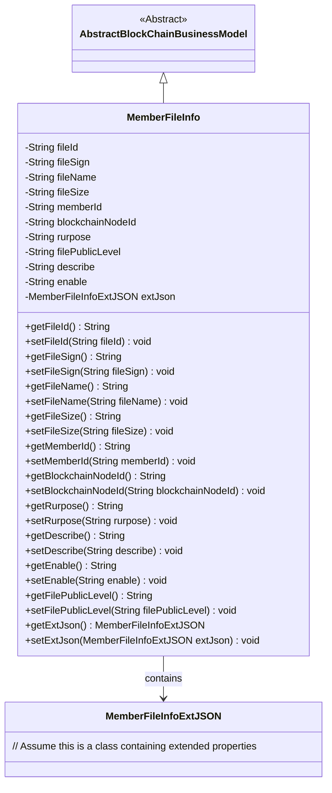

# Basic Information

|      |      |
|------|------|
| Name | MemberFileInfo |
| Language | .java |
| Code Path | WeFe/common/java/common-data-mongodb/src/main/java/com/welab/wefe/common/data/mongodb/entity/union/MemberFileInfo.java |
| Package Name | com.welab.wefe.common.data.mongodb.entity.union |
| Dependencies | ['com.welab.wefe.common.data.mongodb.constant.MongodbTable', 'com.welab.wefe.common.data.mongodb.entity.base.AbstractBlockChainBusinessModel', 'com.welab.wefe.common.data.mongodb.entity.union.ext.MemberFileInfoExtJSON', 'org.springframework.data.mongodb.core.mapping.Document'] |
| Brief Description | The MemberFileInfo class represents member file information, including file ID, signature, name, size, member ID, blockchain node ID, purpose, public level, description, enabled status, and extended JSON data. |

# Description

The content defines a Java class named MemberFileInfo, which represents member file information. This class inherits from AbstractBlockChainBusinessModel and is annotated as the MongoDB collection MEMBER_FILE_INFO. It includes attributes such as file ID, signature, name, size, member ID, blockchain node ID, purpose, public level, description, enabled status, and an extended JSON object. All attributes are provided with getter and setter methods, with the default enabled status set to "1".

# Class Summary

| Name   | Type  | Description |
|-------|------|-------------|
| MemberFileInfo | class | The MemberFileInfo class stores member file information, including file ID, signature, name, size, member ID, blockchain node ID, purpose, public level, description, enabled status, and extended JSON. |

## Class MemberFileInfo

|      |      |
|------|------|
| Access Modifier | @Document(collection = MongodbTable.Union.MEMBER_FILE_INFO);public |
| Type | class |
| Name | MemberFileInfo |
| Description | The MemberFileInfo class stores member file information, including file ID, signature, name, size, member ID, blockchain node ID, purpose, public level, description, enabled status, and extended JSON. |

### UML Class Diagram

This class diagram illustrates that the MemberFileInfo class inherits from AbstractBlockChainBusinessModel and contains multiple file-related attributes (such as fileId, fileName, etc.) along with an extended property of type MemberFileInfoExtJSON. The class is primarily used for managing blockchain member file information, providing complete getter/setter methods for attribute access and modification, where the enable field defaults to "1". Through inheritance, the class acquires the foundational functionality of the blockchain business model, while extending file information storage capabilities via composition.

### Internal Method Call Graph

```mermaid
graph TD
    A["Class MemberFileInfo"]
    B["Inheritance: AbstractBlockChainBusinessModel"]
    C["Annotation: @Document(collection = MongodbTable.Union.MEMBER_FILE_INFO)"]
    D["Property: String fileId"]
    E["Property: String fileSign"]
    F["Property: String fileName"]
    G["Property: String fileSize"]
    H["Property: String memberId"]
    I["Property: String blockchainNodeId"]
    J["Property: String purpose"]
    K["Property: String filePublicLevel"]
    L["Property: String describe"]
    M["Property: String enable = '1'"]
    N["Property: MemberFileInfoExtJSON extJson = new MemberFileInfoExtJSON()"]
    O["Getter/Setter Method Group"]
    
    A --> B
    A --> C
    A --> D
    A --> E
    A --> F
    A --> G
    A --> H
    A --> I
    A --> J
    A --> K
    A --> L
    A --> M
    A --> N
    A --> O
```

This flowchart illustrates the complete structure of the MemberFileInfo class, including inheritance relationships, class annotations, 11 string-type properties, 1 custom object property with its initialization value. All properties are equipped with corresponding Getter/Setter method groups, where the enable property has a default value of "1", and the extJson property is instantiated upon declaration. The class establishes a mapping relationship with MongoDB's MEMBER_FILE_INFO collection through the @Document annotation and inherits from the blockchain business model base class.

### Field List

| Name  | Type  | Description |
|-------|-------|------|
| fileName | String | Declare a private string variable fileName. |
| extJson = new MemberFileInfoExtJSON() | MemberFileInfoExtJSON | Initialization of JSON object for member file information extension. |
| filePublicLevel | String | File Disclosure Level Attribute |
| rurpose | String | Private string variable `purpose`, usage unspecified. |
| blockchainNodeId | String | Private string variable storing the blockchain node ID. |
| fileSize | String | Define a string variable for file size. |
| describe | String | The private string variable `describe` is used to store description information. |
| enable = "1" | String | The variable enable is initialized to the string "1". |
| fileId | String | The private string-type variable fileId is used to store the file identifier. |
| fileSign | String | Private string variable fileSign, used to store file signatures. |
| memberId | String | Member ID string variable |

### Method List

| Name  | Type  | Description |
|-------|-------|------|
| getDescribe | String | Methods for obtaining descriptive strings. |
| setMemberId | void | The method to set the member ID assigns the input parameter memberId to the memberId property of the current object. |
| setFileSign | void | This is a Java method used to set file signature properties. The method is named setFileSign, which takes a String parameter fileSign and assigns it to the property of the same name in the current object. |
| getMemberId | String | Methods to obtain the member ID, returns a string-type memberId. |
| getFileSize | String | Methods to obtain file size, returning a fileSize string. |
| getFileId | String | Methods to obtain the file ID, returns a fileId string. |
| getFileSign | String | Methods for obtaining file signature strings. |
| setFileId | void | This is a Java method used to set the file ID. The method takes a string parameter fileId and assigns it to the class's member variable fileId. |
| setRurpose | void | This is a Java method used to set the value of the class member variable `rurpose`. The method accepts a string parameter `rurpose` and assigns it to the property of the same name in the current object. |
| setBlockchainNodeId | void | Methods for setting the blockchain node ID, assigning the parameter to the member variable blockchainNodeId. |
| setFileName | void | Methods for setting the file name, assigning the input parameter to the member variable fileName. |
| getFileName | String | Methods to obtain the file name, returning the fileName variable value of string type. |
| setFileSize | void | Java Method: Set file size attribute, with parameter of string type. |
| setDescribe | void | This is a Java method used to set the describe property value of an object. The method takes a string parameter and assigns it to the describe field of the object. |
| getRurpose | String | Public method to obtain the rurpose value. |
| getBlockchainNodeId | String | Methods to obtain blockchain node ID, directly returning the node ID string. |
| getEnable | String | Public method to get the enable value, returns a string type. |
| setEnable | void | This is a Java method used to set the value of the member variable `enable`. The method accepts a string parameter `enable` and assigns it to the `enable` property of the current object. |
| getFilePublicLevel | String | Method to obtain the file's public level, returns a filePublicLevel string. |
| setFilePublicLevel | void | The method to set the file public level, with the parameter being the file public level string, assigns it to the class member variable filePublicLevel. |
| getExtJson | MemberFileInfoExtJSON | Get the JSON object of member file extension information. |
| setExtJson | void | The method `setExtJson` is used to set the extended JSON data of a member file's information, with the parameter being an object of type `MemberFileInfoExtJSON`. |

