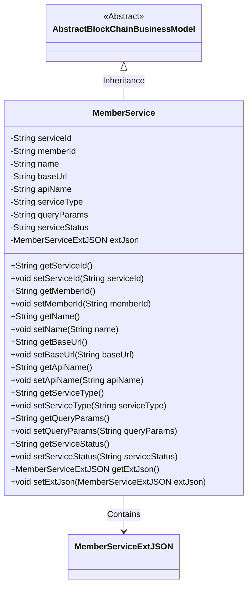

# Basic Information

|      |      |
|------|------|
| Name | MemberService |
| Language | .java |
| Code Path | WeFe/common/java/common-data-mongodb/src/main/java/com/welab/wefe/common/data/mongodb/entity/union/MemberService.java |
| Package Name | com.welab.wefe.common.data.mongodb.entity.union |
| Dependencies | ['com.welab.wefe.common.data.mongodb.constant.MongodbTable', 'com.welab.wefe.common.data.mongodb.entity.base.AbstractBlockChainBusinessModel', 'com.welab.wefe.common.data.mongodb.entity.union.ext.MemberServiceExtJSON', 'org.springframework.data.mongodb.core.mapping.Document'] |
| Brief Description | The MemberService class stores member service information, including fields such as ID, name, URL, API, type, status, and extended JSON. |

# Description

The content defines a Java class named `MemberService`, which extends `AbstractBlockChainBusinessModel` and represents member service information. The class includes multiple private fields: `serviceId`, `memberId`, `name`, `baseUrl`, `apiName`, `serviceType`, `queryParams`, and `serviceStatus`, as well as an `extJson` field of type `MemberServiceExtJSON`. Each field has corresponding getter and setter methods for accessing and modifying the field values. The class uses the `@Document` annotation to specify the MongoDB collection name as `MongodbTable.Union.MEMBER_SERVICE`.

# Class Summary

| Name   | Type  | Description |
|-------|------|-------------|
| MemberService | class | The Java class MemberService stores member service information, including fields such as ID, name, URL, API, type, status, and extended JSON. |

## Class MemberService

|      |      |
|------|------|
| Access Modifier | @Document(collection = MongodbTable.Union.MEMBER_SERVICE);public |
| Type | class |
| Name | MemberService |
| Description | The Java class MemberService stores member service information, including fields such as ID, name, URL, API, type, status, and extended JSON. |

### UML Class Diagram

This class diagram illustrates the structure of the MemberService class, which inherits from the AbstractBlockChainBusinessModel abstract class and contains a member variable of type MemberServiceExtJSON. The MemberService class primarily encapsulates various attributes of member services, including service ID, member ID, name, base URL, API name, service type, query parameters, and service status, providing complete getter and setter methods. Through the extJson field, the class achieves encapsulation of extended JSON data, demonstrating sound object-oriented design principles.

### Internal Method Call Graph

```mermaid
graph TD
    A["Class MemberService"]
    B["Inherits: AbstractBlockChainBusinessModel"]
    C["Annotation: @Document(collection = MongodbTable.Union.MEMBER_SERVICE)"]
    D["Property: String serviceId"]
    E["Property: String memberId"]
    F["Property: String name"]
    G["Property: String baseUrl"]
    H["Property: String apiName"]
    I["Property: String serviceType"]
    J["Property: String queryParams"]
    K["Property: String serviceStatus"]
    L["Property: MemberServiceExtJSON extJson"]
    M["Method: getServiceId/setServiceId"]
    N["Method: getMemberId/setMemberId"]
    O["Method: getName/setName"]
    P["Method: getBaseUrl/setBaseUrl"]
    Q["Method: getApiName/setApiName"]
    R["Method: getServiceType/setServiceType"]
    S["Method: getQueryParams/setQueryParams"]
    T["Method: getServiceStatus/setServiceStatus"]
    U["Method: getExtJson/setExtJson"]

    A --> B
    A --> C
    A --> D
    A --> E
    A --> F
    A --> G
    A --> H
    A --> I
    A --> J
    A --> K
    A --> L
    A --> M
    A --> N
    A --> O
    A --> P
    A --> Q
    A --> R
    A --> S
    A --> T
    A --> U
```

This code defines a class named MemberService, which inherits from AbstractBlockChainBusinessModel and is marked with the @Document annotation for MongoDB collection. The class includes multiple String-type properties (such as serviceId, memberId, etc.) and an extJson property of type MemberServiceExtJSON, each with corresponding getter and setter methods. This class is primarily used to represent business models related to member services, containing fields such as basic service information, API configuration, and status. It is suitable for data persistence operations in blockchain business scenarios.

### Field List

| Name  | Type  | Description |
|-------|-------|------|
| serviceStatus | String | Declare a private string variable serviceStatus to store service status information. |
| serviceId | String | The private string variable serviceId is used to store the service identifier. |
| name | String | Private string variable name. |
| serviceType | String | Private string variable storing service type information. |
| queryParams | String | The private string variable queryParams is used to store query parameters. |
| extJson = new MemberServiceExtJSON() | MemberServiceExtJSON | Create an instance of the MemberServiceExtJSON class named extJson. |
| apiName | String | Declare a private string variable apiName. |
| memberId | String | Declare a private string variable memberId. |
| baseUrl | String | private string variable baseUrl |

### Method List

| Name  | Type  | Description |
|-------|-------|------|
| setName | void | Methods for setting the object name, assigning the parameter 'name' to the 'name' property of the object. |
| getServiceStatus | String | The method returns the service status string. |
| getBaseUrl | String | The method returns the baseUrl string value. |
| getMemberId | String | The method returns a member ID string. |
| setServiceId | void | The method to set the service ID involves assigning the input parameter to the class's serviceId member variable. |
| getServiceId | String | Common method to obtain the serviceId, returns the serviceId value as a string. |
| getQueryParams | String | Methods to Obtain Query Parameter Strings. |
| setApiName | void | Define a public method setApiName that takes a string parameter apiName and assigns it to the property of the same name on the current object. |
| getApiName | String | The method returns the apiName value of string type. |
| setBaseUrl | void | The method to set the base URL involves assigning the parameter `baseUrl` to the class member variable `this.baseUrl`. |
| getServiceType | String | Methods to obtain the string value of serviceType. |
| setServiceStatus | void | This is a Java method used to set the value of the serviceStatus property of a class. The method takes a string parameter serviceStatus and assigns it to the member variable of the same name in the class. |
| setQueryParams | void | Methods for setting query parameters, assigning the input parameters to the class member variable queryParams. |
| getName | String | This is a Java method that returns the value of the string variable named "name". |
| getExtJson | MemberServiceExtJSON | Get the extended JSON data of the member service. |
| setMemberId | void | The method to set the member ID assigns the input parameter to the class's member variable memberId. |
| setServiceType | void | Define the method `setServiceType` to set the value of the class member variable `serviceType`. The parameter is of string type `serviceType`. |
| setExtJson | void | The method `setExtJson` is used to set the member service extension JSON data, assigning the passed `extJson` to the `extJson` property of the current object. |

