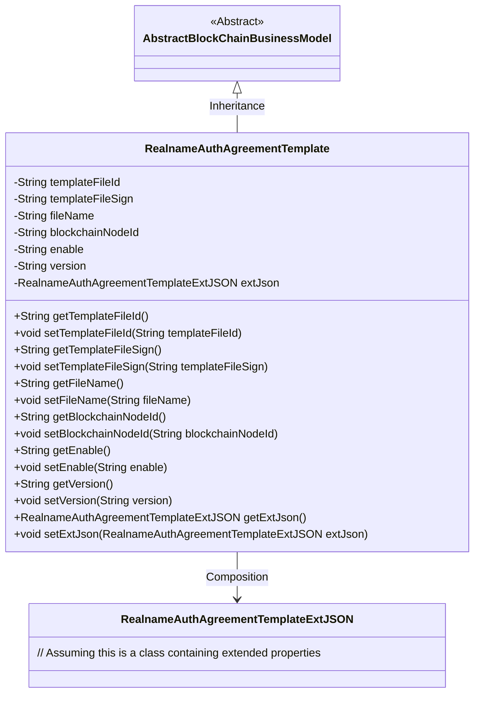

# Basic Information

|      |      |
|------|------|
| Name | RealnameAuthAgreementTemplate |
| Language | .java |
| Code Path | WeFe/common/java/common-data-mongodb/src/main/java/com/welab/wefe/common/data/mongodb/entity/union/RealnameAuthAgreementTemplate.java |
| Package Name | com.welab.wefe.common.data.mongodb.entity.union |
| Dependencies | ['com.welab.wefe.common.data.mongodb.constant.MongodbTable', 'com.welab.wefe.common.data.mongodb.entity.base.AbstractBlockChainBusinessModel', 'com.welab.wefe.common.data.mongodb.entity.union.ext.RealnameAuthAgreementTemplateExtJSON', 'org.springframework.data.mongodb.core.mapping.Document'] |
| Brief Description | The Java class RealnameAuthAgreementTemplate represents a real-name authentication agreement template, containing the file ID, signature, name, blockchain node ID, activation status, version, and extended JSON data. |

# Description

This is a Java class named RealnameAuthAgreementTemplate, which extends AbstractBlockChainBusinessModel and represents a real-name authentication agreement template. The class is mapped to the REALNAME_AUTH_AGREEMENT_TEMPLATE collection in MongoDB. It includes the following fields: templateFileId (template file ID), templateFileSign (template file signature), fileName (file name), blockchainNodeId (blockchain node ID), enable (enabled status, default "0"), version (version number), and extJson (extended JSON object). It provides getter and setter methods for all fields.

# Class Summary

| Name   | Type  | Description |
|-------|------|-------------|
| RealnameAuthAgreementTemplate | class | The `RealnameAuthAgreementTemplate` class represents a real-name authentication agreement template, containing attributes such as file ID, signature, name, blockchain node ID, activation status, version, and extended JSON. |

## Class RealnameAuthAgreementTemplate

|      |      |
|------|------|
| Access Modifier | @Document(collection = MongodbTable.Union.REALNAME_AUTH_AGREEMENT_TEMPLATE);public |
| Type | class |
| Name | RealnameAuthAgreementTemplate |
| Description | The `RealnameAuthAgreementTemplate` class represents a real-name authentication agreement template, containing attributes such as file ID, signature, name, blockchain node ID, activation status, version, and extended JSON. |

### UML Class Diagram

This code describes a real-name authentication agreement template class `RealnameAuthAgreementTemplate`, which inherits from the abstract class `AbstractBlockChainBusinessModel`. The class contains core attributes such as template file ID, signature, file name, blockchain node ID, etc., along with an extended JSON object `extJson` for storing additional information. All fields are accessed through getter/setter methods, demonstrating good encapsulation. By inheriting, the class acquires the generic features of blockchain business models, while extending template customization capabilities through composition.

### Internal Method Call Graph

```mermaid
graph TD
    A["Class RealnameAuthAgreementTemplate"]
    B["Attribute: String templateFileId"]
    C["Attribute: String templateFileSign"]
    D["Attribute: String fileName"]
    E["Attribute: String blockchainNodeId"]
    F["Attribute: String enable = '0'"]
    G["Attribute: String version"]
    H["Attribute: RealnameAuthAgreementTemplateExtJSON extJson"]
    I["Method: getTemplateFileId()"]
    J["Method: setTemplateFileId()"]
    K["Method: getTemplateFileSign()"]
    L["Method: setTemplateFileSign()"]
    M["Method: getFileName()"]
    N["Method: setFileName()"]
    O["Method: getBlockchainNodeId()"]
    P["Method: setBlockchainNodeId()"]
    Q["Method: getEnable()"]
    R["Method: setEnable()"]
    S["Method: getVersion()"]
    T["Method: setVersion()"]
    U["Method: getExtJson()"]
    V["Method: setExtJson()"]

    A --> B
    A --> C
    A --> D
    A --> E
    A --> F
    A --> G
    A --> H
    A --> I
    A --> J
    A --> K
    A --> L
    A --> M
    A --> N
    A --> O
    A --> P
    A --> Q
    A --> R
    A --> S
    A --> T
    A --> U
    A --> V
```

This code defines a class named RealnameAuthAgreementTemplate, which inherits from AbstractBlockChainBusinessModel and represents a real-name authentication agreement template. The class includes multiple attributes such as template file ID, signature, file name, etc., along with corresponding getter and setter methods. The enable attribute has a default value of "0", indicating a disabled state. Additionally, it contains an extJson attribute for storing extended JSON data. This class is primarily used for storing and managing real-name authentication agreement template information in MongoDB.

### Field List

| Name  | Type  | Description |
|-------|-------|------|
| extJson = new RealnameAuthAgreementTemplateExtJSON() | RealnameAuthAgreementTemplateExtJSON | Declare a private variable extJson of type RealnameAuthAgreementTemplateExtJSON and initialize it as a new instance. |
| blockchainNodeId | String | Private string variable storing the blockchain node ID. |
| enable = "0" | String | The private string variable "enable" has an initial value of "0". |
| templateFileId | String | The private string variable templateFileId is used to store the template file ID. |
| fileName | String | The private string variable fileName is used to store the file name. |
| templateFileSign | String | The private string variable templateFileSign is used to store the template file signature. |
| version | String | Declare a private string variable version. |

### Method List

| Name  | Type  | Description |
|-------|-------|------|
| getEnable | String | Get the string value of the enable attribute. |
| setTemplateFileId | void | The method to set the template file ID assigns the passed string parameter to the class member variable `templateFileId`. |
| getVersion | String | Methods to obtain the version number, returning the value of the version variable as a string type. |
| setTemplateFileSign | void | Java Method: Set Template File Signature Property Value. |
| getTemplateFileSign | String | Methods to obtain the template file signature, returning the `templateFileSign` value. |
| setVersion | void | This is a Java method used to set the version property of an object. The method is named setVersion, which takes a string parameter version and assigns it to the version field of the object. |
| setBlockchainNodeId | void | Methods for setting blockchain node ID, assigning parameters to member variables. |
| getTemplateFileId | String | The method to obtain the template file ID, with the return value being templateFileId. |
| setFileName | void | Methods for setting the filename, assigning the input string to the fileName property of the class. |
| getFileName | String | The method returns a string-type file name variable fileName. |
| getExtJson | RealnameAuthAgreementTemplateExtJSON | Method to obtain the extended JSON data template for real-name authentication agreement. |
| getBlockchainNodeId | String | Methods to obtain the blockchain node ID, returns the node ID as a string. |
| setEnable | void | The method `setEnable` takes a string parameter `enable` and assigns it to the `enable` property of the current object. |
| setExtJson | void | Set the extended JSON data with the parameter as an object of type RealnameAuthAgreementTemplateExtJSON. |

