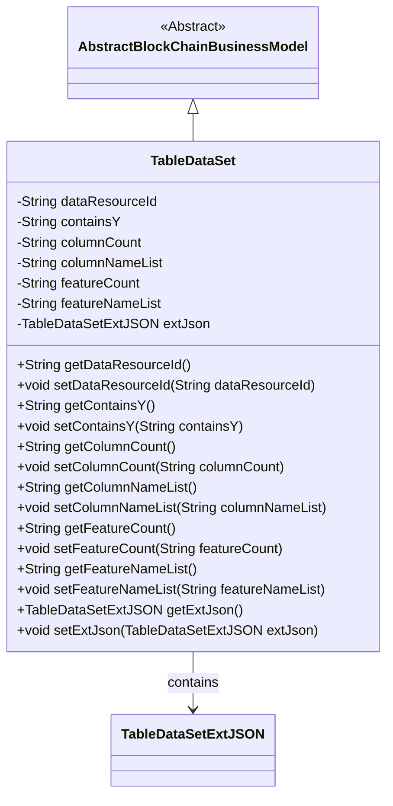

# Basic Information

|      |      |
|------|------|
| Name | TableDataSet |
| Language | .java |
| Code Path | WeFe/common/java/common-data-mongodb/src/main/java/com/welab/wefe/common/data/mongodb/entity/union/TableDataSet.java |
| Package Name | com.welab.wefe.common.data.mongodb.entity.union |
| Dependencies | ['com.welab.wefe.common.data.mongodb.constant.MongodbTable', 'com.welab.wefe.common.data.mongodb.entity.base.AbstractBlockChainBusinessModel', 'com.welab.wefe.common.data.mongodb.entity.union.ext.DataResourceExtJSON', 'com.welab.wefe.common.data.mongodb.entity.union.ext.TableDataSetExtJSON', 'org.springframework.data.mongodb.core.mapping.Document'] |
| Brief Description | The TableDataSet class stores table dataset information, including the data resource ID, number of columns, column name list, number of features, feature name list, and extended JSON fields. |

# Description

This is a Java class named TableDataSet, which represents the structure of a dataset table in MongoDB. It inherits from the AbstractBlockChainBusinessModel class and is mapped to the Union.TABLE_DATASET collection in MongoDB. The class includes fields such as data resource ID, whether it contains Y values, column count, column name list, feature count, feature name list, and an extended JSON object. Each field has corresponding getter and setter methods for accessing and modifying property values.

# Class Summary

| Name   | Type  | Description |
|-------|------|-------------|
| TableDataSet | class | The TableDataSet class stores dataset information, including data resource ID, column count, column name list, feature count, feature name list, and extended JSON. It inherits from AbstractBlockChainBusinessModel. |

## Class TableDataSet

|      |      |
|------|------|
| Access Modifier | @Document(collection = MongodbTable.Union.TABLE_DATASET);public |
| Type | class |
| Name | TableDataSet |
| Description | The TableDataSet class stores dataset information, including data resource ID, column count, column name list, feature count, feature name list, and extended JSON. It inherits from AbstractBlockChainBusinessModel. |

### UML Class Diagram

This code defines a class named TableDataSet, which inherits from the abstract class AbstractBlockChainBusinessModel and contains multiple String-type attributes and a TableDataSetExtJSON-type attribute. The class is primarily used to represent tabular datasets, including information such as data resource ID, whether it contains Y values, column count and column name list, feature count and feature name list, and extends storage of additional JSON data through the extJson attribute. All attributes have corresponding getter and setter methods, complying with the JavaBean specification.

### Internal Method Call Graph

```mermaid
graph TD
    A["Class TableDataSet"]
    B["Inheritance: AbstractBlockChainBusinessModel"]
    C["Annotation: @Document(collection = MongodbTable.Union.TABLE_DATASET)"]
    D["Field: String dataResourceId"]
    E["Field: String containsY"]
    F["Field: String columnCount"]
    G["Field: String columnNameList"]
    H["Field: String featureCount"]
    I["Field: String featureNameList"]
    J["Field: TableDataSetExtJSON extJson"]
    K["Method: getDataResourceId()"]
    L["Method: setDataResourceId(String)"]
    M["Method: getContainsY()"]
    N["Method: setContainsY(String)"]
    O["Method: getColumnCount()"]
    P["Method: setColumnCount(String)"]
    Q["Method: getColumnNameList()"]
    R["Method: setColumnNameList(String)"]
    S["Method: getFeatureCount()"]
    T["Method: setFeatureCount(String)"]
    U["Method: getFeatureNameList()"]
    V["Method: setFeatureNameList(String)"]
    W["Method: getExtJson()"]
    X["Method: setExtJson(TableDataSetExtJSON)"]

    A --> B
    A --> C
    A --> D
    A --> E
    A --> F
    A --> G
    A --> H
    A --> I
    A --> J
    A --> K
    A --> L
    A --> M
    A --> N
    A --> O
    A --> P
    A --> Q
    A --> R
    A --> S
    A --> T
    A --> U
    A --> V
    A --> W
    A --> X
```

This code defines a class named TableDataSet, which inherits from AbstractBlockChainBusinessModel and is annotated as a MongoDB document collection. The class contains multiple String-type fields (such as dataResourceId, containsY, etc.) and a TableDataSetExtJSON-type extJson field, along with corresponding getter and setter methods for each field. This class is primarily used to represent structured information of tabular datasets, including metadata such as column name lists and feature counts, and is suitable for data storage and operations in blockchain business scenarios.

### Field List

| Name  | Type  | Description |
|-------|-------|------|
| dataResourceId | String | The private string-type variable dataResourceId is used to identify the data resource. |
| extJson = new TableDataSetExtJSON() | TableDataSetExtJSON | Define a private variable extJson, initialized as a new instance of the TableDataSetExtJSON class. |
| featureNameList | String | The private string variable featureNameList is used to store the list of feature names. |
| containsY | String | Private string variable used to determine if it contains the letter Y. |
| columnCount | String | The private string variable columnCount is used to store column count information. |
| featureCount | String | The private string variable `featureCount` is used to store the number of features. |
| columnNameList | String | The private string variable columnNameList is used to store the list of column names. |

### Method List

| Name  | Type  | Description |
|-------|-------|------|
| getDataResourceId | String | Methods to obtain the data resource ID, returning a string-type value. |
| getColumnCount | String | Methods to obtain the number of columns, returns the value of the columnCount variable. |
| setFeatureNameList | void | Methods for setting the feature name list, assigning the input string to the class member variable featureNameList. |
| setDataResourceId | void | The method to set the data resource ID assigns the input parameter to the class member variable dataResourceId. |
| getColumnNameList | String | Methods to obtain the column name list, returning a string-type columnNameList. |
| getExtJson | TableDataSetExtJSON | Methods to obtain the extJson property, returning an object of type TableDataSetExtJSON. |
| getFeatureNameList | String | The method returns a list of feature name strings. |
| setExtJson | void | This is a Java method used to set the extJson property value of type TableDataSetExtJSON. The method accepts an extJson parameter and assigns it to the extJson field of the current object. |
| getContainsY | String | Methods to obtain the value of the containsY string. |
| setContainsY | void | This is a Java method used to set the value of the containsY property of type String. |
| setFeatureCount | void | This is a Java method used to set the value of the featureCount property. The method takes a string parameter featureCount and assigns it to the class member variable of the same name. |
| setColumnNameList | void | Methods for setting the column name list, assigning the input parameters to the member variable columnNameList of the class. |
| setColumnCount | void | The method to set the number of columns assigns the input string to the class's columnCount property. |
| getFeatureCount | String | Methods to obtain the number of features, returning the featureCount value as a string type. |

