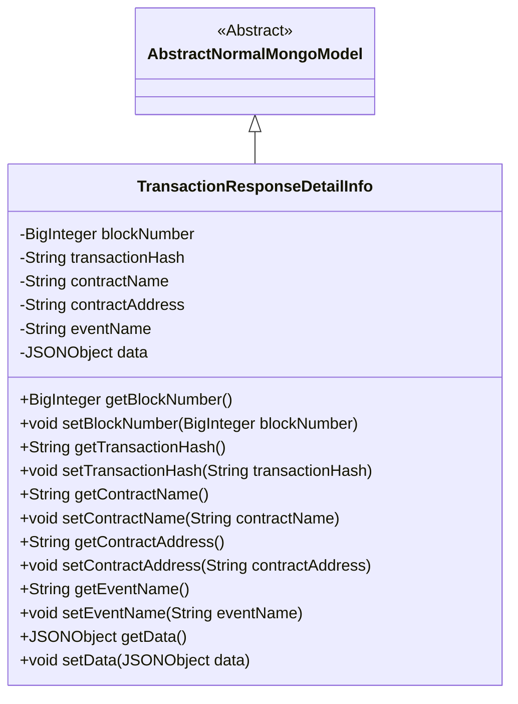

# Basic Information

|      |      |
|------|------|
| Name | TransactionResponseDetailInfo |
| Language | .java |
| Code Path | WeFe/common/java/common-data-mongodb/src/main/java/com/welab/wefe/common/data/mongodb/entity/union/TransactionResponseDetailInfo.java |
| Package Name | com.welab.wefe.common.data.mongodb.entity.union |
| Dependencies | ['java.math.BigInteger', 'com.alibaba.fastjson.JSONObject', 'com.welab.wefe.common.data.mongodb.entity.base.AbstractNormalMongoModel'] |
| Brief Description | The `TransactionResponseDetailInfo` class inherits from `AbstractNormalMongoModel` and includes attributes such as block number, transaction hash, contract name, contract address, event name, and data, along with their corresponding getter and setter methods. |

# Description

The `TransactionResponseDetailInfo` class inherits from `AbstractNormalMongoModel` and is used to store transaction response details. It includes the following fields: block number `blockNumber`, transaction hash `transactionHash`, contract name `contractName`, contract address `contractAddress`, event name `eventName`, and data `data`. Each field has corresponding getter and setter methods for retrieving and setting property values. This class is primarily used for handling data storage and retrieval related to blockchain transactions.

# Class Summary

| Name   | Type  | Description |
|-------|------|-------------|
| TransactionResponseDetailInfo | class | The `TransactionResponseDetailInfo` class inherits from `AbstractNormalMongoModel` and includes attributes such as block number, transaction hash, contract name, contract address, event name, and data, along with their corresponding getter/setter methods. |

## Class TransactionResponseDetailInfo

|      |      |
|------|------|
| Access Modifier | public |
| Type | class |
| Name | TransactionResponseDetailInfo |
| Description | The `TransactionResponseDetailInfo` class inherits from `AbstractNormalMongoModel` and includes attributes such as block number, transaction hash, contract name, contract address, event name, and data, along with their corresponding getter/setter methods. |

### UML Class Diagram

This class diagram illustrates that the TransactionResponseDetailInfo class inherits from the abstract class AbstractNormalMongoModel, containing core blockchain transaction attributes such as block number, transaction hash, contract information, and event data. The class provides complete getter/setter methods for accessing and modifying private fields, typically used for storing and retrieving blockchain transaction details in MongoDB, embodying a standard data model design pattern.

### Internal Method Call Graph

```mermaid
graph TD
    A["Class TransactionResponseDetailInfo"]
    B["Inherits: AbstractNormalMongoModel"]
    C["Property: BigInteger blockNumber"]
    D["Property: String transactionHash"]
    E["Property: String contractName"]
    F["Property: String contractAddress"]
    G["Property: String eventName"]
    H["Property: JSONObject data"]
    I["Method: getBlockNumber/setBlockNumber"]
    J["Method: getTransactionHash/setTransactionHash"]
    K["Method: getContractName/setContractName"]
    L["Method: getContractAddress/setContractAddress"]
    M["Method: getEventName/setEventName"]
    N["Method: getData/setData"]

    A --> B
    A --> C
    A --> D
    A --> E
    A --> F
    A --> G
    A --> H
    A --> I
    A --> J
    A --> K
    A --> L
    A --> M
    A --> N
```

This code defines a class named TransactionResponseDetailInfo, which inherits from AbstractNormalMongoModel and is primarily used to store detailed blockchain transaction response information. The class includes six private properties: blockNumber, transactionHash, contractName, contractAddress, eventName, and data, each with corresponding getter and setter methods. The design purpose of this class is to encapsulate blockchain transaction-related data, facilitating storage and querying in MongoDB, reflecting the structural characteristics of a typical data model class.

### Field List

| Name  | Type  | Description |
|-------|-------|------|
| contractAddress | String | Contract address string variable |
| contractName | String | Private string variable contractName. |
| transactionHash | String | Transaction hash string variable |
| data | JSONObject | Private JSONObject type data object. |
| blockNumber | BigInteger | Defined a private big integer variable blockNumber. |
| eventName | String | Declare a private string variable eventName. |

### Method List

| Name  | Type  | Description |
|-------|-------|------|
| getBlockNumber | BigInteger | Methods to obtain the block number, returning a BigInteger-type blockNumber value. |
| getContractName | String | Methods to obtain the contract name, returning a string-type variable `contractName`. |
| setEventName | void | This is a Java method used to set the event name. The method takes a string parameter `eventName` and assigns it to the class's member variable `eventName`. |
| setContractName | void | Java Method: Set Contract Name, assigns the input parameter contractName to the current object's property of the same name. |
| setBlockNumber | void | The method for setting the block number assigns the input parameter blockNumber to the blockNumber property of the current object. |
| getData | JSONObject | Retrieve the stored JSON object data. |
| setData | void | Methods for setting JSON object data. |
| getTransactionHash | String | Methods to Obtain Transaction Hash. |
| setTransactionHash | void | Java Method: Set Transaction Hash, assigns the input parameter to the class member variable transactionHash. |
| getEventName | String | Methods to obtain the event name, returning the event name as a string type. |
| setContractAddress | void | The method to set the contract address assigns the input parameter `contractAddress` to the class member variable of the same name. |
| getContractAddress | String | Methods to obtain the contract address, returning a string-type variable `contractAddress`. |

