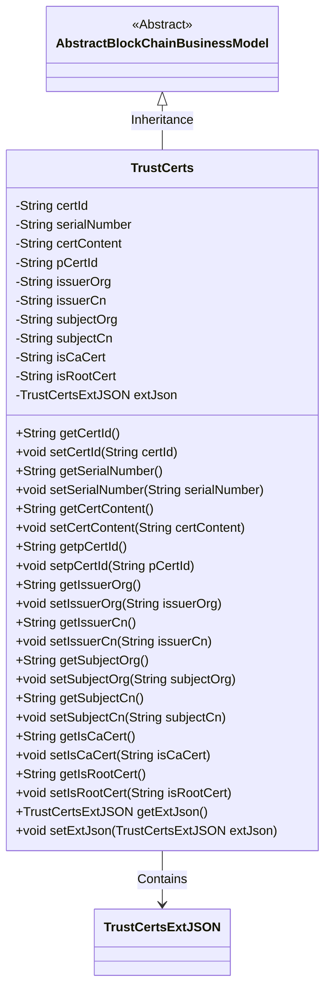

# Basic Information

|      |      |
|------|------|
| Name | TrustCerts |
| Language | .java |
| Code Path | WeFe/common/java/common-data-mongodb/src/main/java/com/welab/wefe/common/data/mongodb/entity/union/TrustCerts.java |
| Package Name | com.welab.wefe.common.data.mongodb.entity.union |
| Dependencies | ['com.welab.wefe.common.data.mongodb.constant.MongodbTable', 'com.welab.wefe.common.data.mongodb.entity.base.AbstractBlockChainBusinessModel', 'com.welab.wefe.common.data.mongodb.entity.union.ext.TrustCertsExtJSON', 'com.welab.wefe.common.data.mongodb.entity.union.ext.UnionNodeExtJSON', 'org.springframework.data.mongodb.core.mapping.Document'] |
| Brief Description | The TrustCerts class represents the trust certificate collection in MongoDB, containing fields such as certificate ID, serial number, content, issuer, subject, and CA identifier, inheriting from AbstractBlockChainBusinessModel. |

# Description

The `TrustCerts` class is a MongoDB collection model that inherits from `AbstractBlockChainBusinessModel`, designed to store trust certificate information. It includes fields such as certificate ID, serial number, certificate content, parent certificate ID, issuer organization and CN, subject organization and CN, flags indicating whether it is a CA certificate or a root certificate, as well as extended JSON fields. The class provides getter and setter methods for all fields.

# Class Summary

| Name   | Type  | Description |
|-------|------|-------------|
| TrustCerts | class | The TrustCerts class stores trust certificate information, including certificate ID, serial number, content, parent certificate ID, issuer and subject information, CA and root certificate flags, and extension JSON. |

## Class TrustCerts

|      |      |
|------|------|
| Access Modifier | @Document(collection = MongodbTable.Union.TRUST_CERTS);public |
| Type | class |
| Name | TrustCerts |
| Description | The TrustCerts class stores trust certificate information, including certificate ID, serial number, content, parent certificate ID, issuer and subject information, CA and root certificate flags, and extension JSON. |

### UML Class Diagram

This class diagram illustrates that the TrustCerts class inherits from the AbstractBlockChainBusinessModel abstract class and contains a member variable of type TrustCertsExtJSON. The TrustCerts class is primarily used for managing trust certificate information in blockchain, including attributes such as certificate ID, serial number, certificate content, issuer information, subject information, and corresponding getter and setter methods. The class extends additional JSON-formatted information through the extJson field, reflecting the core data structure of blockchain certificate management.

### Internal Method Call Graph

This code defines a class named TrustCerts, representing a data model for trust certificates. The class inherits from AbstractBlockChainBusinessModel and is annotated with @Document to mark it as a MongoDB collection. It contains 12 String-type properties and 1 TrustCertsExtJSON-type property, each with corresponding getter and setter methods. Primarily used for storing certificate-related data such as certificate ID, serial number, content, parent certificate ID, issuer and subject information, supporting certificate management functions in blockchain business scenarios.

### Field List

| Name  | Type  | Description |
|-------|-------|------|
| serialNumber | String | Private string type variable, storing the serial number. |
| isRootCert | String | Declare a private string variable isRootCert to identify whether it is a root certificate. |
| isCaCert | String | The private string variable `isCaCert` is used to identify whether it is a CA certificate. |
| certId | String | The private string-type variable certId is used to store the certificate ID. |
| issuerCn | String | Declare a private string variable issuerCn to store the issuer's common name. |
| extJson = new TrustCertsExtJSON() | TrustCertsExtJSON | Declared a private variable extJson, of type TrustCertsExtJSON, and initialized it as a new instance. |
| subjectCn | String | Private string variable storing Chinese theme information. |
| pCertId | String | The private string variable pCertId is used to store the certificate ID. |
| subjectOrg | String | The private string variable subjectOrg is used to store organizational subject information. |
| certContent | String | The private string variable certContent is used to store certificate content. |
| issuerOrg | String | Declare a private string variable issuerOrg to store issuer organization information. |

### Method List

| Name  | Type  | Description |
|-------|-------|------|
| setpCertId | void | This is a Java method used to set the value of the pCertId property of an object. The method takes a string parameter pCertId and assigns it to the property of the same name in the current object. |
| getSubjectOrg | String | Method to obtain the subjectOrg string. |
| getSubjectCn | String | Methods to obtain the Chinese theme, returning the subjectCn string. |
| getCertContent | String | The method returns the certificate content string. |
| getSerialNumber | String | The method to obtain the serial number directly returns the value of the serialNumber variable. |
| setIssuerCn | void | Java Method: Set the string value of the issuer common name (issuerCn). |
| setCertContent | void | The method to set the certificate content assigns the input string to the class member variable certContent. |
| setIssuerOrg | void | The method to set the issuer organization name assigns the parameter `issuerOrg` to the class member variable `issuerOrg`. |
| getpCertId | String | The method returns the pCertId value of string type. |
| setSerialNumber | void | This is a Java method used to set the serial number property of an object. The method takes a string parameter `serialNumber` and assigns it to the `serialNumber` field of the object. |
| getIssuerCn | String | Get the common name of the certificate issuer. |
| getCertId | String | Methods to obtain the certificate ID, returns a certId string. |
| setCertId | void | The method to set the certificate ID assigns the input parameter certId to the certId property of the current object. |
| setSubjectOrg | void | This is a Java method used to set the value of the subjectOrg property of an object. The method takes a string parameter and assigns it to the member variable of the object. |
| setSubjectCn | void | The method to set the Chinese subject field assigns the input value to the subjectCn property of the class. |
| getIssuerOrg | String | The method to obtain the issuer organization name, returns a string issuerOrg. |
| getIsCaCert | String | Method to obtain the string value of isCaCert. |
| setIsCaCert | void | Method to set whether the certificate is a CA certificate, with the parameter being of string type. |
| getIsRootCert | String | Method to obtain the root certificate identifier, returns a string-type value `isRootCert`. |
| setIsRootCert | void | Set the root certificate identification method, with the parameter being of string type. |
| getExtJson | TrustCertsExtJSON | Get the extJson object of type TrustCertsExtJSON. |
| setExtJson | void | Set external JSON data with parameters of type TrustCertsExtJSON. |

