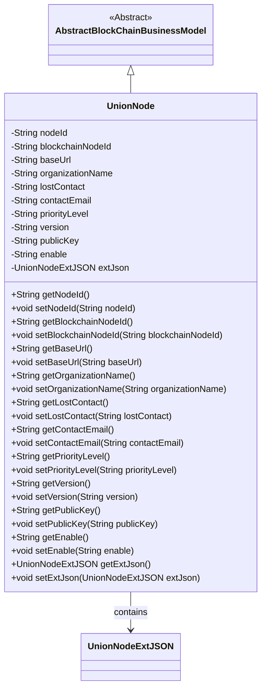

# Basic Information

|      |      |
|------|------|
| Name | UnionNode |
| Language | .java |
| Code Path | WeFe/common/java/common-data-mongodb/src/main/java/com/welab/wefe/common/data/mongodb/entity/union/UnionNode.java |
| Package Name | com.welab.wefe.common.data.mongodb.entity.union |
| Dependencies | ['com.welab.wefe.common.data.mongodb.constant.MongodbTable', 'com.welab.wefe.common.data.mongodb.entity.base.AbstractBlockChainBusinessModel', 'com.welab.wefe.common.data.mongodb.entity.union.ext.UnionNodeExtJSON', 'org.springframework.data.mongodb.core.mapping.Document'] |
| Brief Description | The UnionNode class represents a blockchain consortium node, containing attributes such as node ID, URL, organization name, contact person, priority, version, public key, and extends additional JSON fields. |

# Description

The UnionNode class is a MongoDB document model designed to store union node information, inheriting from AbstractBlockChainBusinessModel. It includes fields such as node ID, blockchain node ID, base URL, organization name, offline status, contact email, priority, version number, public key, enabled status, and an extended JSON object UnionNodeExtJSON. Each field has corresponding getter and setter methods for data access operations.

# Class Summary

| Name   | Type  | Description |
|-------|------|-------------|
| UnionNode | class | The UnionNode class stores alliance node information, including fields such as node ID, blockchain node ID, URL, organization name, contact details, priority, version, public key, enabled status, and extended JSON. |

## Class UnionNode

|      |      |
|------|------|
| Access Modifier | @Document(collection = MongodbTable.Union.UNION_NODE);public |
| Type | class |
| Name | UnionNode |
| Description | The UnionNode class stores alliance node information, including fields such as node ID, blockchain node ID, URL, organization name, contact details, priority, version, public key, enabled status, and extended JSON. |

### UML Class Diagram

This code defines a class named `UnionNode`, which inherits from `AbstractBlockChainBusinessModel` and represents node information in a blockchain consortium. The class includes attributes such as node ID, blockchain node ID, base URL, organization name, contact details, priority level, version, public key, and enable status, with extended information stored via the `UnionNodeExtJSON` class. All attributes are accessed and modified through getter and setter methods, complying with the JavaBean specification. The class diagram clearly illustrates the inheritance and composition relationships.

### Internal Method Call Graph

```mermaid
graph TD
    A["Class UnionNode"]
    B["Inherits: AbstractBlockChainBusinessModel"]
    C["Annotation: @Document(collection = MongodbTable.Union.UNION_NODE)"]
    D["Property: String nodeId"]
    E["Property: String blockchainNodeId"]
    F["Property: String baseUrl"]
    G["Property: String organizationName"]
    H["Property: String lostContact"]
    I["Property: String contactEmail"]
    J["Property: String priorityLevel"]
    K["Property: String version"]
    L["Property: String publicKey"]
    M["Property: String enable"]
    N["Property: UnionNodeExtJSON extJson"]
    O["Method: getNodeId()/setNodeId()"]
    P["Method: getBlockchainNodeId()/setBlockchainNodeId()"]
    Q["Method: getBaseUrl()/setBaseUrl()"]
    R["Method: getOrganizationName()/setOrganizationName()"]
    S["Method: getLostContact()/setLostContact()"]
    T["Method: getContactEmail()/setContactEmail()"]
    U["Method: getPriorityLevel()/setPriorityLevel()"]
    V["Method: getVersion()/setVersion()"]
    W["Method: getPublicKey()/setPublicKey()"]
    X["Method: getEnable()/setEnable()"]
    Y["Method: getExtJson()/setExtJson()"]

    A --> B
    A --> C
    A --> D
    A --> E
    A --> F
    A --> G
    A --> H
    A --> I
    A --> J
    A --> K
    A --> L
    A --> M
    A --> N
    A --> O
    A --> P
    A --> Q
    A --> R
    A --> S
    A --> T
    A --> U
    A --> V
    A --> W
    A --> X
    A --> Y
```

This code defines a class named UnionNode, which inherits from AbstractBlockChainBusinessModel and is marked with the @Document annotation for MongoDB collection. The class contains 12 private properties representing node ID, blockchain node ID, base URL, organization name, etc., along with corresponding getter and setter methods for each property. Notably, the extJson property is a UnionNodeExtJSON object used to store extended information. This class primarily describes node information in a consortium blockchain, encapsulating properties and methods to enable operations and management of node data.

### Field List

| Name  | Type  | Description |
|-------|-------|------|
| contactEmail | String | Private string variable storing the contact email. |
| publicKey | String | The private string variable publicKey is used to store the public key. |
| blockchainNodeId | String | Private string variable used to store the blockchain node ID. |
| priorityLevel | String | Private string variable representing the priority level. |
| organizationName | String | Private string variable storing the organization name. |
| lostContact | String | The private string variable `lostContact` is used to store lost contact information. |
| version | String | The private string variable `version` is used to store version information. |
| enable | String | private string variable enable |
| nodeId | String | Private string type variable nodeId |
| baseUrl | String | Declare a private string variable baseUrl. |
| extJson = new UnionNodeExtJSON() | UnionNodeExtJSON | The private variable extJson is initialized as a new instance of the UnionNodeExtJSON class. |

### Method List

| Name  | Type  | Description |
|-------|-------|------|
| getNodeId | String | Methods to obtain the node ID, returns a string-type nodeId. |
| getVersion | String | Methods to obtain the version number, returns a string-type version value. |
| setContactEmail | void | The method to set the contact email is to assign the parameter contactEmail to the class property of the same name. |
| getPriorityLevel | String | Methods to obtain the priority level, returning a priorityLevel value of string type. |
| getContactEmail | String | Methods to obtain the contact email, directly return the value of the contactEmail variable. |
| setBaseUrl | void | The method to set the base URL assigns the input parameter `baseUrl` to the class member variable `this.baseUrl`. |
| setPriorityLevel | void | Method to set priority, which takes a string parameter and assigns it to the class member variable priorityLevel. |
| setVersion | void | Methods for setting the version number: Assign the input parameter `version` to the `version` property of the current object. |
| getLostContact | String | Methods to retrieve lost contact information, returns the `lostContact` string. |
| getBlockchainNodeId | String | Methods to obtain the blockchain node ID, returning a string-type node ID. |
| setBlockchainNodeId | void | Methods for setting blockchain node IDs, assigning parameters to member variables. |
| getOrganizationName | String | Methods to obtain the organization name, returning a string-type variable organizationName. |
| setOrganizationName | void | The method to set the organization name assigns the input parameter to the member variable organizationName. |
| setNodeId | void | Methods for setting the node ID: Assign the input parameter nodeId to the nodeId property of the current object. |
| setLostContact | void | Method for setting the disconnected status, with the parameter being of string type. |
| getBaseUrl | String | The method returns the baseUrl string value. |
| getEnable | String | Public method to get the enable value, returns a string type. |
| setEnable | void | This is a Java method used to set the value of the enable property. The method accepts a string parameter named enable and assigns it to the class member variable of the same name. |
| getExtJson | UnionNodeExtJSON | The method returns an extJson object of type UnionNodeExtJSON. |
| setExtJson | void | The method `setExtJson` is used to set the `extJson` property, with the parameter being an object of type `UnionNodeExtJSON`. |
| getPublicKey | String | Methods to obtain the public key, returning the value of the publicKey variable as a string type. |
| setPublicKey | void | The method to set the public key assigns the input string to the `publicKey` member variable of the class. |

