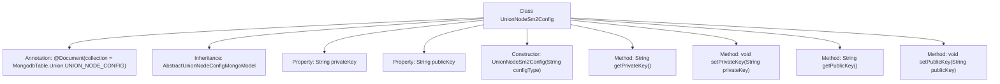

# Basic Information

|      |      |
|------|------|
| Name | UnionNodeSm2Config |
| Language | .java |
| Code Path | WeFe/common/java/common-data-mongodb/src/main/java/com/welab/wefe/common/data/mongodb/entity/union/UnionNodeSm2Config.java |
| Package Name | com.welab.wefe.common.data.mongodb.entity.union |
| Dependencies | ['com.welab.wefe.common.data.mongodb.constant.MongodbTable', 'com.welab.wefe.common.data.mongodb.entity.base.AbstractUnionNodeConfigMongoModel', 'org.springframework.data.mongodb.core.mapping.Document'] |
| Brief Description | The `UnionNodeSm2Config` class inherits from `AbstractUnionNodeConfigMongoModel`, stores SM2 public and private keys, and includes getter/setter methods. |

# Description

The `UnionNodeSm2Config` class is a MongoDB document model designed to store the SM2 key configuration of alliance nodes. It inherits from `AbstractUnionNodeConfigMongoModel` and is annotated with the `MongodbTable.Union.UNION_NODE_CONFIG` collection. The class includes two string properties, `privateKey` and `publicKey`, along with their corresponding getter and setter methods. The constructor initializes the class by accepting a `configType` parameter.

# Class Summary

| Name   | Type  | Description |
|-------|------|-------------|
| UnionNodeSm2Config | class | The UnionNodeSm2Config class inherits from AbstractUnionNodeConfigMongoModel, stores SM2 key pairs, and includes public/private key fields along with their getter/setter methods. |


## Class UnionNodeSm2Config

|      |      |
|------|------|
| Access Modifier | @Document(collection = MongodbTable.Union.UNION_NODE_CONFIG);public |
| Type | class |
| Name | UnionNodeSm2Config |
| Description | The UnionNodeSm2Config class inherits from AbstractUnionNodeConfigMongoModel, stores SM2 key pairs, and includes public/private key fields along with their getter/setter methods. |


### UML Class Diagram

```mermaid
classDiagram
    class AbstractUnionNodeConfigMongoModel {
        <<Abstract>>
        // Abstract base class providing common configuration model functionality
    }
    
    class UnionNodeSm2Config {
        -String privateKey
        -String publicKey
        +UnionNodeSm2Config(String configType)
        +String getPrivateKey()
        +void setPrivateKey(String privateKey)
        +String getPublicKey()
        +void setPublicKey(String publicKey)
    }
    
    AbstractUnionNodeConfigMongoModel <|-- UnionNodeSm2Config : Inheritance
    note for UnionNodeSm2Config "MongoDB collection mapping:\n"+MongodbTable.Union.UNION_NODE_CONFIG
```

This code describes a MongoDB entity class for SM2 encryption algorithm node configuration. UnionNodeSm2Config inherits from the abstract base class AbstractUnionNodeConfigMongoModel, containing fields for storing public-private key pairs. It is mapped to a specified MongoDB collection via the @Document annotation. The class provides standard getter/setter methods and supports initializing configuration types through constructors, primarily used for managing SM2 encryption key configurations of nodes in consortium blockchain scenarios.


### Internal Method Call Graph



This code defines a class named UnionNodeSm2Config, which inherits from AbstractUnionNodeConfigMongoModel and uses the @Document annotation to specify the MongoDB collection name. The class contains two private properties, privateKey and publicKey, along with their corresponding getter and setter methods. The constructor accepts a configType parameter and initializes the parent class's configType property. This class is designed primarily to store public and private key configuration information for the SM2 encryption algorithm, with persistence achieved through MongoDB.

### Field List

| Name  | Type  | Description |
|-------|-------|------|
| privateKey | String | Private key string variable |
| publicKey | String | The private string variable publicKey is used to store the public key. |

### Method List

| Name  | Type  | Description |
|-------|-------|------|
| getPublicKey | String | Methods to obtain the public key, returns a publicKey string. |
| setPrivateKey | void | Methods for setting a private key, assigning the input string to the class's private key variable. |
| getPrivateKey | String | Methods to obtain the private key, returning the value of the privateKey variable. |
| setPublicKey | void | The method to set the public key assigns the input string to the publicKey member variable of the class. |


