# Basic Information

|      |      |
|------|------|
| Name | union |
| Language | .java |
| Code Path | WeFe/common/java/common-data-mongodb/src/main/java/com/welab/wefe/common/data/mongodb/entity/union |
| Package Name | docs.common.java.common-data-mongodb.src.main.java.com.welab.wefe.common.data.mongodb.entity.union |
| Brief Description | The Java module provides a JSON data extension framework that supports the extended management of various business entities (such as datasets, member services, real-name authentication, etc.) in federated learning scenarios. It defines data structures through POJO classes and relies on the Java standard library and MongoDB for storage implementation. |

# Description

## Overview  
This module serves as the core component for data management in federated learning scenarios, enabling unified modeling and extensible management of multi-type data resources through MongoDB entity classes. Adopting a standardized structure inherited from AbstractBlockChainBusinessModel, all entity classes include an extJson field to support JSON extensions, such as DataSet for extended data permission control and Member for real-name authentication status. Key data structures comprise 12 document models, including dataset metadata (DataSet), member permissions (DataSetMemberPermission), and trust certificates (TrustCerts). External dependencies are limited to the MongoDB driver and Java standard library, resembling an ORM-layer data persistence solution.

## Primary Business Scenarios  
The module supports full-lifecycle data management in federated learning, encompassing three typical scenarios: data resource management (e.g., ImageDataSet for image annotation), member services (e.g., MemberService for maintaining gateway information), and blockchain interactions (e.g., BlockSyncHeight for recording block synchronization status). The interaction mode uniformly follows the POJO getter/setter convention, such as RealnameAuthAgreementTemplate dynamically extending agreement templates via extJson. Functional completeness is reflected in covering 8 business dimensions, including data annotation, permission control, and node authentication, akin to a metadata management architecture similar to a configuration center. All API types are MongoDB document entities, with integration cases including a data resource tagging system (DataResourceDefaultTag) and SM2 key configuration (UnionNodeSm2Config).

### Package Internal Structure View

```mermaid
graph TD
    union --> ext
    union --> DataResourceDefaultTag.java
    union --> TableDataSet.java
    union --> TrustCerts.java
    union --> RealnameAuthAgreementTemplate.java
    union --> DataResourceLazyUpdateModel.java
    union --> MemberFileInfo.java
    union --> DataSet.java
    union --> BloomFilter.java
    union --> BlockSyncHeight.java
    union --> UnionNode.java
    union --> BlockSyncDetailInfo.java
    union --> BlockSyncContractHeight.java
    union --> DataResource.java
    union --> TransactionResponseDetailInfo.java
    union --> MemberAuthType.java
    union --> DataSetMemberPermission.java
    union --> ImageDataSet.java
    union --> MemberService.java
    union --> Member.java
    union --> DataSetDefaultTag.java
    union --> UnionNodeSm2Config.java
    ext --> DataSetDefaultTagExtJSON.java
    ext --> MemberServiceExtJSON.java
    ext --> MemberAuthTypeExtJSON.java
    ext --> TableDataSetExtJSON.java
    ext --> RealnameAuthAgreementTemplateExtJSON.java
    ext --> BloomFilterExtJSON.java
    ext --> MemberExtJSON.java
    ext --> DataSetMemberPermissionExtJSON.java
    ext --> ImageDataSetExtJSON.java
    ext --> UnionNodeExtJSON.java
    ext --> RealnameAuthFileInfo.java
    ext --> MemberFileInfoExtJSON.java
    ext --> DataResourceDefaultTagExtJSON.java
    ext --> DataResourceExtJSON.java
    ext --> TrustCertsExtJSON.java
    ext --> DataSetExtJSON.java
```

This flowchart illustrates the hierarchical structure of the `union` directory and its subdirectory `ext`. The `union` directory contains multiple entity class files such as `DataResourceDefaultTag.java`, `TableDataSet.java`, etc., while the `ext` subdirectory includes a series of extension class files like `DataSetDefaultTagExtJSON.java`, `MemberServiceExtJSON.java`, etc. The entire structure clearly reflects the classification relationship between entity classes and extension classes.

# File List

| Name   | Type  | Description |
|-------|------|-------------|
| [DataResourceDefaultTag.java](DataResourceDefaultTag.md) | file | The Java class DataResourceDefaultTag represents the default tags in a MongoDB collection, containing tag ID, name, resource type, and extended JSON fields, and inherits from AbstractBlockChainBusinessModel. |
| [TableDataSet.java](TableDataSet.md) | file | The TableDataSet class stores table dataset information, including the data resource ID, number of columns, column name list, number of features, feature name list, and extended JSON fields. |
| [TrustCerts.java](TrustCerts.md) | file | The `TrustCerts` class represents the trust certificate collection in MongoDB, containing fields such as certificate ID, serial number, content, issuer, subject, and CA identifier, and inherits from `AbstractBlockChainBusinessModel`. |
| [RealnameAuthAgreementTemplate.java](RealnameAuthAgreementTemplate.md) | file | The Java class RealnameAuthAgreementTemplate represents a real-name authentication agreement template, containing file ID, signature, name, blockchain node ID, activation status, version, and extended JSON data. |
| [DataResourceLazyUpdateModel.java](DataResourceLazyUpdateModel.md) | file | The DataResourceLazyUpdateModel class is used to record lazy update information of data resources, including resource ID, type, label list, total data volume, marked quantity, marking completion status, and usage counts in jobs, workflows, projects, and members. |
| [MemberFileInfo.java](MemberFileInfo.md) | file | The MemberFileInfo class represents member file information, including file ID, signature, name, size, member ID, blockchain node ID, purpose, public level, description, enabled status, and extended JSON data. |
| [DataSet.java](DataSet.md) | file | Dataset class, containing attributes such as ID, name, member ID, row and column count, features, public level, usage statistics, description, tags, and extended JSON fields. |
| [BloomFilter.java](BloomFilter.md) | file | The BloomFilter class extends AbstractBlockChainBusinessModel and includes attributes such as dataResourceId, hashFunction, and extJson, providing constructor methods and getter/setter. |
| [BlockSyncHeight.java](BlockSyncHeight.md) | file | The Java class BlockSyncHeight is used to store block synchronization height information, containing the fields groupId and blockNumber along with their getter/setter methods. |
| [UnionNode.java](UnionNode.md) | file | The `UnionNode` class represents a blockchain consortium node, containing attributes such as node ID, URL, organization name, contact person, priority, version, public key, and extends additional JSON fields. |
| [BlockSyncDetailInfo.java](BlockSyncDetailInfo.md) | file | The MongoDB entity class BlockSyncDetailInfo includes fields such as groupId, blockNumber, and data, which are used to store block synchronization details. |
| [BlockSyncContractHeight.java](BlockSyncContractHeight.md) | file | The MongoDB entity class BlockSyncContractHeight includes fields such as groupId, blockNumber, and contractName, which are used to store block synchronization contract height information. |
| [DataResource.java](DataResource.md) | file | The DataResource class stores MongoDB data resource information, including attributes such as ID, name, description, tags, data volume, public level, usage statistics, and extended JSON. |
| [TransactionResponseDetailInfo.java](TransactionResponseDetailInfo.md) | file | The `TransactionResponseDetailInfo` class inherits from `AbstractNormalMongoModel` and includes attributes such as block number, transaction hash, contract name, contract address, event name, and data, along with their corresponding getter and setter methods. |
| [MemberAuthType.java](MemberAuthType.md) | file | The Java class MemberAuthType, stored in the MEMBER_AUTH_TYPE table of MongoDB, includes fields such as typeId (auto-generated UUID), typeName, and extJson, and provides getter/setter methods. It inherits from AbstractBlockChainBusinessModel. |
| [DataSetMemberPermission.java](DataSetMemberPermission.md) | file | Dataset member permission class, including permission ID, dataset ID, member ID, and extended JSON fields, inherits from the blockchain business model base class. |
| [ImageDataSet.java](ImageDataSet.md) | file | The ImageDataSet class represents an image dataset in MongoDB, containing the data resource ID, task type, label list, annotation count, completion status, file size, and extended JSON information. |
| [MemberService.java](MemberService.md) | file | The MemberService class stores member service information, including fields such as ID, name, URL, API, type, status, and extended JSON. |
| [Member.java](Member.md) | file | The Member class represents a blockchain member, containing attributes such as ID, name, contact information, status flag, public key, gateway URI, LOGO, last activity time, and extended information. |
| [DataSetDefaultTag.java](DataSetDefaultTag.md) | file | The DataSetDefaultTag class inherits from AbstractBlockChainBusinessModel and includes attributes such as tagId, tagName, and extJson, providing corresponding getter and setter methods. The tagId is generated as a UUID by default with hyphens removed. |
| [UnionNodeSm2Config.java](UnionNodeSm2Config.md) | file | The UnionNodeSm2Config class inherits from AbstractUnionNodeConfigMongoModel, stores SM2 public/private keys, and includes getter/setter methods. |
| [ext](ext/_module.md) | package | Multiple Java extension JSON processing classes, mostly empty implementations with functionality to be determined. MemberExtJSON contains member information fields and methods, while DataSetExtJSON has an enable attribute. RealnameAuthFileInfo stores file information. |

