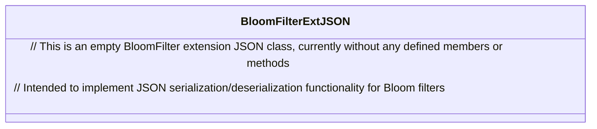

# Basic Information

|      |      |
|------|------|
| Name | BloomFilterExtJSON |
| Language | .java |
| Code Path | WeFe/common/java/common-data-mongodb/src/main/java/com/welab/wefe/common/data/mongodb/entity/union/ext/BloomFilterExtJSON.java |
| Package Name | com.welab.wefe.common.data.mongodb.entity.union.ext |
| Dependencies | [] |
| Brief Description | BloomFilterExtJSON is a public Java class that may be used to extend the JSON functionality of Bloom filters. |

# Description

BloomFilterExtJSON is a public Java class, currently implemented as an empty shell without any member variables or methods. The class name suggests it may be intended for extending JSON-related functionality of Bloom filters, but its specific purpose would need to be determined based on context or subsequent implementations. As a foundational class structure, it provides a framework for future functional extensions.

# Class Summary

| Name   | Type  | Description |
|-------|------|-------------|
| BloomFilterExtJSON | class | BloomFilterExtJSON is a public class designed to extend the JSON functionality of Bloom filters. |

## Class BloomFilterExtJSON

|      |      |
|------|------|
| Access Modifier | public |
| Type | class |
| Name | BloomFilterExtJSON |
| Description | BloomFilterExtJSON is a public class designed to extend the JSON functionality of Bloom filters. |

### UML Class Diagram

This class diagram presents an empty class structure named BloomFilterExtJSON. Judging by the class name, it may be designed to extend Bloom filter functionality, specifically for handling JSON-formatted data conversion. Currently, the class contains no fields or methods, but it may potentially include serialization/deserialization-related methods in the future to convert a Bloom filter's bit array and hash function configurations into JSON format or reconstruct Bloom filter states from JSON.

### Internal Method Call Graph

This flowchart depicts an empty class structure named BloomFilterExtJSON. Currently, this class does not contain any attributes or methods and exists solely as a class declaration. In subsequent development, core Bloom filter-related properties and methods can be added to this class, such as hash function sets, bit array operations, and other essential functionalities. The diagram shows the most basic class definition node, reserving structural space for future expansion.

### Field List

| Name  | Type  | Description |
|-------|-------|------|

### Method List

| Name  | Type  | Description |
|-------|-------|------|

