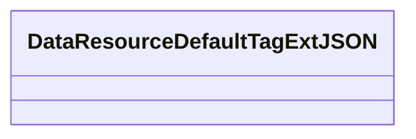
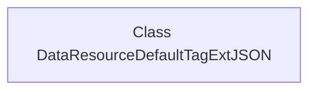

# Basic Information

|      |      |
|------|------|
| Name | DataResourceDefaultTagExtJSON |
| Language | .java |
| Code Path | WeFe/common/java/common-data-mongodb/src/main/java/com/welab/wefe/common/data/mongodb/entity/union/ext/DataResourceDefaultTagExtJSON.java |
| Package Name | com.welab.wefe.common.data.mongodb.entity.union.ext |
| Dependencies | [] |
| Brief Description | The class DataResourceDefaultTagExtJSON defines a JSON data structure for default tag extensions. |

# Description

The content defines a public Java class named DataResourceDefaultTagExtJSON. This class is currently empty, containing no member variables or methods, and exists solely as a basic class structure. Its naming suggests it may be related to default tag extension JSON processing for data resources, but specific functionality requires implementation in subsequent development.

# Class Summary

| Name   | Type  | Description |
|-------|------|-------------|
| DataResourceDefaultTagExtJSON | class | The class DataResourceDefaultTagExtJSON defines a JSON data structure for default tag extensions. |

## Class DataResourceDefaultTagExtJSON

|      |      |
|------|------|
| Access Modifier | public |
| Type | class |
| Name | DataResourceDefaultTagExtJSON |
| Description | The class DataResourceDefaultTagExtJSON defines a JSON data structure for default tag extensions. |

### UML Class Diagram

This class diagram depicts an empty class named DataResourceDefaultTagExtJSON, which currently does not define any member variables or methods. It serves as a basic class structure that can be extended in the future, potentially adding properties and behaviors related to default tag extensions for data resources. The class name suggests it may be associated with JSON-formatted data resource tag processing, though the current implementation does not provide specific functionality.

### Internal Method Call Graph

This flowchart depicts an empty class structure named DataResourceDefaultTagExtJSON. Since the class contains no attributes or methods, the diagram only displays the class name node. Such structures are typically used as base classes or placeholders, which can later extend functionality through inheritance or add member variables and methods. Empty classes are commonly employed in framework design for marking interfaces or serving as reserved extension points.

### Field List

| Name  | Type  | Description |
|-------|-------|------|

### Method List

| Name  | Type  | Description |
|-------|-------|------|

