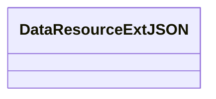

# Basic Information

|      |      |
|------|------|
| Name | DataResourceExtJSON |
| Language | .java |
| Code Path | WeFe/common/java/common-data-mongodb/src/main/java/com/welab/wefe/common/data/mongodb/entity/union/ext/DataResourceExtJSON.java |
| Package Name | com.welab.wefe.common.data.mongodb.entity.union.ext |
| Dependencies | [] |
| Brief Description | The class DataResourceExtJSON is used for processing JSON data resources. |

# Description

This is a public Java class definition named DataResourceExtJSON, currently an empty class containing no member variables or methods. The "ExtJSON" in the class name may suggest its functionality relates to JSON data extension processing, but its specific purpose requires determination within the full code context. The definition only provides the most basic class structure framework.

# Class Summary

| Name   | Type  | Description |
|-------|------|-------------|
| DataResourceExtJSON | class | DataResourceExtJSON is a public Java class designed for handling JSON data resources. |

## Class DataResourceExtJSON

|      |      |
|------|------|
| Access Modifier | public |
| Type | class |
| Name | DataResourceExtJSON |
| Description | DataResourceExtJSON is a public Java class designed for handling JSON data resources. |

### UML Class Diagram

This code defines an empty class named DataResourceExtJSON, which currently has no attributes or methods. Judging by the class name, it might be intended for handling JSON-formatted data resource extension functionalities, but the current implementation is empty and requires subsequent addition of specific features. The "Ext" in the class name could indicate that this is an extended version of some base class, though more contextual information is lacking.

### Internal Method Call Graph

This flowchart depicts an empty class structure named DataResourceExtJSON. The diagram contains only a single node representing the class declaration, without displaying any attributes or methods since the original code defines this class as empty. Such structures are typically used as base classes or placeholders, which can later be extended through inheritance or expansion to add specific functionalities. Empty classes are commonly employed in framework design for marking particular types or serving as extension points.

### Field List

| Name  | Type  | Description |
|-------|-------|------|

### Method List

| Name  | Type  | Description |
|-------|-------|------|

