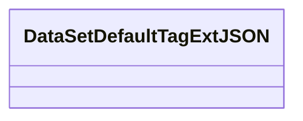
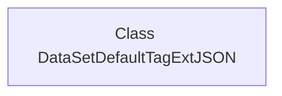

# Basic Information

|      |      |
|------|------|
| Name | DataSetDefaultTagExtJSON |
| Language | .java |
| Code Path | WeFe/common/java/common-data-mongodb/src/main/java/com/welab/wefe/common/data/mongodb/entity/union/ext/DataSetDefaultTagExtJSON.java |
| Package Name | com.welab.wefe.common.data.mongodb.entity.union.ext |
| Dependencies | [] |
| Brief Description | The class DataSetDefaultTagExtJSON is used for handling JSON extensions of dataset default tags. |

# Description

This is a public Java class named `DataSetDefaultTagExtJSON`, currently with an empty class body and no member variables or methods defined. The class may be intended for handling JSON data extension functionalities related to dataset default tags, but its specific purpose depends on the actual implementation. The class name follows camel case notation, adhering to Java naming conventions.

# Class Summary

| Name   | Type  | Description |
|-------|------|-------------|
| DataSetDefaultTagExtJSON | class | The class DataSetDefaultTagExtJSON is used for handling JSON operations related to default tag data. |

## Class DataSetDefaultTagExtJSON

|      |      |
|------|------|
| Access Modifier | public |
| Type | class |
| Name | DataSetDefaultTagExtJSON |
| Description | The class DataSetDefaultTagExtJSON is used for handling JSON operations related to default tag data. |

### UML Class Diagram

This class diagram depicts an empty class named DataSetDefaultTagExtJSON, currently without any attributes or methods. It serves as a foundational JSON processing class for dataset tag extensions, potentially designed to handle default tag extension functionalities related to datasets, though no concrete implementations exist yet. The class name suggests its association with JSON-formatted dataset tag extensions, likely forming part of a data processing system.

### Internal Method Call Graph

This code defines an empty class named `DataSetDefaultTagExtJSON` with no properties or methods. The flowchart contains only a single node representing the class declaration. Since the class body is empty, there are no internal structures or method call relationships to display. This is a basic class framework, potentially intended for future extension to handle JSON-related functionalities for data tagging.

### Field List

| Name  | Type  | Description |
|-------|-------|------|

### Method List

| Name  | Type  | Description |
|-------|-------|------|

