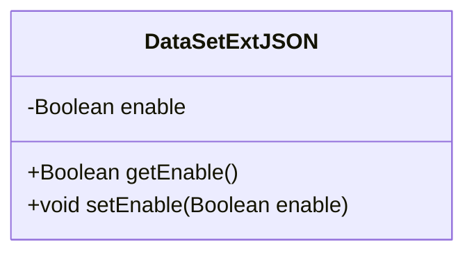
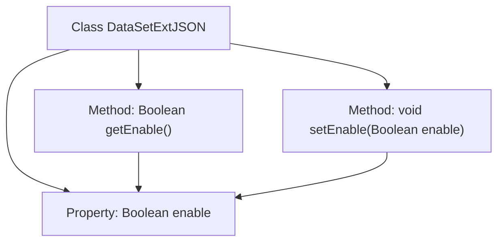

# Basic Information

|      |      |
|------|------|
| Name | DataSetExtJSON |
| Language | .java |
| Code Path | WeFe/common/java/common-data-mongodb/src/main/java/com/welab/wefe/common/data/mongodb/entity/union/ext/DataSetExtJSON.java |
| Package Name | com.welab.wefe.common.data.mongodb.entity.union.ext |
| Dependencies | [] |
| Brief Description | The DataSetExtJSON class contains a boolean property named enable along with its getter and setter methods. |

# Description

DataSetExtJSON is a Java class that contains a private boolean member variable named "enable," representing the enabled state. The class provides public methods getEnable and setEnable for retrieving and modifying the value of this variable.

# Class Summary

| Name   | Type  | Description |
|-------|------|-------------|
| DataSetExtJSON | class | The DataSetExtJSON class contains a boolean enable property along with its getter and setter methods. |

## Class DataSetExtJSON

|      |      |
|------|------|
| Access Modifier | public |
| Type | class |
| Name | DataSetExtJSON |
| Description | The DataSetExtJSON class contains a boolean enable property along with its getter and setter methods. |

### UML Class Diagram

This code defines a simple Java class named DataSetExtJSON, representing extended JSON configuration for a certain dataset. The class contains a private Boolean field 'enable', along with corresponding public getter and setter methods. The 'enable' field controls the activation status of dataset extension features, where the current status can be retrieved via getEnable() method and modified via setEnable() method. This is a typical data encapsulation class that complies with JavaBean specifications.

### Internal Method Call Graph

This code defines a simple Java class named DataSetExtJSON, containing a Boolean-type property 'enable' and corresponding getter/setter methods. The flowchart illustrates the basic structure of the class: the class serves as the root node, extending downward to property and method nodes, where both getEnable() and setEnable() methods operate on the 'enable' property. This is a typical data encapsulation class used for storing and accessing boolean configuration flags, commonly seen in configuration management or data transfer scenarios.

### Field List

| Name  | Type  | Description |
|-------|-------|------|
| enable | Boolean | Private boolean variable `enable`, used to control the feature toggle state. |

### Method List

| Name  | Type  | Description |
|-------|-------|------|
| getEnable | Boolean | Public method to obtain the enable boolean value. |
| setEnable | void | The method `setEnable` is used to set the boolean value of the `enable` property. |

