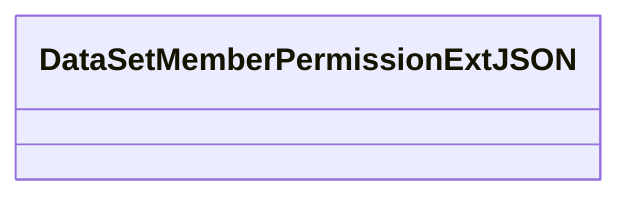
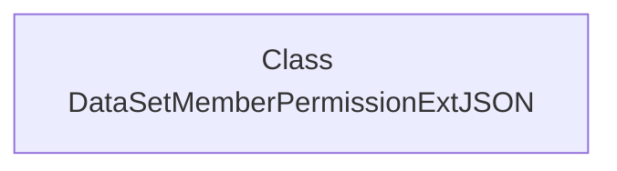

# Basic Information

|      |      |
|------|------|
| Name | DataSetMemberPermissionExtJSON |
| Language | .java |
| Code Path | WeFe/common/java/common-data-mongodb/src/main/java/com/welab/wefe/common/data/mongodb/entity/union/ext/DataSetMemberPermissionExtJSON.java |
| Package Name | com.welab.wefe.common.data.mongodb.entity.union.ext |
| Dependencies | [] |
| Brief Description | Class definition: DataSetMemberPermissionExtJSON, used for handling JSON data of dataset member permission extensions. |

# Description

This is a public Java class named `DataSetMemberPermissionExtJSON`, currently with an empty class body and no member variables or methods defined. The class may be intended for handling extended JSON data related to dataset member permissions, but its specific functionality depends on the subsequent implementation logic. The class name follows camel case notation, complying with Java naming conventions, and the suffix "ExtJSON" suggests its association with JSON data extension functionality.

# Class Summary

| Name   | Type  | Description |
|-------|------|-------------|
| DataSetMemberPermissionExtJSON | class | The class DataSetMemberPermissionExtJSON is used to define the JSON structure for dataset member permission extensions. |

## Class DataSetMemberPermissionExtJSON

|      |      |
|------|------|
| Access Modifier | public |
| Type | class |
| Name | DataSetMemberPermissionExtJSON |
| Description | The class DataSetMemberPermissionExtJSON is used to define the JSON structure for dataset member permission extensions. |

### UML Class Diagram

This class diagram describes an empty class named DataSetMemberPermissionExtJSON, which currently does not define any member variables or methods. Judging by the class name, this is likely a JSON-related class for handling extended dataset member permission information, but the current implementation is empty. It may potentially include properties and methods related to permission validation and data serialization/deserialization in the future. The "Ext" in the class name suggests this is an extended implementation of some base permission class, though specific implementation details are currently lacking.

### Internal Method Call Graph

This flowchart describes an empty class structure named DataSetMemberPermissionExtJSON. The class currently contains no attributes or methods, serving only as a framework. In the Mermaid diagram, we represent this class with a single node, without further internal structure or method call relationships. This design may be intended for future expansion of permission management features or as a base class for extending dataset member permission interfaces. The current implementation requires subsequent additions of specific business logic and member variables.

### Field List

| Name  | Type  | Description |
|-------|-------|------|

### Method List

| Name  | Type  | Description |
|-------|-------|------|

