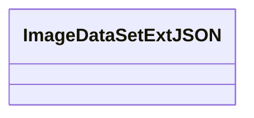

# Basic Information

|      |      |
|------|------|
| Name | ImageDataSetExtJSON |
| Language | .java |
| Code Path | WeFe/common/java/common-data-mongodb/src/main/java/com/welab/wefe/common/data/mongodb/entity/union/ext/ImageDataSetExtJSON.java |
| Package Name | com.welab.wefe.common.data.mongodb.entity.union.ext |
| Dependencies | [] |
| Brief Description | ImageDataSetExtJSON is a public class designed for handling JSON data related to image dataset extensions. |

# Description

This is a public Java class named ImageDataSetExtJSON, currently implemented as an empty class without any member variables or methods. The class name suggests it may be used for handling extended JSON-related functionalities of image datasets, but its specific purpose needs to be determined within the full code context. The class follows camel case naming conventions, complying with Java naming standards.

# Class Summary

| Name   | Type  | Description |
|-------|------|-------------|
| ImageDataSetExtJSON | class | ImageDataSetExtJSON is a public class designed for handling JSON data related to image dataset extensions. |

## Class ImageDataSetExtJSON

|      |      |
|------|------|
| Access Modifier | public |
| Type | class |
| Name | ImageDataSetExtJSON |
| Description | ImageDataSetExtJSON is a public class designed for handling JSON data related to image dataset extensions. |

### UML Class Diagram

This class diagram depicts an empty class named ImageDataSetExtJSON, which currently has no defined attributes or methods. Based on the class name, it might be intended for handling JSON extension functionalities related to image datasets, but the current implementation is empty and requires subsequent addition of specific feature implementations. The "ExtJSON" in the class name suggests that this class could be associated with data extension in JSON format.

### Internal Method Call Graph

This flowchart depicts an empty class structure named ImageDataSetExtJSON. The diagram contains only a single node representing the class declaration, with no attributes or method definitions. It illustrates the most basic class framework, serving as a foundational structure for future extensions. Since the current class body is empty, the flowchart merely reflects the class name identifier, with no internal members or method invocation relationships to display.

### Field List

| Name  | Type  | Description |
|-------|-------|------|

### Method List

| Name  | Type  | Description |
|-------|-------|------|

