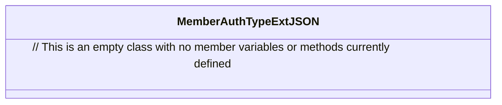

# Basic Information

|      |      |
|------|------|
| Name | MemberAuthTypeExtJSON |
| Language | .java |
| Code Path | WeFe/common/java/common-data-mongodb/src/main/java/com/welab/wefe/common/data/mongodb/entity/union/ext/MemberAuthTypeExtJSON.java |
| Package Name | com.welab.wefe.common.data.mongodb.entity.union.ext |
| Dependencies | [] |
| Brief Description | The class MemberAuthTypeExtJSON defines a public JSON extension class. |

# Description

The content defines a public Java class named MemberAuthTypeExtJSON, with an empty class body that does not contain any member variables or methods. The class name suggests it may be used for handling extended JSON data related to member authentication types, but its specific functionality will depend on subsequent implementation.

# Class Summary

| Name   | Type  | Description |
|-------|------|-------------|
| MemberAuthTypeExtJSON | class | MemberAuthTypeExtJSON is an empty public class that may be used to extend member authentication type-related functionalities. |

## Class MemberAuthTypeExtJSON

|      |      |
|------|------|
| Access Modifier | public |
| Type | class |
| Name | MemberAuthTypeExtJSON |
| Description | MemberAuthTypeExtJSON is an empty public class that may be used to extend member authentication type-related functionalities. |

### UML Class Diagram

This class diagram describes an empty class named MemberAuthTypeExtJSON, which currently contains no attributes or methods. Based on the class name, it may be intended for handling extended JSON data related to member authentication types, but its specific functionality would depend on the member variables and methods implemented later. The diagram follows standard UML notation, with a dashed box representing the class definition and the blank interior reflecting its current stateless condition, adhering to Mermaid syntax conventions.

### Internal Method Call Graph

This flowchart depicts the structure of an empty class named MemberAuthTypeExtJSON. The diagram contains only a single node, indicating that the class currently defines no attributes, constructors, or member methods. This represents the simplest possible class structure diagram, suitable for framework placeholders or class templates awaiting implementation. No connecting arrows are present in the diagram as there exist no internal invocation relationships or inheritance hierarchies.

### Field List

| Name  | Type  | Description |
|-------|-------|------|

### Method List

| Name  | Type  | Description |
|-------|-------|------|

