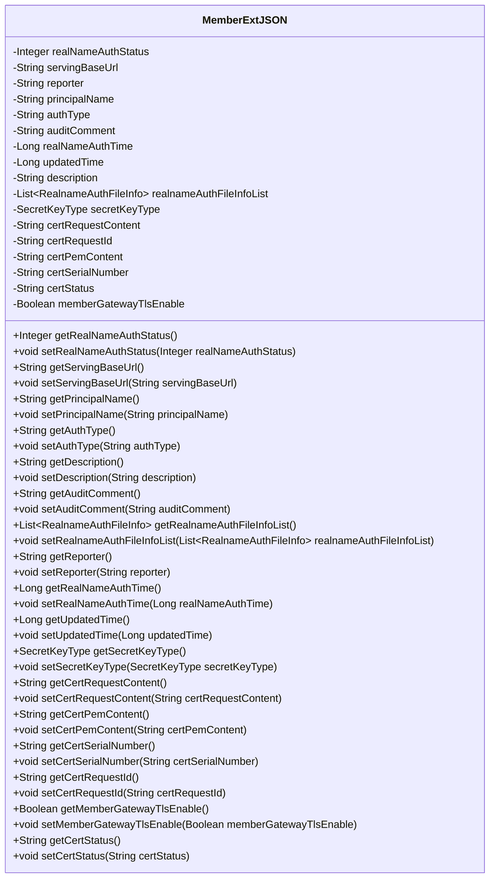

# Basic Information

|      |      |
|------|------|
| Name | MemberExtJSON |
| Language | .java |
| Code Path | WeFe/common/java/common-data-mongodb/src/main/java/com/welab/wefe/common/data/mongodb/entity/union/ext/MemberExtJSON.java |
| Package Name | com.welab.wefe.common.data.mongodb.entity.union.ext |
| Dependencies | ['com.welab.wefe.common.constant.SecretKeyType', 'java.util.List'] |
| Brief Description | The MemberExtJSON class contains fields such as member authentication status, service URLs, certificate information, and TLS communication switches, which are used to manage member authentication and certificate-related data. |

# Description

The MemberExtJSON class is a Java class designed for managing member extension information, encompassing fields such as real-name authentication status, service base URL, reporter, responsible person name, authentication type, review comments, authentication time, update time, and description. Additionally, it includes a list of real-name authentication files and key type information. Certificate-related fields consist of certificate request content, request ID, PEM content, serial number, status, and a flag indicating whether TLS communication is enabled. The class provides getter and setter methods for all fields to access and modify these attributes.

# Class Summary

| Name   | Type  | Description |
|-------|------|-------------|
| MemberExtJSON | class | The MemberExtJSON class contains fields such as member authentication status, service URLs, certificate information, and TLS switch, which are used to manage user authentication and certificate-related data. |

## Class MemberExtJSON

|      |      |
|------|------|
| Access Modifier | public |
| Type | class |
| Name | MemberExtJSON |
| Description | The MemberExtJSON class contains fields such as member authentication status, service URLs, certificate information, and TLS switch, which are used to manage user authentication and certificate-related data. |

### UML Class Diagram

This class diagram illustrates a member extension information class (MemberExtJSON), containing core fields such as real-name authentication status, serving base URL, reporter, principal name, authentication type, as well as certificate-related fields like certificate request content, certificate PEM content, and certificate serial number. The class provides complete getter and setter methods for managing member extension information, including real-name authentication, certificate management, and TLS communication configuration. Field types encompass primitive types, strings, lists, and custom enumeration types (SecretKeyType), reflecting the data encapsulation requirements of complex business objects.

### Internal Method Call Graph

This flowchart illustrates the complete structure of the `MemberExtJSON` class, including all its properties and methods. The class is primarily used for managing member extension information, encompassing attributes such as real-name authentication status, serving base URL, reporter, principal name, authentication type, audit comments, authentication time, update time, description, real-name authentication file information list, secret key type, as well as certificate-related fields like certificate request content, certificate request ID, certificate PEM content, certificate serial number, certificate status, and whether TLS communication is enabled. Each property has corresponding getter and setter methods for retrieving and setting property values.

### Field List

| Name  | Type  | Description |
|-------|-------|------|
| certSerialNumber | String | Declare a private string variable certSerialNumber. |
| authType | String | Declare a private string variable authType to store authentication type information. |
| reporter | String | Private string variable reporter. |
| servingBaseUrl | String | Private string variable storing the base URL of the service. |
| realNameAuthStatus | Integer | The field realNameAuthStatus indicates the real-name authentication status, with a data type of Integer. |
| description | String | Private string type variable description. |
| certPemContent | String | The private string variable certPemContent is used to store the certificate content in PEM format. |
| certRequestContent | String | The private string variable certRequestContent is used to store the certificate request content. |
| principalName | String | Declare a private string variable principalName. |
| certStatus | String | The private string variable certStatus is used to store certificate status information. |
| memberGatewayTlsEnable | Boolean | Member gateway TLS enabled status boolean variable. |
| auditComment | String | The private string variable auditComment is used to store audit comments. |
| realNameAuthTime | Long | The field `realNameAuthTime` is used to record the real-name authentication time, and its type is long integer. |
| realnameAuthFileInfoList | List<RealnameAuthFileInfo> | List of private real-name authentication document information. |
| updatedTime | Long | Private long variable updatedTime, used to record the update time. |
| certRequestId | String | The private string variable certRequestId is used to store the certificate request ID. |
| secretKeyType | SecretKeyType | The variable of private key type secretKeyType. |

### Method List

| Name  | Type  | Description |
|-------|-------|------|
| getCertSerialNumber | String | Methods to obtain the certificate serial number, returning a string-type variable `certSerialNumber`. |
| getDescription | String | Public method to retrieve descriptive information, returns the description content as a string. |
| getRealnameAuthFileInfoList | List<RealnameAuthFileInfo> | The method to retrieve the list of real-name authentication file information, which returns a list of type RealnameAuthFileInfo. |
| setCertPemContent | void | The method to set the certificate PEM content assigns the input string to the class member variable certPemContent. |
| getAuthType | String | Obtain the public method for authentication type, which returns the string authType. |
| setUpdatedTime | void | Method to set the object update time, with the parameter being a long integer timestamp. |
| setAuditComment | void | The method for setting audit comments involves assigning the parameter `auditComment` to the class's `auditComment` property. |
| setReporter | void | Set the reporter method to assign the input string to the reporter property of the class. |
| setServingBaseUrl | void | The method to set the service base URL assigns the input parameter to the class variable servingBaseUrl. |
| getPrincipalName | String | Get the string value of principalName. |
| setCertRequestContent | void | The method for setting certificate request content assigns the input parameters to the class member variable certRequestContent. |
| setSecretKeyType | void | The method for setting the key type assigns the passed-in secretKeyType to the secretKeyType property of the current object. |
| getRealNameAuthTime | Long | Method to obtain the real-name authentication time, with the return value being a long integer. |
| getServingBaseUrl | String | This is a Java method that returns the value of a string variable named servingBaseUrl. |
| getCertPemContent | String | Methods to obtain the PEM content of the certificate, returning the certPemContent string. |
| getSecretKeyType | SecretKeyType | The method returns the value of secretKeyType. |
| setPrincipalName | void | The method to set the principalName attribute assigns the input parameter to the member variable of the class. |
| setRealnameAuthFileInfoList | void | The method for setting the real-name authentication document information list, with the parameter being the document information list. |
| getAuditComment | String | Method to obtain audit comments, returns the auditComment string. |
| setRealNameAuthTime | void | Method for setting real-name authentication time, with the parameter being a long integer timestamp. |
| setCertSerialNumber | void | The method to set the certificate serial number assigns the input parameter to the class member variable certSerialNumber. |
| getCertRequestId | String | Methods to obtain the certificate request ID, returning a string-type variable certRequestId. |
| setCertRequestId | void | The method setCertRequestId is used to set the value of the certRequestId field, with the parameter being of string type. |
| getMemberGatewayTlsEnable | Boolean | Get the boolean value method for the TLS enable status of the member gateway. |
| setMemberGatewayTlsEnable | void | Method to set the member gateway TLS enable status, with the parameter being a boolean value. |
| getCertStatus | String | Methods to obtain certificate status, returns a certStatus string. |
| setCertStatus | void | Method for setting certificate status, which assigns the input string to the class member variable certStatus. |
| getUpdatedTime | Long | Get the long integer value of updatedTime. |
| setRealNameAuthStatus | void | Method to set the real-name authentication status, with the parameter being an integer status value. |
| getReporter | String | This is a Java method that returns a string variable named reporter. |
| setAuthType | void | The method to set the authentication type assigns the input parameter authType to the class member variable authType. |
| setDescription | void | This is a Java method used to set the description property of an object. The method takes a string parameter description and assigns it to the description field of the object. |
| getCertRequestContent | String | The method returns the certificate request content string. |
| getRealNameAuthStatus | Integer | Method to obtain real-name authentication status, returns an integer status value. |

