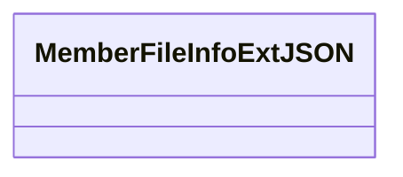

# Basic Information

|      |      |
|------|------|
| Name | MemberFileInfoExtJSON |
| Language | .java |
| Code Path | WeFe/common/java/common-data-mongodb/src/main/java/com/welab/wefe/common/data/mongodb/entity/union/ext/MemberFileInfoExtJSON.java |
| Package Name | com.welab.wefe.common.data.mongodb.entity.union.ext |
| Dependencies | [] |
| Brief Description | The class MemberFileInfoExtJSON is used to store extended JSON data of member file information. |

# Description

This is a public Java class named MemberFileInfoExtJSON, currently implemented as an empty class without any member variables or methods. The class name suggests it may be used for handling JSON data extension functionality related to member file information, but its specific purpose needs to be determined based on the context.

# Class Summary

| Name   | Type  | Description |
|-------|------|-------------|
| MemberFileInfoExtJSON | class | MemberFileInfoExtJSON is an empty public class, possibly used for extending member file information processing functionality. |

## Class MemberFileInfoExtJSON

|      |      |
|------|------|
| Access Modifier | public |
| Type | class |
| Name | MemberFileInfoExtJSON |
| Description | MemberFileInfoExtJSON is an empty public class, possibly used for extending member file information processing functionality. |

### UML Class Diagram

This class diagram illustrates an empty class structure named MemberFileInfoExtJSON. Currently, the class does not define any attributes or methods and serves only as a foundational framework. It can be extended in the future to handle JSON data operations related to member file information. Based on naming conventions, it is speculated that this class may be used to store or parse extended JSON information of member files, but its specific functionality will need to be clarified through subsequent code implementation.

### Internal Method Call Graph

This flowchart depicts an empty class structure named MemberFileInfoExtJSON. The diagram contains only a single node representing the class declaration, with no branches for attributes or methods since the current class body is empty. The diagram clearly reflects the current code state - this is a simple class definition without any implemented functionality, which can serve as a base class for future extension or as a placeholder class.

### Field List

| Name  | Type  | Description |
|-------|-------|------|

### Method List

| Name  | Type  | Description |
|-------|-------|------|

