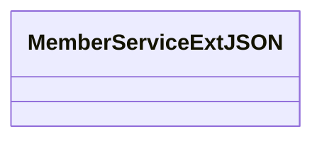

# Basic Information

|      |      |
|------|------|
| Name | MemberServiceExtJSON |
| Language | .java |
| Code Path | WeFe/common/java/common-data-mongodb/src/main/java/com/welab/wefe/common/data/mongodb/entity/union/ext/MemberServiceExtJSON.java |
| Package Name | com.welab.wefe.common.data.mongodb.entity.union.ext |
| Dependencies | [] |
| Brief Description | MemberServiceExtJSON is an empty public class. |

# Description

MemberServiceExtJSON is a public Java class, currently implemented as empty without containing any member variables or methods. The naming of this class suggests it may be intended for handling JSON data extension functionalities related to member services, but its specific purpose requires further contextual analysis. The "Ext" in the class name implies that this is an extended implementation of some base member service class.

# Class Summary

| Name   | Type  | Description |
|-------|------|-------------|
| MemberServiceExtJSON | class | MemberServiceExtJSON is a public Java class designed to extend member service functionalities. |

## Class MemberServiceExtJSON

|      |      |
|------|------|
| Access Modifier | public |
| Type | class |
| Name | MemberServiceExtJSON |
| Description | MemberServiceExtJSON is a public Java class designed to extend member service functionalities. |

### UML Class Diagram

This class diagram displays an empty class structure named `MemberServiceExtJSON`. Currently, the class has not defined any member variables or methods, serving as a foundational framework class potentially intended for extending JSON-related member service functionalities. Based on the class name, it can be inferred that this class may involve the extension and processing of JSON data for member services, but further implementation of specific business logic is required.

### Internal Method Call Graph

This flowchart depicts an empty class structure named MemberServiceExtJSON. Since the class currently has no attributes, methods, or constructors, the diagram only contains a single node representing the class itself. This serves as a foundational framework, where member variables, methods, and other elements can be added later based on actual requirements to extend functionality. The current structure provides a clear starting point for subsequent development, adhering to the definition standards of classes in object-oriented programming.

### Field List

| Name  | Type  | Description |
|-------|-------|------|

### Method List

| Name  | Type  | Description |
|-------|-------|------|

