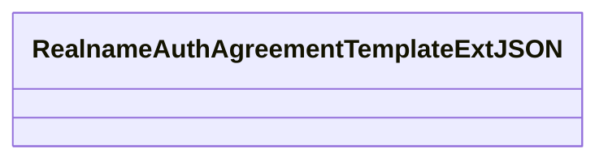
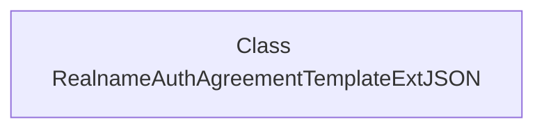

# Basic Information

|      |      |
|------|------|
| Name | RealnameAuthAgreementTemplateExtJSON |
| Language | .java |
| Code Path | WeFe/common/java/common-data-mongodb/src/main/java/com/welab/wefe/common/data/mongodb/entity/union/ext/RealnameAuthAgreementTemplateExtJSON.java |
| Package Name | com.welab.wefe.common.data.mongodb.entity.union.ext |
| Dependencies | [] |
| Brief Description | The class RealnameAuthAgreementTemplateExtJSON is used for real-name authentication agreement template extended JSON data. |

# Description

The content defines a public Java class named `RealnameAuthAgreementTemplateExtJSON`, which currently has an empty class body and contains no member variables or methods. The class name suggests it may be used for extended JSON data processing related to real-name authentication agreement templates, but its specific functionality requires subsequent implementation. The class follows camel case naming conventions, complies with Java naming standards, and the `public` modifier indicates it can be accessed by other classes.

# Class Summary

| Name   | Type  | Description |
|-------|------|-------------|
| RealnameAuthAgreementTemplateExtJSON | class | The class RealnameAuthAgreementTemplateExtJSON is used for real-name authentication agreement template extended JSON data. |

## Class RealnameAuthAgreementTemplateExtJSON

|      |      |
|------|------|
| Access Modifier | public |
| Type | class |
| Name | RealnameAuthAgreementTemplateExtJSON |
| Description | The class RealnameAuthAgreementTemplateExtJSON is used for real-name authentication agreement template extended JSON data. |

### UML Class Diagram

This class diagram describes an empty class named RealnameAuthAgreementTemplateExtJSON, which may be used to handle JSON extension data for real-name authentication agreement templates. The current class does not define any attributes or methods, indicating it could be a base class or data container awaiting implementation, with JSON processing functionalities related to real-name authentication agreement templates to be added based on business requirements. The "ExtJSON" in the class name suggests it may extend standard JSON processing capabilities.

### Internal Method Call Graph

This code defines an empty class named `RealnameAuthAgreementTemplateExtJSON`, which currently contains no attributes or methods. Based on the class name, it may be intended for handling JSON extension data of real-name authentication agreement templates, but currently serves only as a placeholder requiring subsequent implementation logic. The class name suggests its functionality could be related to identity verification, agreement templates, and JSON data format processing.

### Field List

| Name  | Type  | Description |
|-------|-------|------|

### Method List

| Name  | Type  | Description |
|-------|-------|------|

