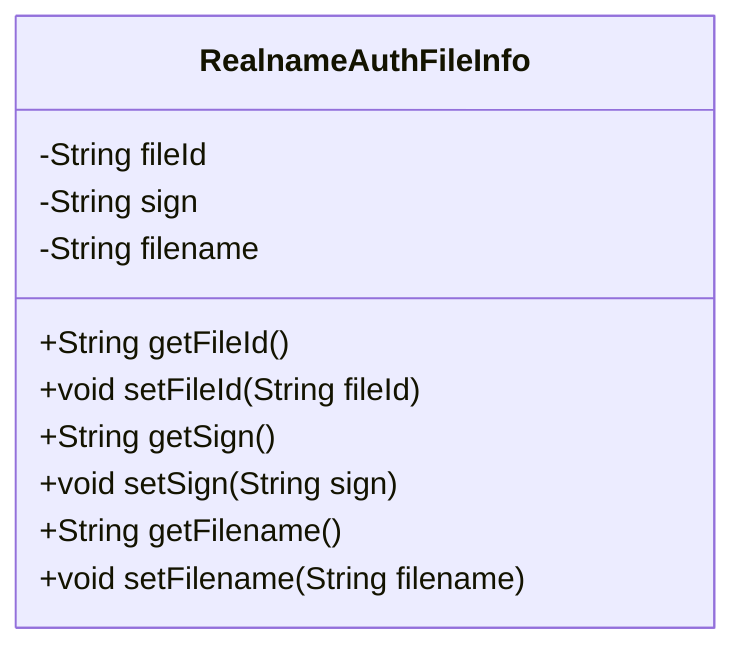
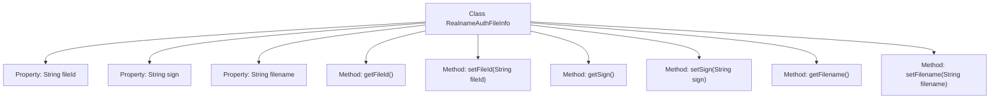

# Basic Information

|      |      |
|------|------|
| Name | RealnameAuthFileInfo |
| Language | .java |
| Code Path | WeFe/common/java/common-data-mongodb/src/main/java/com/welab/wefe/common/data/mongodb/entity/union/ext/RealnameAuthFileInfo.java |
| Package Name | com.welab.wefe.common.data.mongodb.entity.union.ext |
| Dependencies | [] |
| Brief Description | The RealnameAuthFileInfo class contains file ID, signature, and file name attributes, providing getter and setter methods. |

# Description

The RealnameAuthFileInfo class is a Java class used to store real-name authentication file information, containing three private string attributes: fileId represents the unique identifier of the file, sign represents the file signature, and filename represents the file name. The class provides corresponding getter and setter methods for each attribute to retrieve and set the attribute values.

# Class Summary

| Name   | Type  | Description |
|-------|------|-------------|
| RealnameAuthFileInfo | class | The Java class RealnameAuthFileInfo contains attributes such as file ID, signature, and file name, along with their corresponding getter and setter methods. |

## Class RealnameAuthFileInfo

|      |      |
|------|------|
| Access Modifier | public |
| Type | class |
| Name | RealnameAuthFileInfo |
| Description | The Java class RealnameAuthFileInfo contains attributes such as file ID, signature, and file name, along with their corresponding getter and setter methods. |

### UML Class Diagram

This code defines a class named RealnameAuthFileInfo, which is used to store information related to real-name authentication files. The class contains three private attributes: fileId (file ID), sign (signature), and filename (file name), along with corresponding getter and setter methods for each attribute. This class is primarily designed to encapsulate file information uploaded during the real-name authentication process, facilitating the transfer and processing of such data within the system.

### Internal Method Call Graph

This flowchart illustrates the structure of the RealnameAuthFileInfo class, which contains three private String properties (fileId, sign, filename) and their corresponding getter and setter methods. Each property has independent method pairs for read/write operations, forming a typical JavaBean pattern. The class encapsulates property access through methods, adhering to object-oriented design principles, making it suitable for scenarios requiring controlled property access such as file authentication information management.

### Field List

| Name  | Type  | Description |
|-------|-------|------|
| filename | String | The private string variable `filename` is used to store the file name. |
| fileId | String | The private string variable fileId is used to store the file identifier. |
| sign | String | Private string variable sign |

### Method List

| Name  | Type  | Description |
|-------|-------|------|
| getFilename | String | This is a Java method that returns the value of the string variable `filename`. |
| setSign | void | This is a Java method used to set the value of the sign attribute in a class. The method takes a string parameter named sign and assigns it to the member variable this.sign of the class. |
| setFilename | void | Methods for setting the filename, assigning the input string to the filename variable of the class. |
| getFileId | String | Methods to obtain the file ID, returning a fileId string. |
| setFileId | void | Methods for setting the file ID: Assign the input parameter fileId to the fileId property of the current object. |
| getSign | String | Common methods for obtaining the sign value. |

