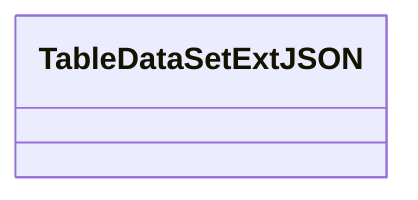
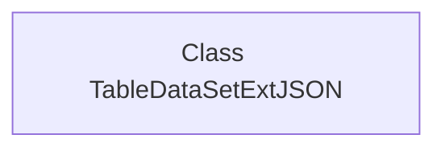

# Basic Information

|      |      |
|------|------|
| Name | TableDataSetExtJSON |
| Language | .java |
| Code Path | WeFe/common/java/common-data-mongodb/src/main/java/com/welab/wefe/common/data/mongodb/entity/union/ext/TableDataSetExtJSON.java |
| Package Name | com.welab.wefe.common.data.mongodb.entity.union.ext |
| Dependencies | [] |
| Brief Description | The class TableDataSetExtJSON is used for extended processing of JSON datasets. |

# Description

This is a public Java class named TableDataSetExtJSON, currently implemented as an empty class without any member variables or methods. The class name suggests its functionality might be related to JSON extension processing for table datasets, but its specific purpose requires further analysis within the complete code context.

# Class Summary

| Name   | Type  | Description |
|-------|------|-------------|
| TableDataSetExtJSON | class | The class TableDataSetExtJSON is an empty public class used for JSON data processing. |

## Class TableDataSetExtJSON

|      |      |
|------|------|
| Access Modifier | public |
| Type | class |
| Name | TableDataSetExtJSON |
| Description | The class TableDataSetExtJSON is an empty public class used for JSON data processing. |

### UML Class Diagram

This class diagram illustrates an empty class structure named TableDataSetExtJSON. Currently, the class does not define any attributes or methods, serving solely as a framework, potentially intended for future extension of JSON data processing capabilities. Such foundational class designs are commonly found in system architectures requiring预留扩展点, providing a basic container for adding table data and JSON format conversion functionalities later. The "Ext" suffix in the class name implies its extensible nature, while "JSON" indicates its association with data serialization.

### Internal Method Call Graph

This flowchart depicts an empty class structure named TableDataSetExtJSON. Since the class does not define any attributes or methods, the flowchart contains only a single node representing the class itself. Such a basic structure typically serves as an extension point or placeholder class, which can later be implemented with specific functionality by adding fields and methods. The current diagram clearly and concisely reflects the initial state of the class.

### Field List

| Name  | Type  | Description |
|-------|-------|------|

### Method List

| Name  | Type  | Description |
|-------|-------|------|

