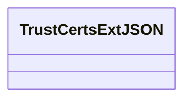
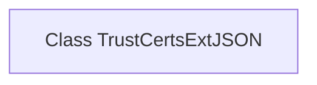

# Basic Information

|      |      |
|------|------|
| Name | TrustCertsExtJSON |
| Language | .java |
| Code Path | WeFe/common/java/common-data-mongodb/src/main/java/com/welab/wefe/common/data/mongodb/entity/union/ext/TrustCertsExtJSON.java |
| Package Name | com.welab.wefe.common.data.mongodb.entity.union.ext |
| Dependencies | [] |
| Brief Description | TrustCertsExtJSON is a public Java class designed for processing trust certificate extension JSON data. |

# Description

TrustCertsExtJSON is a public Java class designed for handling extended JSON data related to trust certificates. Currently, this class is empty and does not contain any methods or attributes, potentially reserved as foundational infrastructure for frameworks or systems, with future extensibility to implement certificate validation, parsing, or management functionalities. Its naming indicates a focus on JSON format extension operations for certificate trust chains.

# Class Summary

| Name   | Type  | Description |
|-------|------|-------------|
| TrustCertsExtJSON | class | The class `TrustCertsExtJSON` defines a public class used for handling trust certificate extension JSON data. |

## Class TrustCertsExtJSON

|      |      |
|------|------|
| Access Modifier | public |
| Type | class |
| Name | TrustCertsExtJSON |
| Description | The class `TrustCertsExtJSON` defines a public class used for handling trust certificate extension JSON data. |

### UML Class Diagram

This code defines an empty class named TrustCertsExtJSON with no member variables or methods. Judging by the class name, it might be related to trust certificate extension JSON, but the current implementation is empty, possibly serving as a placeholder for future features or requiring subsequent development to fill in specific logic. The class diagram only displays an empty class structure without any attributes or methods, which can later be extended with certificate parsing, validation, and other relevant functionalities based on actual requirements.

### Internal Method Call Graph

This flowchart describes an empty class structure named TrustCertsExtJSON. The diagram contains only a single node representing the class itself, without any attributes or methods. This is a foundational framework class, potentially intended for future extension of certificate trust-related functionalities. The current design indicates it is a placeholder class that may later incorporate modules for certificate validation, trust management, and other related features.

### Field List

| Name  | Type  | Description |
|-------|-------|------|

### Method List

| Name  | Type  | Description |
|-------|-------|------|

