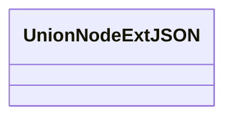

# Basic Information

|      |      |
|------|------|
| Name | UnionNodeExtJSON |
| Language | .java |
| Code Path | WeFe/common/java/common-data-mongodb/src/main/java/com/welab/wefe/common/data/mongodb/entity/union/ext/UnionNodeExtJSON.java |
| Package Name | com.welab.wefe.common.data.mongodb.entity.union.ext |
| Dependencies | [] |
| Brief Description | UnionNodeExtJSON is an empty public class. |

# Description

UnionNodeExtJSON is an empty public class that does not contain any member variables or methods, existing solely as a class definition.

# Class Summary

| Name   | Type  | Description |
|-------|------|-------------|
| UnionNodeExtJSON | class | UnionNodeExtJSON is an empty public class. |

## Class UnionNodeExtJSON

|      |      |
|------|------|
| Access Modifier | public |
| Type | class |
| Name | UnionNodeExtJSON |
| Description | UnionNodeExtJSON is an empty public class. |

### UML Class Diagram

This code defines an empty class named UnionNodeExtJSON, which currently has no member variables or methods. It is a simple class structure that can serve as a foundation or placeholder for more complex classes. In the class diagram, we clearly illustrate the structure of this empty class, adhering to Mermaid syntax specifications. According to coding conventions, we use minus signs to denote private members and plus signs for public members, but currently, there are no members in this class that require such notation. This class diagram can be progressively refined as the class's functionality expands.

### Internal Method Call Graph

This flowchart depicts an empty class structure named `UnionNodeExtJSON`. Since the class does not define any attributes or methods, the diagram contains only a single node representing the class itself. The diagram demonstrates the most basic form of class declaration, serving as a foundational framework for future extensions. When member variables or methods are added, the flowchart can be further expanded following standard formatting conventions.

### Field List

| Name  | Type  | Description |
|-------|-------|------|

### Method List

| Name  | Type  | Description |
|-------|-------|------|

