# Basic Information

|      |      |
|------|------|
| Name | ext |
| Language | .java |
| Code Path | WeFe/common/java/common-data-mongodb/src/main/java/com/welab/wefe/common/data/mongodb/entity/union/ext |
| Package Name | docs.common.java.common-data-mongodb.src.main.java.com.welab.wefe.common.data.mongodb.entity.union.ext |
| Brief Description | Multiple Java extension JSON processing classes, mostly empty implementations with functionality to be determined. MemberExtJSON contains member information fields and methods, while DataSetExtJSON has an enable attribute. RealnameAuthFileInfo stores file information. |

# Description

## Overview  
This module is a collection of Java classes designed for handling extended JSON data, with its core responsibility being to provide a structural framework for extending JSON data across various business entities (such as datasets, member services, real-name authentication, etc.). The interface specifications uniformly adopt empty classes or basic field definitions. For example, `MemberExtJSON` includes fields like real-name authentication status, while `DataSetExtJSON` only contains a boolean `enable` flag. Key data structures include real-name authentication file information (`RealnameAuthFileInfo`) and member extension information (`MemberExtJSON`). External dependencies are limited to the Java standard library and the MongoDB entity layer. For instance, `RealnameAuthFileInfo` manages metadata such as file IDs, resembling a file metadata storage pattern.  

## Primary Business Scenarios  
The module supports multi-type data extension management in federated learning scenarios, such as image datasets (`ImageDataSetExtJSON`), tabular data (`TableDataSetExtJSON`), and trust certificates (`TrustCertsExtJSON`). The interaction mode accesses extended properties via getter/setter methods, with `MemberExtJSON` managing sensitive data like certificate requests. Functional completeness is reflected in its coverage of data resources, member services, and authentication processes. For example, `DataSetDefaultTagExtJSON` handles label extensions. Typical applications include member real-name authentication (`RealnameAuthAgreementTemplateExtJSON`) and data permission control (`DataSetMemberPermissionExtJSON`). All API types are POJO extension classes, with integration cases resembling data structure extension solutions in configuration centers.

### Package Internal Structure View

```mermaid
graph TD
    ext --> DataSetDefaultTagExtJSON.java
    ext --> MemberServiceExtJSON.java
    ext --> MemberAuthTypeExtJSON.java
    ext --> TableDataSetExtJSON.java
    ext --> RealnameAuthAgreementTemplateExtJSON.java
    ext --> BloomFilterExtJSON.java
    ext --> MemberExtJSON.java
    ext --> DataSetMemberPermissionExtJSON.java
    ext --> ImageDataSetExtJSON.java
    ext --> UnionNodeExtJSON.java
    ext --> RealnameAuthFileInfo.java
    ext --> MemberFileInfoExtJSON.java
    ext --> DataResourceDefaultTagExtJSON.java
    ext --> DataResourceExtJSON.java
    ext --> TrustCertsExtJSON.java
    ext --> DataSetExtJSON.java
```

This flowchart illustrates 17 Java entity class files under the union/ext directory of the common-data-mongodb module in the WeFe project. All files are directly subordinate to the ext node, representing JSON extension entities for various business scenarios, including dataset tags, member services, real-name authentication agreement templates, and other types of business entity extensions.

# File List

| Name   | Type  | Description |
|-------|------|-------------|
| [DataSetDefaultTagExtJSON.java](DataSetDefaultTagExtJSON.md) | file | The class `DataSetDefaultTagExtJSON` is used for handling JSON extensions of dataset default tags. |
| [MemberServiceExtJSON.java](MemberServiceExtJSON.md) | file | MemberServiceExtJSON is an empty public class. |
| [MemberAuthTypeExtJSON.java](MemberAuthTypeExtJSON.md) | file | The class MemberAuthTypeExtJSON defines a public JSON extension class. |
| [TableDataSetExtJSON.java](TableDataSetExtJSON.md) | file | The class TableDataSetExtJSON is used for extended processing of JSON datasets. |
| [RealnameAuthAgreementTemplateExtJSON.java](RealnameAuthAgreementTemplateExtJSON.md) | file | The class RealnameAuthAgreementTemplateExtJSON is used for real-name authentication agreement template extended JSON data. |
| [BloomFilterExtJSON.java](BloomFilterExtJSON.md) | file | BloomFilterExtJSON is a public Java class that may be used to extend the JSON functionality of Bloom filters. |
| [MemberExtJSON.java](MemberExtJSON.md) | file | The MemberExtJSON class contains fields such as member authentication status, service URL, certificate information, and TLS communication switch, which are used to manage member authentication and certificate-related data. |
| [DataSetMemberPermissionExtJSON.java](DataSetMemberPermissionExtJSON.md) | file | Class Definition: DataSetMemberPermissionExtJSON, used for handling JSON data related to dataset member permission extensions. |
| [ImageDataSetExtJSON.java](ImageDataSetExtJSON.md) | file | ImageDataSetExtJSON is a public class designed for handling JSON data related to image dataset extensions. |
| [UnionNodeExtJSON.java](UnionNodeExtJSON.md) | file | UnionNodeExtJSON is an empty public class. |
| [RealnameAuthFileInfo.java](RealnameAuthFileInfo.md) | file | The RealnameAuthFileInfo class contains attributes such as file ID, signature, and file name, providing getter and setter methods. |
| [MemberFileInfoExtJSON.java](MemberFileInfoExtJSON.md) | file | The class MemberFileInfoExtJSON is used to store extended JSON data of member file information. |
| [DataResourceDefaultTagExtJSON.java](DataResourceDefaultTagExtJSON.md) | file | The class DataResourceDefaultTagExtJSON defines a JSON data structure for default tag extensions. |
| [DataResourceExtJSON.java](DataResourceExtJSON.md) | file | The class DataResourceExtJSON is used for handling JSON data resources. |
| [TrustCertsExtJSON.java](TrustCertsExtJSON.md) | file | TrustCertsExtJSON is a public Java class designed for processing trust certificate extension JSON data. |
| [DataSetExtJSON.java](DataSetExtJSON.md) | file | The DataSetExtJSON class contains a boolean property named enable along with its getter and setter methods. |

