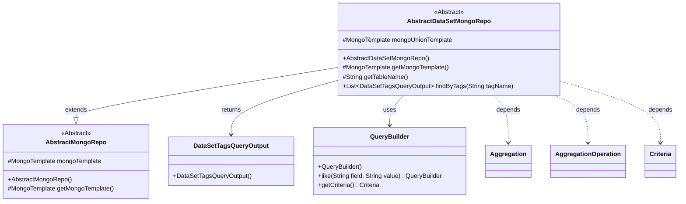
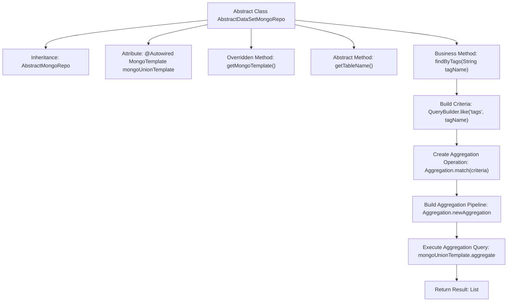

# Basic Information

|      |      |
|------|------|
| Name | AbstractDataSetMongoRepo |
| Language | .java |
| Code Path | WeFe/common/java/common-data-mongodb/src/main/java/com/welab/wefe/common/data/mongodb/repo/AbstractDataSetMongoRepo.java |
| Package Name | com.welab.wefe.common.data.mongodb.repo |
| Dependencies | ['com.welab.wefe.common.data.mongodb.dto.dataset.DataSetTagsQueryOutput', 'com.welab.wefe.common.data.mongodb.util.QueryBuilder', 'org.springframework.beans.factory.annotation.Autowired', 'org.springframework.data.domain.Sort', 'org.springframework.data.mongodb.core.MongoTemplate', 'org.springframework.data.mongodb.core.aggregation.Aggregation', 'org.springframework.data.mongodb.core.aggregation.AggregationOperation', 'org.springframework.data.mongodb.core.query.Criteria', 'java.util.List'] |
| Brief Description | The abstract class AbstractDataSetMongoRepo extends AbstractMongoRepo and uses MongoTemplate for aggregation queries, retrieving and counting dataset tag results by tag name. |

# Description

This is an abstract class named AbstractDataSetMongoRepo, which inherits from AbstractMongoRepo. It utilizes MongoTemplate for database operations, with an instance named mongoUnionTemplate injected via @Autowired. The class includes an abstract method getTableName() for retrieving the table name, as well as a concrete method findByTags(). The latter queries data by tag names, employing aggregation operations for matching, grouping, sorting, and projection, ultimately returning a list result of type DataSetTagsQueryOutput.

# Class Summary

| Name   | Type  | Description |
|-------|------|-------------|
| AbstractDataSetMongoRepo | class | The abstract class AbstractDataSetMongoRepo extends AbstractMongoRepo, uses MongoTemplate to query data, aggregates and counts tags by their names, and returns the results in descending order. |

## Class AbstractDataSetMongoRepo

|      |      |
|------|------|
| Access Modifier | public abstract |
| Type | class |
| Name | AbstractDataSetMongoRepo |
| Description | The abstract class AbstractDataSetMongoRepo extends AbstractMongoRepo, uses MongoTemplate to query data, aggregates and counts tags by their names, and returns the results in descending order. |

### UML Class Diagram

This code demonstrates an abstract class `AbstractDataSetMongoRepo`, which inherits from `AbstractMongoRepo` and is primarily used for handling MongoDB dataset tag queries. The class contains a core method `findByTags` that constructs aggregation queries (using `QueryBuilder` to generate conditions and `Aggregation` to build pipeline operations) to count tag frequencies and returns a list of `DataSetTagsQueryOutput` type results. The class diagram clearly presents the inheritance relationships, dependent components, and return types, reflecting the repository class's encapsulated usage of the MongoDB aggregation framework.

### Internal Method Call Graph

This flowchart illustrates the core structure and workflow of the AbstractDataSetMongoRepo abstract class. The class inherits from AbstractMongoRepo and implements tag retrieval functionality through aggregation queries. The main process includes: injecting MongoTemplate, constructing query conditions, creating an aggregation pipeline (containing match/group/sort/projection operations), executing the aggregation query, and mapping results. The getTableName() abstract method requires subclass implementation, demonstrating the application of the Template Method design pattern.

### Field List

| Name  | Type  | Description |
|-------|-------|------|
| mongoUnionTemplate | MongoTemplate | Use @Autowired to automatically inject the MongoTemplate instance mongoUnionTemplate. |

### Method List

| Name  | Type  | Description |
|-------|-------|------|
| getMongoTemplate | MongoTemplate | Rewrite the getMongoTemplate method to return a mongoUnionTemplate instance. |
| getTableName | String | Abstract method, returns the table name string. |
| findByTags | List<DataSetTagsQueryOutput> | This method uses MongoDB aggregation queries to perform fuzzy matching on dataset tags based on tag names, groups and counts them by tag, sorts the results in descending order, and returns a list of tags along with their corresponding counts. |

