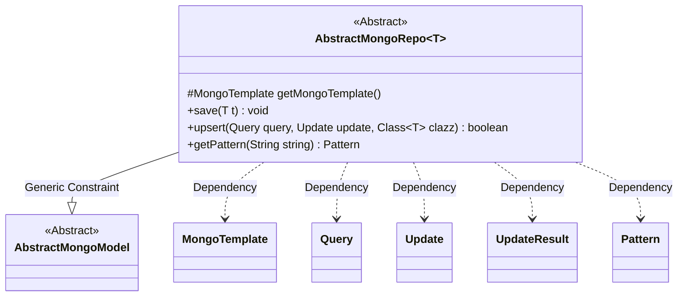
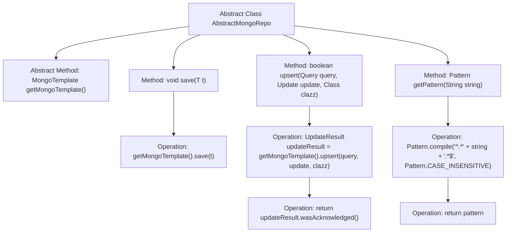

# Basic Information

|      |      |
|------|------|
| Name | AbstractMongoRepo |
| Language | .java |
| Code Path | WeFe/common/java/common-data-mongodb/src/main/java/com/welab/wefe/common/data/mongodb/repo/AbstractMongoRepo.java |
| Package Name | com.welab.wefe.common.data.mongodb.repo |
| Dependencies | ['com.mongodb.client.result.UpdateResult', 'com.welab.wefe.common.data.mongodb.entity.base.AbstractMongoModel', 'org.springframework.data.mongodb.core.MongoTemplate', 'org.springframework.data.mongodb.core.query.Query', 'org.springframework.data.mongodb.core.query.Update', 'java.util.regex.Pattern'] |
| Brief Description | Abstract MongoDB repository class, providing save, upsert, and fuzzy query methods, requires subclass implementation of template retrieval. |

# Description

This is an abstract class AbstractMongoRepo designed for operating MongoDB databases. It defines an abstract method to obtain MongoTemplate and provides functionality for saving entities and performing upsert operations. The save method is used to persist entity objects, while the upsert method executes update or insert operations and returns whether they succeeded. It also includes a helper method getPattern for generating case-insensitive fuzzy query regex patterns. The class uses generic type T constrained to subclasses of AbstractMongoModel.

# Class Summary

| Name   | Type  | Description |
|-------|------|-------------|
| AbstractMongoRepo | class | Abstract MongoDB repository class, providing save, upsert operations, and case-insensitive fuzzy query methods. Requires subclass implementation to obtain MongoTemplate. |

## Class AbstractMongoRepo

|      |      |
|------|------|
| Access Modifier | public abstract |
| Type | class |
| Name | AbstractMongoRepo |
| Description | Abstract MongoDB repository class, providing save, upsert operations, and case-insensitive fuzzy query methods. Requires subclass implementation to obtain MongoTemplate. |

### UML Class Diagram

This class diagram illustrates an abstract MongoDB repository class `AbstractMongoRepo`, which is generically constrained to subclasses of `AbstractMongoModel` through type parameter `T`. Its core functionalities include document saving, upsert operations, and fuzzy query pattern generation, relying on Spring Data MongoDB's `MongoTemplate` for database interactions. The class defines an abstract method for obtaining the template, to be implemented by concrete subclasses, reflecting the design philosophy of the Template Method pattern.

### Internal Method Call Graph

This code represents an abstract base class for MongoDB data access layer, providing core CRUD operations and utility methods. The flowchart illustrates the class structure containing 1 abstract method and 3 concrete methods, where save() performs document storage, upsert() implements update/insert and returns operation status, and getPattern() generates regular expressions for fuzzy queries. All database operations are executed through the template instance obtained via getMongoTemplate(), demonstrating the Template Method design pattern.

### Field List

| Name  | Type  | Description |
|-------|-------|------|

### Method List

| Name  | Type  | Description |
|-------|-------|------|
| save | void | This method is used to save an object to the MongoDB database by invoking the save method of MongoTemplate to achieve persistence. |
| getMongoTemplate | MongoTemplate | Abstract method that returns a MongoTemplate instance. |
| upsert | boolean | The Java method `upsert` performs an update or insert operation using MongoTemplate and returns whether the operation was acknowledged. |
| getPattern | Pattern | The method accepts a string parameter, compiles and generates a case-insensitive regular expression pattern that matches the input string with any preceding or following characters. |

