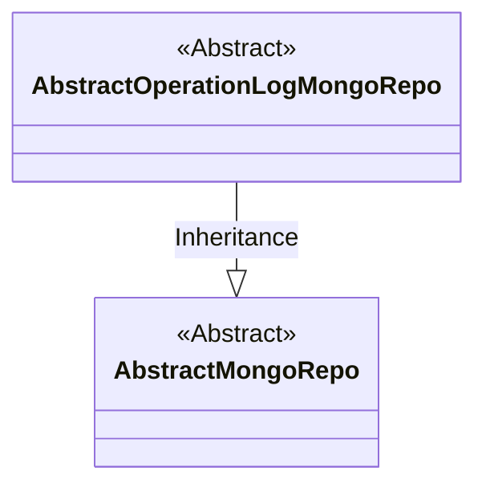
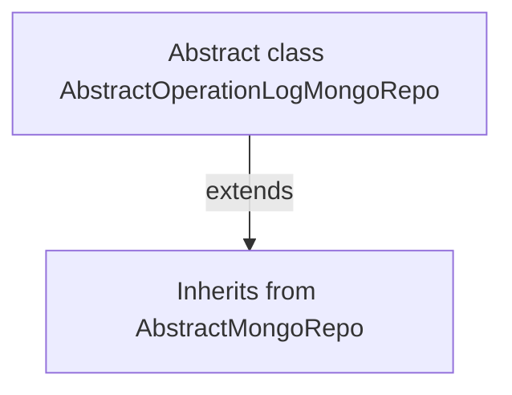

# Basic Information

|      |      |
|------|------|
| Name | AbstractOperationLogMongoRepo |
| Language | .java |
| Code Path | WeFe/common/java/common-data-mongodb/src/main/java/com/welab/wefe/common/data/mongodb/repo/AbstractOperationLogMongoRepo.java |
| Package Name | com.welab.wefe.common.data.mongodb.repo |
| Dependencies | [] |
| Brief Description | The abstract class AbstractOperationLogMongoRepo extends AbstractMongoRepo and is used for MongoDB storage of operation logs. |

# Description

This is an abstract class named AbstractOperationLogMongoRepo, which inherits from the AbstractMongoRepo class. It is used for MongoDB database operations related to logs, serving as the base class for other specific log operation classes. Being an abstract class, it cannot be directly instantiated and requires subclasses to implement specific functionalities. The class definition does not include any concrete methods or attributes, with its primary purpose being to provide a foundational framework structure.

# Class Summary

| Name   | Type  | Description |
|-------|------|-------------|
| AbstractOperationLogMongoRepo | class | Abstract MongoDB operation log repository base class, inheriting from AbstractMongoRepo. |

## Class AbstractOperationLogMongoRepo

|      |      |
|------|------|
| Access Modifier | public abstract |
| Type | class |
| Name | AbstractOperationLogMongoRepo |
| Description | Abstract MongoDB operation log repository base class, inheriting from AbstractMongoRepo. |

### UML Class Diagram

This class diagram illustrates an abstract inheritance structure of MongoDB repositories. The `AbstractOperationLogMongoRepo`, serving as an abstract repository class for operation logs, inherits from the base abstract class `AbstractMongoRepo`. Both classes are abstract, indicating they require concrete subclass implementations for actual usage. The design demonstrates the hierarchical relationship of MongoDB repositories, providing foundational framework support for the operation log module.

### Internal Method Call Graph

This flowchart illustrates the inheritance relationship of the AbstractOperationLogMongoRepo class. The abstract class directly inherits from the parent class AbstractMongoRepo without defining any additional attributes or methods. The diagram uses a solid arrow to denote a clear inheritance relationship, conforming to the standard notation for generalization in class diagrams. As an abstract class that extends no new functionality, the entire structure remains simple and clear, reflecting the base class extension design pattern in the MongoDB repository layer.

### Field List

| Name  | Type  | Description |
|-------|-------|------|

### Method List

| Name  | Type  | Description |
|-------|-------|------|

