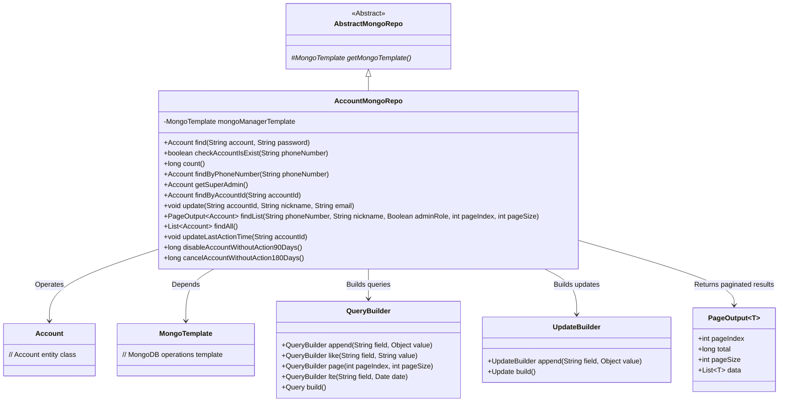

# Basic Information

|      |      |
|------|------|
| Name | AccountMongoRepo |
| Language | .java |
| Code Path | WeFe/common/java/common-data-mongodb/src/main/java/com/welab/wefe/common/data/mongodb/repo/AccountMongoRepo.java |
| Package Name | com.welab.wefe.common.data.mongodb.repo |
| Dependencies | ['com.alibaba.fastjson.JSONArray', 'com.mongodb.client.result.UpdateResult', 'com.welab.wefe.common.data.mongodb.dto.PageOutput', 'com.welab.wefe.common.data.mongodb.entity.manager.Account', 'com.welab.wefe.common.data.mongodb.util.QueryBuilder', 'com.welab.wefe.common.data.mongodb.util.UpdateBuilder', 'com.welab.wefe.common.util.DateUtil', 'com.welab.wefe.common.wefe.enums.AuditStatus', 'org.springframework.beans.factory.annotation.Autowired', 'org.springframework.data.mongodb.core.MongoTemplate', 'org.springframework.data.mongodb.core.query.Query', 'org.springframework.data.mongodb.core.query.Update', 'org.springframework.stereotype.Repository', 'java.util.Date', 'java.util.List'] |
| Brief Description | The `AccountMongoRepo` class inherits from `AbstractMongoRepo` and utilizes `MongoTemplate` to interact with MongoDB. It provides functionalities such as account querying, updating, paginated queries, and supports conditional deactivation and deletion of long-inactive accounts. |

# Description

This is a MongoDB data access class named AccountMongoRepo, which inherits from AbstractMongoRepo. It utilizes MongoTemplate for database operations, primarily managing CRUD functionalities for the Account entity. It includes features such as finding accounts, checking account existence, counting quantities, querying by phone number, retrieving super administrators, and querying by ID. It also provides operations like updating account information, paginated querying of lists, updating the last operation time, disabling accounts inactive for 90 days, and deactivating accounts inactive for 180 days. All queries are constructed using QueryBuilder to define query conditions, while update operations use UpdateBuilder to construct update content.

# Class Summary

| Name   | Type  | Description |
|-------|------|-------------|
| AccountMongoRepo | class | The AccountMongoRepo class inherits from AbstractMongoRepo, providing account CRUD operations including querying, updating, paginated listing, and automatic deactivation and deletion of long-inactive accounts. |

## Class AccountMongoRepo

|      |      |
|------|------|
| Access Modifier | @Repository;public |
| Type | class |
| Name | AccountMongoRepo |
| Description | The AccountMongoRepo class inherits from AbstractMongoRepo, providing account CRUD operations including querying, updating, paginated listing, and automatic deactivation and deletion of long-inactive accounts. |

### UML Class Diagram

Class Diagram Description: This diagram shows that the AccountMongoRepo class inherits from AbstractMongoRepo and operates on the Account entity class through MongoTemplate. AccountMongoRepo provides comprehensive CRUD methods including query, update, pagination, etc., utilizing QueryBuilder and UpdateBuilder to construct query conditions and update operations. PageOutput is used to encapsulate paginated query results, reflecting a complete MongoDB data access layer design.

### Internal Method Call Graph

```mermaid
graph TD
    A["Class AccountMongoRepo"]
    B["Inherits: AbstractMongoRepo"]
    C["Property: MongoTemplate mongoManagerTemplate"]
    D["Method: getMongoTemplate()"]
    E["Method: find(account, password)"]
    F["Method: checkAccountIsExist(phoneNumber)"]
    G["Method: count()"]
    H["Method: findByPhoneNumber(phoneNumber)"]
    I["Method: getSuperAdmin()"]
    J["Method: findByAccountId(accountId)"]
    K["Method: update(accountId, nickname, email)"]
    L["Method: findList(phoneNumber, nickname, adminRole, pageIndex, pageSize)"]
    M["Method: findAll()"]
    N["Method: updateLastActionTime(accountId)"]
    O["Method: disableAccountWithoutAction90Days()"]
    P["Method: cancelAccountWithoutAction180Days()"]

    A --> B
    A --> C
    A --> D
    A --> E
    A --> F
    A --> G
    A --> H
    A --> I
    A --> J
    A --> K
    A --> L
    A --> M
    A --> N
    A --> O
    A --> P
```

This flowchart illustrates the structure and methods of the AccountMongoRepo class. The class inherits from AbstractMongoRepo, contains a property named mongoManagerTemplate of type MongoTemplate, and provides multiple database operation methods related to accounts. These methods cover functionalities such as account lookup, updates, and statistics, including finding accounts by credentials, checking phone number existence, updating account information, and paginated account list queries. All methods interact with MongoDB through mongoManagerTemplate, implementing CRUD operations for account data.

### Field List

| Name  | Type  | Description |
|-------|-------|------|
| mongoManagerTemplate | MongoTemplate | Use @Autowired to automatically inject a MongoTemplate instance with the variable name mongoManagerTemplate. |

### Method List

| Name  | Type  | Description |
|-------|-------|------|
| cancelAccountWithoutAction180Days | long | This method queries accounts with no activity within the past 180 days, marks them as canceled, and returns the count of updated records. |
| findList | PageOutput<Account> | The method `findList` queries the account list based on phone number, nickname, and administrator role, supports pagination, and returns paginated results. |
| disableAccountWithoutAction90Days | long | This method queries accounts with no activity within 90 days, sets their status to disabled, and returns the count of updated records. |
| findByAccountId | Account | Query the Account record in MongoDB by accountId, use QueryBuilder to construct the query conditions and return the result. |
| count | long | Count the total number of records for the Account class in MongoDB using an empty query condition. |
| checkAccountIsExist | boolean | Check whether an account exists for the corresponding phone number. Query the Account collection in MongoDB to determine if a matching record exists. |
| find | Account | The method queries the account using the username and password, returning the matching Account object via the MongoDB template. |
| updateLastActionTime | void | Update the last operation time of the specified account to the current time, using MongoDB for database operations. |
| update | void | Update the account nickname, email, and update time for the specified accountId using MongoDB operations. |
| getMongoTemplate | MongoTemplate | Rewrite the method to return a MongoManagerTemplate instance. |
| findAll | List<Account> | This method uses a MongoDB template to query all Account class documents and returns a list. |
| findByPhoneNumber | Account | Query account information based on mobile number, use MongoDB query builder to generate query conditions and return the matched account object. |
| getSuperAdmin | Account | Obtain super administrator account: Use the MongoDB template to query and return matching Account objects with the condition "superAdminRole" set to true. |

