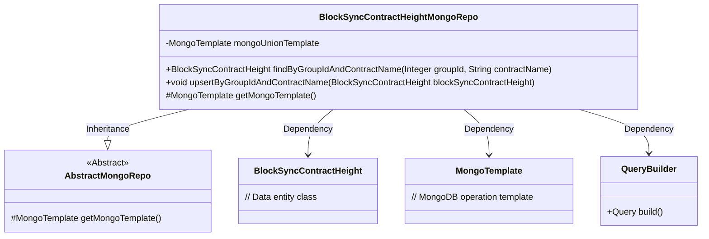
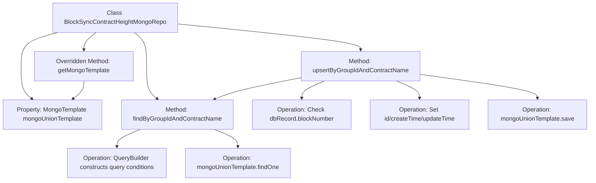

# Basic Information

|      |      |
|------|------|
| Name | BlockSyncContractHeightMongoRepo |
| Language | .java |
| Code Path | WeFe/common/java/common-data-mongodb/src/main/java/com/welab/wefe/common/data/mongodb/repo/BlockSyncContractHeightMongoRepo.java |
| Package Name | com.welab.wefe.common.data.mongodb.repo |
| Dependencies | ['com.welab.wefe.common.data.mongodb.entity.union.BlockSyncContractHeight', 'com.welab.wefe.common.data.mongodb.util.QueryBuilder', 'org.springframework.beans.factory.annotation.Autowired', 'org.springframework.data.mongodb.core.MongoTemplate', 'org.springframework.data.mongodb.core.query.Query', 'org.springframework.stereotype.Repository'] |
| Brief Description | This is a MongoDB repository class designed for managing block synchronization contract height data. It provides query functionality by group ID and contract name, supports updating or inserting records, and ensures data is up-to-date without duplication. Inheriting from an abstract Mongo repository class, it utilizes MongoTemplate for database operations. |

# Description

The code defines a MongoDB repository class named `BlockSyncContractHeightMongoRepo`, which inherits from `AbstractMongoRepo`. It utilizes `MongoTemplate` for database operations and includes two primary methods: `findByGroupIdAndContractName` for querying records based on `groupId` and `contractName`, and `upsertByGroupIdAndContractName` for updating or inserting records, with data updates occurring only when the new block number is greater than the existing record. The class also overrides the `getMongoTemplate` method to return the injected `mongoUnionTemplate` instance.

# Class Summary

| Name   | Type  | Description |
|-------|------|-------------|
| BlockSyncContractHeightMongoRepo | class | The `BlockSyncContractHeightMongoRepo` class stores and queries block synchronization contract height information via MongoDB, providing query and update functionalities by `groupId` and `contractName` to ensure data uniqueness and timeliness. |

## Class BlockSyncContractHeightMongoRepo

|      |      |
|------|------|
| Access Modifier | @Repository;public |
| Type | class |
| Name | BlockSyncContractHeightMongoRepo |
| Description | The `BlockSyncContractHeightMongoRepo` class stores and queries block synchronization contract height information via MongoDB, providing query and update functionalities by `groupId` and `contractName` to ensure data uniqueness and timeliness. |

### UML Class Diagram

Class diagram description: This diagram illustrates that the BlockSyncContractHeightMongoRepo class inherits from the AbstractMongoRepo abstract class and relies on components such as MongoTemplate and QueryBuilder to implement MongoDB data access functionality. It primarily includes methods for querying records by groupId and contractName, as well as version-controlled upsert operations, demonstrating a typical repository pattern implementation with Spring Data MongoDB.

### Internal Method Call Graph

This flowchart illustrates the core structure and logical flow of the BlockSyncContractHeightMongoRepo class. The class interacts with MongoDB through mongoUnionTemplate, providing methods to query records by groupId and contractName, as well as an upsert functionality with conditional checks. The upsert operation first queries existing records, compares block heights to determine whether to update, and finally saves the data uniformly. The entire process demonstrates encapsulation of MongoDB operations and control of business logic.

### Field List

| Name  | Type  | Description |
|-------|-------|------|
| mongoUnionTemplate | MongoTemplate | Automatically inject the MongoDB operation template mongoUnionTemplate. |

### Method List

| Name  | Type  | Description |
|-------|-------|------|
| findByGroupIdAndContractName | BlockSyncContractHeight | Query the BlockSyncContractHeight record based on groupId and contractName. Use the MongoDB template to execute the query and return a single result. |
| upsertByGroupIdAndContractName | void | The method updates or inserts records based on groupId and contractName. If the record exists and has a larger block number, it is skipped; otherwise, the ID and time are updated before saving. |
| getMongoTemplate | MongoTemplate | Override the getMongoTemplate method to return a mongoUnionTemplate instance. |

