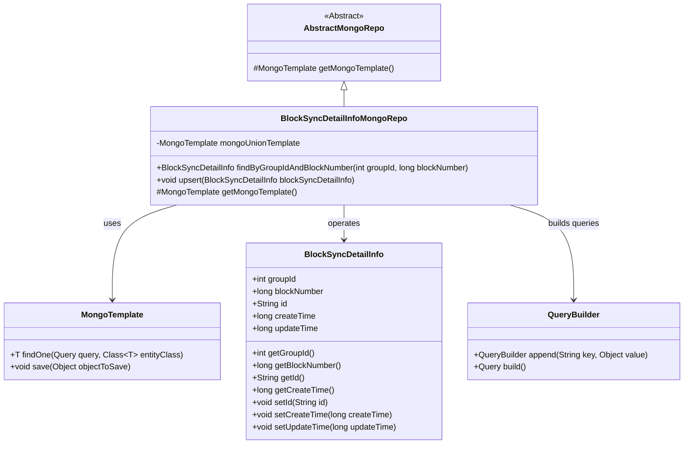
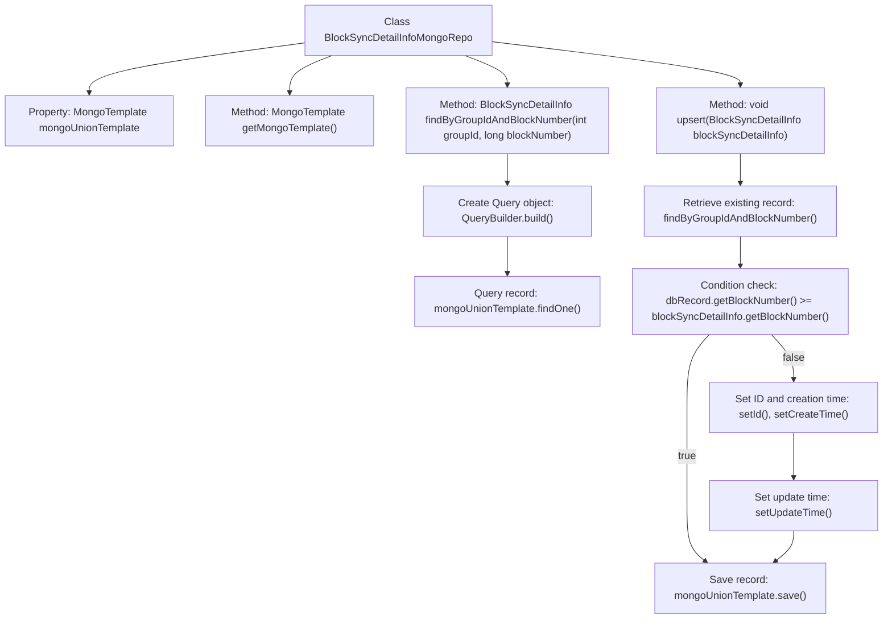

# Basic Information

|      |      |
|------|------|
| Name | BlockSyncDetailInfoMongoRepo |
| Language | .java |
| Code Path | WeFe/common/java/common-data-mongodb/src/main/java/com/welab/wefe/common/data/mongodb/repo/BlockSyncDetailInfoMongoRepo.java |
| Package Name | com.welab.wefe.common.data.mongodb.repo |
| Dependencies | ['com.welab.wefe.common.data.mongodb.entity.union.BlockSyncDetailInfo', 'com.welab.wefe.common.data.mongodb.util.QueryBuilder', 'org.springframework.beans.factory.annotation.Autowired', 'org.springframework.data.mongodb.core.MongoTemplate', 'org.springframework.data.mongodb.core.query.Query', 'org.springframework.stereotype.Repository'] |
| Brief Description | This is a MongoDB repository class designed for managing block synchronization details. It inherits from AbstractMongoRepo and utilizes MongoTemplate for database operations. Key functionalities include querying records by group ID and block number, as well as inserting or updating records (updating when encountering a larger block number). |

# Description

The code defines a MongoDB repository class named `BlockSyncDetailInfoMongoRepo`, which extends `AbstractMongoRepo`. It is marked as a Spring-managed repository component via the `@Repository` annotation and autowires a `MongoTemplate` instance named `mongoUnionTemplate`. The class overrides the `getMongoTemplate` method to return this template. It provides two core methods: `findByGroupIdAndBlockNumber` queries a single record based on `groupId` and `blockNumber`, while the `upsert` method implements the logic for inserting or updating records. The `upsert` method first checks if a record with the same conditions exists—updating it if the existing version is older or skipping otherwise—before uniformly setting the update time and saving. The entire class focuses on persistence operations for block synchronization detail information.

# Class Summary

| Name   | Type  | Description |
|-------|------|-------------|
| BlockSyncDetailInfoMongoRepo | class | This is a MongoDB repository class designed for managing block synchronization details. It inherits from AbstractMongoRepo and utilizes mongoUnionTemplate for database operations. It provides methods to query by groupId and blockNumber, along with an upsert method for updating or inserting records. |

## Class BlockSyncDetailInfoMongoRepo

|      |      |
|------|------|
| Access Modifier | @Repository;public |
| Type | class |
| Name | BlockSyncDetailInfoMongoRepo |
| Description | This is a MongoDB repository class designed for managing block synchronization details. It inherits from AbstractMongoRepo and utilizes mongoUnionTemplate for database operations. It provides methods to query by groupId and blockNumber, along with an upsert method for updating or inserting records. |

### UML Class Diagram

This code demonstrates a MongoDB repository class `BlockSyncDetailInfoMongoRepo`, which inherits from the abstract class `AbstractMongoRepo` and is primarily used to manipulate `BlockSyncDetailInfo` entity data. The class contains two core methods: `findByGroupIdAndBlockNumber` for querying records based on conditions, and `upsert` implementing an "update if exists, insert otherwise" logic. It interacts with MongoDB via `MongoTemplate` and constructs query conditions using `QueryBuilder`. The overall design reflects a typical repository pattern in Spring Data MongoDB.

### Internal Method Call Graph

This code represents a MongoDB repository class that primarily implements storage and update functionalities for block synchronization details. The flowchart illustrates the class structure and core method invocation relationships, with emphasis on the logical flow of the upsert method: first querying existing records, determining whether to update based on block number comparison, and finally setting timestamps before saving data. The entire process embodies business logic for conditional updates and duplicate prevention.

### Field List

| Name  | Type  | Description |
|-------|-------|------|
| mongoUnionTemplate | MongoTemplate | Automatically inject the MongoDB operation template mongoUnionTemplate. |

### Method List

| Name  | Type  | Description |
|-------|-------|------|
| getMongoTemplate | MongoTemplate | Rewrite the method to return a MongoUnionTemplate instance. |
| findByGroupIdAndBlockNumber | BlockSyncDetailInfo | Query BlockSyncDetailInfo based on groupId and blockNumber, execute the query using MongoDB template and return the result. |
| upsert | void | This method implements the update or insertion of block synchronization information. It first queries the database records, skips if the record exists and has a larger block number; otherwise, it updates the record ID and timestamp before saving it to the database. |

