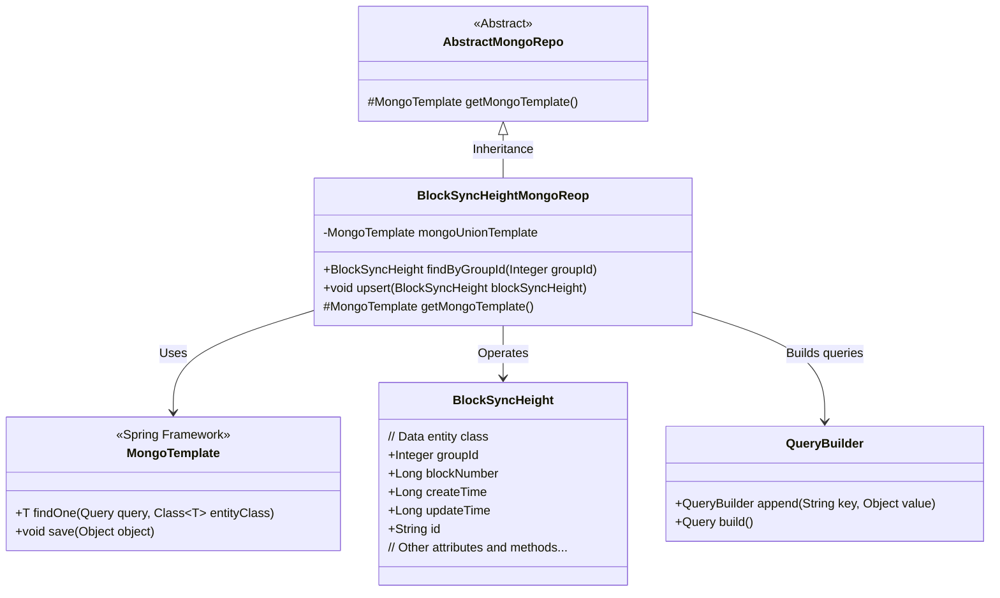
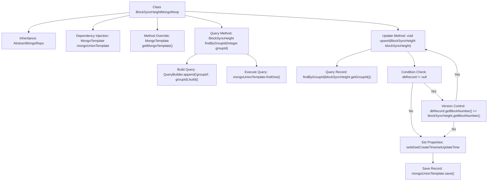

# Basic Information

|      |      |
|------|------|
| Name | BlockSyncHeightMongoReop |
| Language | .java |
| Code Path | WeFe/common/java/common-data-mongodb/src/main/java/com/welab/wefe/common/data/mongodb/repo/BlockSyncHeightMongoReop.java |
| Package Name | com.welab.wefe.common.data.mongodb.repo |
| Dependencies | ['com.welab.wefe.common.data.mongodb.entity.union.BlockSyncHeight', 'com.welab.wefe.common.data.mongodb.util.QueryBuilder', 'org.springframework.beans.factory.annotation.Autowired', 'org.springframework.data.mongodb.core.MongoTemplate', 'org.springframework.data.mongodb.core.query.Query', 'org.springframework.stereotype.Repository'] |
| Brief Description | This is a MongoDB repository class designed for managing block synchronization height data. It provides query and upsert functionalities based on groupId, ensuring data uniqueness and updating the latest timestamp. |

# Description

This is a MongoDB repository class named BlockSyncHeightMongoReop, which inherits from AbstractMongoRepo. It is annotated with @Repository and injects a MongoTemplate instance named mongoUnionTemplate via @Autowired. The class overrides the getMongoTemplate method to return this instance. It provides two core methods: findByGroupId queries BlockSyncHeight records based on groupId; the upsert method implements the logic for inserting or updating records, first checking whether the record exists and whether the block height is greater before deciding whether to update, then uniformly saving and setting the update time. The entire class focuses on handling the persistence operations of block synchronization heights.

# Class Summary

| Name   | Type  | Description |
|-------|------|-------------|
| BlockSyncHeightMongoReop | class | This is a MongoDB repository class for managing block synchronization height data. It includes methods for querying records by groupId and upserting records, ensuring data consistency and timestamp updates. |

## Class BlockSyncHeightMongoReop

|      |      |
|------|------|
| Access Modifier | @Repository;public |
| Type | class |
| Name | BlockSyncHeightMongoReop |
| Description | This is a MongoDB repository class for managing block synchronization height data. It includes methods for querying records by groupId and upserting records, ensuring data consistency and timestamp updates. |

### UML Class Diagram

This code demonstrates a MongoDB-based implementation of a block synchronization height repository. BlockSyncHeightMongoReop inherits from AbstractMongoRepo, operates on BlockSyncHeight entity data through MongoTemplate, and provides query by groupId and upsert (update if exists/insert if not exists) functionalities. The class diagram clearly shows inheritance relationships, dependencies, and core methods, reflecting typical usage patterns of Spring Data MongoDB. The upsert method includes business logic validation to ensure only larger blockNumbers are updated.

### Internal Method Call Graph

This code represents a Spring Data MongoDB Repository implementation class, primarily handling CRUD operations for block synchronization height. The core workflow includes: 1) Querying records by groupId; 2) Implementing upsert logic that skips updates when existing records have newer versions, otherwise sets timestamps and saves. The flowchart demonstrates the complete call chain from dependency injection to conditional updates, particularly highlighting the version control business logic branches.

### Field List

| Name  | Type  | Description |
|-------|-------|------|
| mongoUnionTemplate | MongoTemplate | Use @Autowired to automatically inject the MongoTemplate instance mongoUnionTemplate. |

### Method List

| Name  | Type  | Description |
|-------|-------|------|
| getMongoTemplate | MongoTemplate | Method override, returns a mongoUnionTemplate instance. |
| findByGroupId | BlockSyncHeight | This method queries the BlockSyncHeight records in MongoDB by groupId, constructs the query conditions using QueryBuilder, and returns the matching results. |
| upsert | void | This method is used to update or insert a block synchronization height record. If the record exists and the block number is larger, it will be skipped; otherwise, the record ID and time will be updated before saving. |

