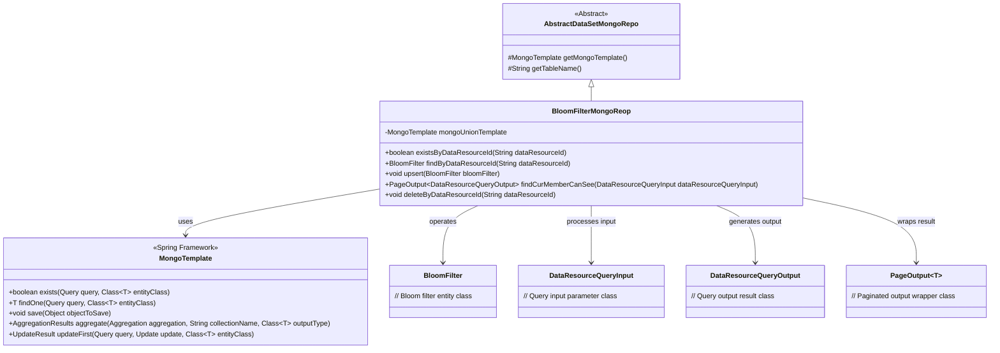
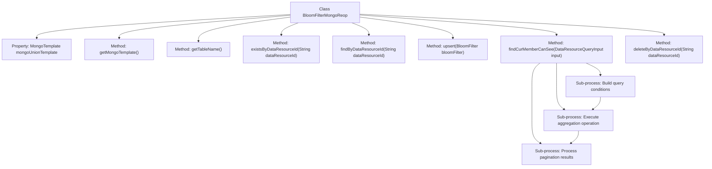
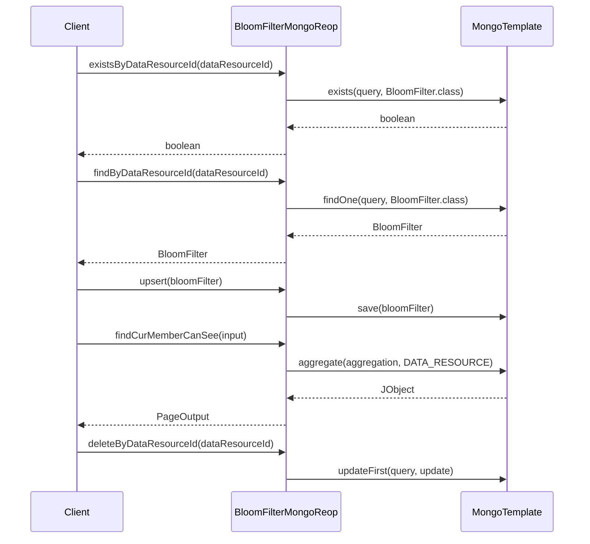

# Basic Information

|      |      |
|------|------|
| Name | BloomFilterMongoReop |
| Language | .java |
| Code Path | WeFe/common/java/common-data-mongodb/src/main/java/com/welab/wefe/common/data/mongodb/repo/BloomFilterMongoReop.java |
| Package Name | com.welab.wefe.common.data.mongodb.repo |
| Dependencies | ['com.welab.wefe.common.data.mongodb.constant.MongodbTable', 'com.welab.wefe.common.data.mongodb.dto.PageOutput', 'com.welab.wefe.common.data.mongodb.dto.dataresource.DataResourceQueryInput', 'com.welab.wefe.common.data.mongodb.dto.dataresource.DataResourceQueryOutput', 'com.welab.wefe.common.data.mongodb.dto.dataset.DataSetQueryOutput', 'com.welab.wefe.common.data.mongodb.entity.union.BloomFilter', 'com.welab.wefe.common.data.mongodb.util.AddFieldsOperation', 'com.welab.wefe.common.data.mongodb.util.QueryBuilder', 'com.welab.wefe.common.data.mongodb.util.UpdateBuilder', 'com.welab.wefe.common.util.JObject', 'org.apache.commons.lang3.StringUtils', 'org.springframework.beans.factory.annotation.Autowired', 'org.springframework.data.domain.Sort', 'org.springframework.data.mongodb.core.MongoTemplate', 'org.springframework.data.mongodb.core.aggregation', 'org.springframework.data.mongodb.core.query.Criteria', 'org.springframework.data.mongodb.core.query.Query', 'org.springframework.data.mongodb.core.query.Update', 'org.springframework.stereotype.Repository', 'java.util.HashMap', 'java.util.List', 'java.util.Map'] |
| Brief Description | The BloomFilterMongoRepo class inherits from AbstractDataSetMongoRepo and uses MongoTemplate to operate on the MongoDB table Union.BLOOM_FILTER. It provides methods such as existsByDataResourceId, findByDataResourceId, upsert, and deleteByDataResourceId to manipulate BloomFilter data, as well as the findCurMemberCanSee method to query paginated BloomFilter data visible to the current member. |

# Description

The BloomFilterMongoReop class inherits from AbstractDataSetMongoRepo and operates MongoDB using MongoTemplate. Its main functionalities include: checking for record existence via dataResourceId, querying records, and inserting or updating records. The findCurMemberCanSee method implements complex queries by performing aggregation operations to join multiple tables, supporting pagination, sorting, and conditional filtering. The deleteByDataResourceId method performs logical deletion of specified records. The table name is defined as MongodbTable.Union.BLOOM_FILTER.

# Class Summary

| Name   | Type  | Description |
|-------|------|-------------|
| BloomFilterMongoReop | class | The BloomFilterMongoRepo class inherits from AbstractDataSetMongoRepo and uses MongoTemplate to operate on the MongoDB table Union.BLOOM_FILTER. It provides methods such as existsByDataResourceId, findByDataResourceId, upsert, and deleteByDataResourceId to manipulate Bloom filter data, as well as the findCurMemberCanSee method to query paginated results of data resources visible to the current member. |

## Class BloomFilterMongoReop

|      |      |
|------|------|
| Access Modifier | @Repository;public |
| Type | class |
| Name | BloomFilterMongoReop |
| Description | The BloomFilterMongoRepo class inherits from AbstractDataSetMongoRepo and uses MongoTemplate to operate on the MongoDB table Union.BLOOM_FILTER. It provides methods such as existsByDataResourceId, findByDataResourceId, upsert, and deleteByDataResourceId to manipulate Bloom filter data, as well as the findCurMemberCanSee method to query paginated results of data resources visible to the current member. |

### UML Class Diagram

This code implements a MongoDB-based Bloom filter repository class BloomFilterMongoReop, which inherits from AbstractDataSetMongoRepo. Its main functionalities include: checking Bloom filter existence by dataResourceId, finding Bloom filters, saving/updating Bloom filters, paginated querying of Bloom filter data visible to current users, and deleting records by dataResourceId. The class interacts with MongoDB through MongoTemplate, utilizing complex operations such as aggregation queries, conditional matching, and pagination, while handling data permission control logic (including public levels and member visibility).

### Internal Method Call Graph

This code implements a MongoDB-based Bloom filter repository class with core functionalities including: checking data resource ID existence, querying Bloom filters by ID, saving/updating Bloom filters, retrieving paginated lists of data resources visible to current users, and deleting records by ID. The findCurMemberCanSee method implements complex aggregation queries involving multi-table joins, conditional filtering, pagination and sorting. All database operations are performed through MongoTemplate, featuring clear code structure and single responsibility principle.

### Field List

| Name  | Type  | Description |
|-------|-------|------|
| mongoUnionTemplate | MongoTemplate | Using @Autowired to automatically inject a MongoTemplate instance named mongoUnionTemplate. |

### Method List

| Name  | Type  | Description |
|-------|-------|------|
| findByDataResourceId | BloomFilter | Query the Bloom filter based on the data resource ID. If the ID is empty, return null; otherwise, construct the query conditions and return the results from MongoDB. |
| getTableName | String | The code overrides the parent class method and returns `MongodbTable.Union.BLOOM_FILTER` as the table name. |
| existsByDataResourceId | boolean | Check if the specified dataResourceId exists. When it is not empty, query MongoDB and return the existence result. |
| getMongoTemplate | MongoTemplate | This method overrides the parent class method and returns a MongoTemplate instance named mongoUnionTemplate. |
| upsert | void | This method is used to save or update a Bloom filter object to a MongoDB database, implemented using the save operation of mongoUnionTemplate. |
| findCurMemberCanSee | PageOutput<DataResourceQueryOutput> | This method utilizes MongoDB aggregation queries to filter data resources visible to the current user based on input conditions, including associated queries, pagination, and sorting processing, ultimately returning paginated results. |
| deleteByDataResourceId | void | This method deletes the data resource based on the dataResourceId by constructing query conditions and updating the status to 1, using the mongoUnionTemplate to perform the update operation. |

