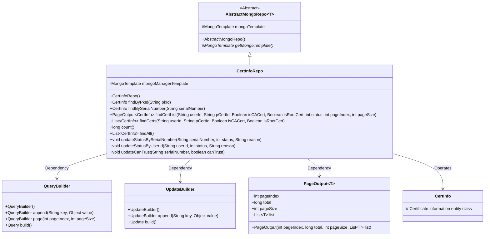
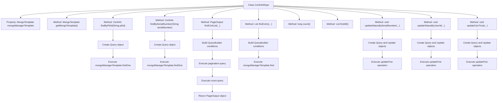

# Basic Information

|      |      |
|------|------|
| Name | CertInfoRepo |
| Language | .java |
| Code Path | WeFe/common/java/common-data-mongodb/src/main/java/com/welab/wefe/common/data/mongodb/repo/CertInfoRepo.java |
| Package Name | com.welab.wefe.common.data.mongodb.repo |
| Dependencies | ['java.util.List', 'org.apache.commons.lang3.StringUtils', 'org.springframework.beans.factory.annotation.Autowired', 'org.springframework.data.mongodb.core.MongoTemplate', 'org.springframework.data.mongodb.core.query.Query', 'org.springframework.data.mongodb.core.query.Update', 'org.springframework.stereotype.Repository', 'com.welab.wefe.common.data.mongodb.dto.PageOutput', 'com.welab.wefe.common.data.mongodb.entity.manager.CertInfo', 'com.welab.wefe.common.data.mongodb.util.QueryBuilder', 'com.welab.wefe.common.data.mongodb.util.UpdateBuilder'] |
| Brief Description | The CertInfoRepo class inherits from AbstractMongoRepo and operates on CertInfo data through MongoTemplate. It provides functionalities such as querying by pkId and serial number, paginated queries, batch queries, and updating status and trust status. |

# Description

CertInfoRepo is a repository class based on MongoDB, inheriting from AbstractMongoRepo, designed for managing data access of CertInfo entities. It performs database operations through MongoTemplate and provides various query and update methods. These include finding certificates by primary key ID or serial number, paginated querying of certificate lists, querying certificate collections based on conditions such as user ID or parent certificate ID, counting certificates, and retrieving all certificates. It also supports updating certificate status and reason by serial number or user ID, as well as updating the trusted status of certificates by serial number. All update operations automatically record the update timestamp.

# Class Summary

| Name   | Type  | Description |
|-------|------|-------------|
| CertInfoRepo | class | The CertInfoRepo class inherits from AbstractMongoRepo and utilizes MongoTemplate for database operations. It provides functionalities such as querying certificates by pkId or serial number, paginated querying of certificate lists, batch querying of certificates, and updating certificate statuses and trust statuses. |

## Class CertInfoRepo

|      |      |
|------|------|
| Access Modifier | @Repository;public |
| Type | class |
| Name | CertInfoRepo |
| Description | The CertInfoRepo class inherits from AbstractMongoRepo and utilizes MongoTemplate for database operations. It provides functionalities such as querying certificates by pkId or serial number, paginated querying of certificate lists, batch querying of certificates, and updating certificate statuses and trust statuses. |

### UML Class Diagram

Class Diagram Description: This diagram illustrates that the CertInfoRepo class inherits from the AbstractMongoRepo generic class, implementing MongoDB operations for the CertInfo entity. Core dependencies include QueryBuilder (for constructing query conditions), UpdateBuilder (for building update operations), and PageOutput (for paginated output). The class provides various query methods (e.g., by primary key, serial number) and update methods (e.g., updating status, trust flag), demonstrating comprehensive CRUD functionality for certificate information.

### Internal Method Call Graph

This code is a Mermaid flowchart of the CertInfoRepo class, illustrating its core methods for interacting with MongoDB. CertInfoRepo inherits from AbstractMongoRepo and is annotated with @Repository as a data access layer component. The flowchart details the internal call flows of various query methods (e.g., findByPkId, findBySerialNumber) and update methods (e.g., updateStatusBySerialNumber), including the creation of Query objects, invocation of MongoTemplate methods, and result processing. It specifically demonstrates typical MongoDB operations such as conditional query building, pagination handling, and batch updates.

### Field List

| Name  | Type  | Description |
|-------|-------|------|
| mongoManagerTemplate | MongoTemplate | Use @Autowired to automatically inject a MongoTemplate instance with the variable name mongoManagerTemplate. |

### Method List

| Name  | Type  | Description |
|-------|-------|------|
| updateStatusBySerialNumber | void | This method updates the status via the serial number, sets the status value, reason, and current time, and finally performs a MongoDB update operation. |
| findCerts | List<CertInfo> | Query the certificate list based on user ID, parent certificate ID, whether it is a CA certificate, and root certificate, and return the set of certificate information that meets the criteria. |
| findAll | List<CertInfo> | Query all certificate information and return a list. |
| findBySerialNumber | CertInfo | Query certificate information based on the serial number, execute the query using a MongoDB template, and return the results. |
| findCertList | PageOutput<CertInfo> | Method for querying certificate list, filtering based on user ID, parent certificate ID, CA certificate flag, root certificate flag, and status, returning paginated results. |
| findByPkId | CertInfo | Query certificate information based on the primary key ID, using the MongoDB template to perform the query operation. |
| getMongoTemplate | MongoTemplate | This is a Java method override that returns the MongoDB operation template mongoManagerTemplate. |
| updateStatusByUserId | void | Method for updating user status: Modify status, reason, and time based on user ID using MongoDB operations. |
| updateCanTrust | void | Methods to update certificate trust status: Set the canTrust field based on the serial number and record the update time, using MongoDB operations. |
| count | long | Count the total number of records for the CertInfo class in MongoDB. |

