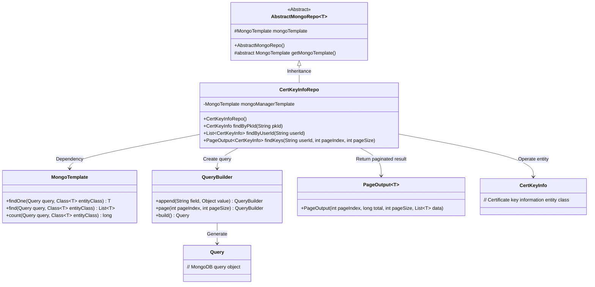
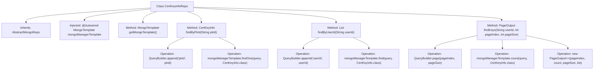

# Basic Information

|      |      |
|------|------|
| Name | CertKeyInfoRepo |
| Language | .java |
| Code Path | WeFe/common/java/common-data-mongodb/src/main/java/com/welab/wefe/common/data/mongodb/repo/CertKeyInfoRepo.java |
| Package Name | com.welab.wefe.common.data.mongodb.repo |
| Dependencies | ['java.util.List', 'org.apache.commons.lang3.StringUtils', 'org.springframework.beans.factory.annotation.Autowired', 'org.springframework.data.mongodb.core.MongoTemplate', 'org.springframework.data.mongodb.core.query.Query', 'org.springframework.stereotype.Repository', 'com.welab.wefe.common.data.mongodb.dto.PageOutput', 'com.welab.wefe.common.data.mongodb.entity.manager.CertKeyInfo', 'com.welab.wefe.common.data.mongodb.util.QueryBuilder'] |
| Brief Description | CertKeyInfoRepo is a MongoDB repository class that provides functionalities for querying a single record by pkId, querying a list by userId, and paginated queries. It inherits from AbstractMongoRepo and utilizes MongoTemplate for data operations. |

# Description

This is a MongoDB repository class named CertKeyInfoRepo, which inherits from AbstractMongoRepo. It utilizes MongoTemplate for database operations and includes three main methods: querying a single CertKeyInfo record by pkId, retrieving a list of CertKeyInfo records that match the criteria by userId, and supporting paginated queries for CertKeyInfo. The paginated query can filter by userId and returns a PageOutput object containing the total count and paginated data.

# Class Summary

| Name   | Type  | Description |
|-------|------|-------------|
| CertKeyInfoRepo | class | CertKeyInfoRepo is a MongoDB repository class that provides functionalities for querying a single record by pkId, querying a list by userId, and paginated queries. It inherits from AbstractMongoRepo and utilizes MongoTemplate for data operations. |

## Class CertKeyInfoRepo

|      |      |
|------|------|
| Access Modifier | @Repository;public |
| Type | class |
| Name | CertKeyInfoRepo |
| Description | CertKeyInfoRepo is a MongoDB repository class that provides functionalities for querying a single record by pkId, querying a list by userId, and paginated queries. It inherits from AbstractMongoRepo and utilizes MongoTemplate for data operations. |

### UML Class Diagram

This code describes a MongoDB-based certificate key information repository class CertKeyInfoRepo, which inherits from the abstract generic class AbstractMongoRepo. The class performs database operations through MongoTemplate, providing three query methods: querying a single record by primary key ID, querying a list by user ID, and a composite query with pagination. QueryBuilder is used to construct query conditions, and PageOutput encapsulates paginated results. The overall design reflects the typical usage pattern of Spring Data MongoDB, abstracting basic operations through the template method pattern while supporting flexible conditional queries and pagination functionality.

### Internal Method Call Graph

This flowchart illustrates the structure and method invocation relationships of the CertKeyInfoRepo class. The class inherits from AbstractMongoRepo, injects a MongoTemplate instance via @Autowired, and implements four core methods: getMongoTemplate() returns the template instance, findByPkId() queries a single document by primary key, findByUserId() retrieves a list of user-associated documents, and findKeys() performs paginated queries returning a PageOutput object containing total count and pagination details. Each method demonstrates its internal operations with QueryBuilder and MongoTemplate.

### Field List

| Name  | Type  | Description |
|-------|-------|------|
| mongoManagerTemplate | MongoTemplate | Automatically inject the MongoDB operation template mongoManagerTemplate. |

### Method List

| Name  | Type  | Description |
|-------|-------|------|
| getMongoTemplate | MongoTemplate | Rewrite the method to return a MongoManagerTemplate instance. |
| findKeys | PageOutput<CertKeyInfo> | This method queries certificate key information by user ID with pagination, returning a paginated result that includes a list and the total count. It uses a MongoDB template to construct query conditions and supports queries with empty user IDs. |
| findByPkId | CertKeyInfo | Query certificate key information based on the primary key ID, execute the query using a MongoDB template, and return the result. |
| findByUserId | List<CertKeyInfo> | Query the list of certificate key information based on user ID, execute the query using MongoDB template, and return the results. |

