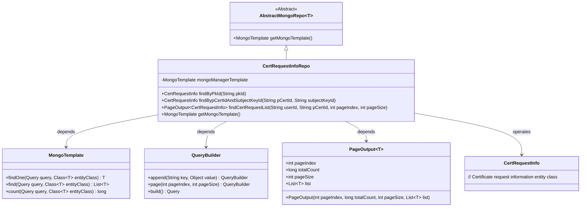
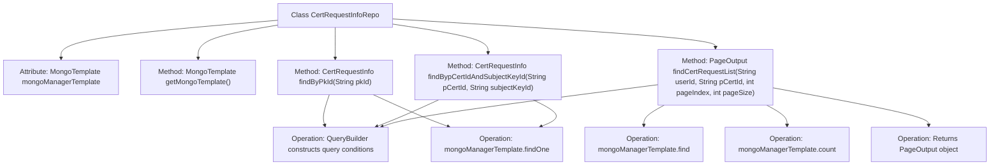

# Basic Information

|      |      |
|------|------|
| Name | CertRequestInfoRepo |
| Language | .java |
| Code Path | WeFe/common/java/common-data-mongodb/src/main/java/com/welab/wefe/common/data/mongodb/repo/CertRequestInfoRepo.java |
| Package Name | com.welab.wefe.common.data.mongodb.repo |
| Dependencies | ['java.util.List', 'org.apache.commons.lang3.StringUtils', 'org.springframework.beans.factory.annotation.Autowired', 'org.springframework.data.mongodb.core.MongoTemplate', 'org.springframework.data.mongodb.core.query.Query', 'org.springframework.stereotype.Repository', 'com.welab.wefe.common.data.mongodb.dto.PageOutput', 'com.welab.wefe.common.data.mongodb.entity.manager.CertRequestInfo', 'com.welab.wefe.common.data.mongodb.util.QueryBuilder'] |
| Brief Description | CertRequestInfoRepo is a MongoDB repository class that provides methods for querying certificate request information by pkId, pCertId, and subjectKeyId, supporting paginated list queries. |

# Description

The code defines a MongoDB repository class named `CertRequestInfoRepo`, which inherits from `AbstractMongoRepo`. It is marked as a Spring component via the `@Repository` annotation and autowires a `MongoTemplate` instance. The class implements three core query methods: fetching a single record by primary key ID, querying a single record by a composite condition of parent certificate ID and subject key ID, and a paginated conditional query method. The paginated query supports filtering by user ID and parent certificate ID, returning a `PageOutput` object containing pagination details and a result list. All queries are constructed using `QueryBuilder` and executed via `MongoTemplate`.

# Class Summary

| Name   | Type  | Description |
|-------|------|-------------|
| CertRequestInfoRepo | class | CertRequestInfoRepo is a MongoDB repository class that provides methods for querying certificate request information by pkId, pCertId, and subjectKeyId, supporting paginated list queries. |

## Class CertRequestInfoRepo

|      |      |
|------|------|
| Access Modifier | @Repository;public |
| Type | class |
| Name | CertRequestInfoRepo |
| Description | CertRequestInfoRepo is a MongoDB repository class that provides methods for querying certificate request information by pkId, pCertId, and subjectKeyId, supporting paginated list queries. |

### UML Class Diagram

This class diagram illustrates that CertRequestInfoRepo inherits from AbstractMongoRepo and interacts with MongoDB through MongoTemplate. Its primary functionalities include querying certificate request information by primary key, joint querying of certificate request information, and paginated querying of certificate request lists. QueryBuilder is used to construct query conditions, while PageOutput encapsulates paginated results. The overall structure clearly reflects a typical repository pattern implementation using Spring Data MongoDB.

### Internal Method Call Graph

This flowchart illustrates the structure of the CertRequestInfoRepo class and its key method invocation relationships. The class inherits AbstractMongoRepo and injects MongoTemplate, containing four core methods: getMongoTemplate() retrieves the template instance, findByPkId() queries a single document by primary key, findBypCertIdAndSubjectKeyId() performs dual-condition queries, and findCertRequestList() implements paginated multi-condition queries. All query methods construct conditions via QueryBuilder before executing operations through MongoTemplate, with paginated queries combining results and total counts into a PageOutput object.

### Field List

| Name  | Type  | Description |
|-------|-------|------|
| mongoManagerTemplate | MongoTemplate | Use @Autowired to automatically inject a MongoTemplate instance with the variable name mongoManagerTemplate. |

### Method List

| Name  | Type  | Description |
|-------|-------|------|
| findBypCertIdAndSubjectKeyId | CertRequestInfo | This method retrieves certificate request information by querying with the parent certificate ID and subject key ID, using a MongoDB template to execute the query and return the results. |
| findByPkId | CertRequestInfo | Query CertRequestInfo by pkId, use MongoDB's QueryBuilder to construct the query condition, and return the single matching record. |
| getMongoTemplate | MongoTemplate | Rewrite the method to return a MongoManagerTemplate instance. |
| findCertRequestList | PageOutput<CertRequestInfo> | This method queries the certificate request list based on user ID and certificate ID, supports pagination, and returns a paginated object containing the result list and total count. |

