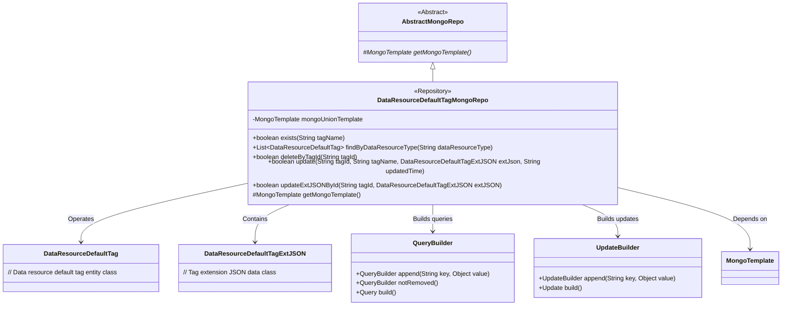
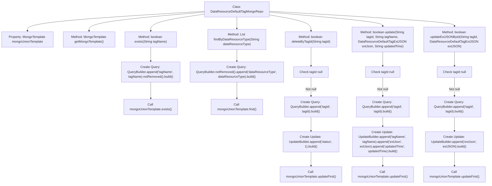

# Basic Information

|      |      |
|------|------|
| Name | DataResourceDefaultTagMongoRepo |
| Language | .java |
| Code Path | WeFe/common/java/common-data-mongodb/src/main/java/com/welab/wefe/common/data/mongodb/repo/DataResourceDefaultTagMongoRepo.java |
| Package Name | com.welab.wefe.common.data.mongodb.repo |
| Dependencies | ['com.mongodb.client.result.UpdateResult', 'com.welab.wefe.common.data.mongodb.entity.union.DataResourceDefaultTag', 'com.welab.wefe.common.data.mongodb.entity.union.ext.DataResourceDefaultTagExtJSON', 'com.welab.wefe.common.data.mongodb.util.QueryBuilder', 'com.welab.wefe.common.data.mongodb.util.UpdateBuilder', 'org.apache.commons.lang3.StringUtils', 'org.springframework.beans.factory.annotation.Autowired', 'org.springframework.data.mongodb.core.MongoTemplate', 'org.springframework.data.mongodb.core.query.Query', 'org.springframework.data.mongodb.core.query.Update', 'org.springframework.stereotype.Repository', 'java.util.List'] |
| Brief Description | The `DataResourceDefaultTagMongoRepo` class inherits from `AbstractMongoRepo` and utilizes `MongoTemplate` to interact with MongoDB. It provides methods such as `exists`, `findByDataResourceType`, `deleteByTagId`, `update`, and `updateExtJSONById` for querying, deleting, and updating `DataResourceDefaultTag` data. |

# Description

This is a MongoDB data access class named DataResourceDefaultTagMongoRepo, which inherits from AbstractMongoRepo. It utilizes MongoTemplate for database operations, with primary functionalities including: checking if a tag name exists, querying tags by resource type, deleting tags (logical deletion), updating tag information (name, extended JSON, and update time), and separately updating the extended JSON of a tag. All operations include non-null validation and are performed on the DataResourceDefaultTag class.

# Class Summary

| Name   | Type  | Description |
|-------|------|-------------|
| DataResourceDefaultTagMongoRepo | class | The DataResourceDefaultTagMongoRepo class inherits from AbstractMongoRepo, providing functionalities such as tag existence checks, querying by type, deletion, updates, and extended JSON updates, utilizing MongoTemplate for database operations. |

## Class DataResourceDefaultTagMongoRepo

|      |      |
|------|------|
| Access Modifier | @Repository;public |
| Type | class |
| Name | DataResourceDefaultTagMongoRepo |
| Description | The DataResourceDefaultTagMongoRepo class inherits from AbstractMongoRepo, providing functionalities such as tag existence checks, querying by type, deletion, updates, and extended JSON updates, utilizing MongoTemplate for database operations. |

### UML Class Diagram

This code demonstrates a MongoDB repository class `DataResourceDefaultTagMongoRepo`, which inherits from the abstract class `AbstractMongoRepo` and is primarily used for CRUD operations on the `DataResourceDefaultTag` entity. The class constructs query and update conditions using `QueryBuilder` and `UpdateBuilder`, and executes database operations via `MongoTemplate`. Key functionalities include checking tag existence, finding tags by resource type, deleting/updating tags, etc., with all methods incorporating parameter validation and status checks.

### Internal Method Call Graph

This flowchart illustrates the complete structure of the DataResourceDefaultTagMongoRepo class, featuring 5 core methods: exists() for tag existence verification, findByDataResourceType() for tag query by type, deleteByTagId() for soft tag deletion, update() for full-field tag updates, and updateExtJSONById() for partial JSON extension updates. All database operations are executed via mongoUnionTemplate, with key steps including Query construction, null checks, and Update operations, demonstrating atomic MongoDB operation encapsulation.

### Field List

| Name  | Type  | Description |
|-------|-------|------|
| mongoUnionTemplate | MongoTemplate | Use @Autowired to automatically inject the MongoTemplate instance mongoUnionTemplate. |

### Method List

| Name  | Type  | Description |
|-------|-------|------|
| findByDataResourceType | List<DataResourceDefaultTag> | This method queries MongoDB for undeleted DataResourceDefaultTag data matching the specified type and returns a result list. |
| getMongoTemplate | MongoTemplate | Rewrite the getMongoTemplate method to return a mongoUnionTemplate instance. |
| deleteByTagId | boolean | This method deletes data by tag ID, first verifying the ID's validity, then constructing query and update conditions, and finally executing the MongoDB update operation and returning whether it was successful. |
| exists | boolean | Check if the specified tag name exists, query undeleted tags and return the result. |
| update | boolean | This method updates the tag information in MongoDB based on the tagId, including the tagName, extJson, and updatedTime fields. If the tagId is empty, it returns false; otherwise, it performs the update and returns whether the operation was successful. |
| updateExtJSONById | boolean | The method updates the extJSON field in MongoDB by tagId, first validating that tagId is not empty, then constructing the query and update conditions, executing the update operation, and returning whether it was successful. |

