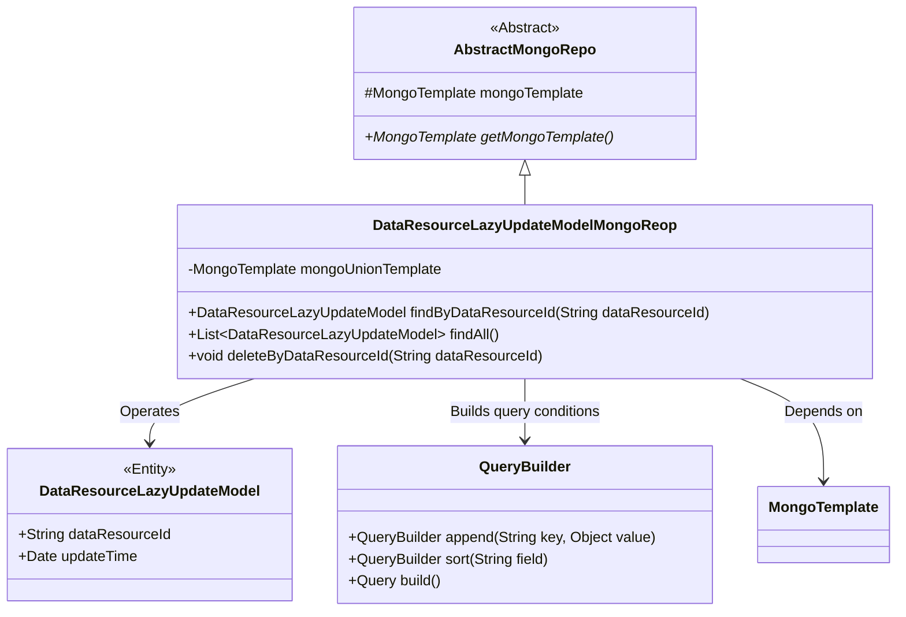
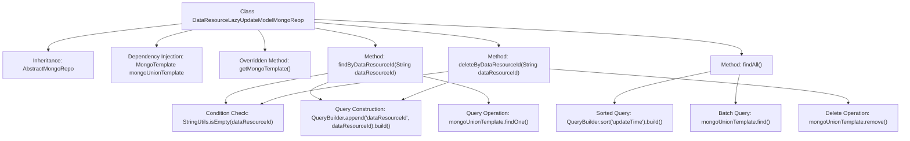

# Basic Information

|      |      |
|------|------|
| Name | DataResourceLazyUpdateModelMongoReop |
| Language | .java |
| Code Path | WeFe/common/java/common-data-mongodb/src/main/java/com/welab/wefe/common/data/mongodb/repo/DataResourceLazyUpdateModelMongoReop.java |
| Package Name | com.welab.wefe.common.data.mongodb.repo |
| Dependencies | ['com.welab.wefe.common.data.mongodb.entity.union.DataResourceLazyUpdateModel', 'com.welab.wefe.common.data.mongodb.util.QueryBuilder', 'org.apache.commons.lang3.StringUtils', 'org.springframework.beans.factory.annotation.Autowired', 'org.springframework.data.mongodb.core.MongoTemplate', 'org.springframework.data.mongodb.core.query.Query', 'org.springframework.stereotype.Repository', 'java.util.List'] |
| Brief Description | This is a MongoDB repository class that inherits from AbstractMongoRepo and uses MongoTemplate to interact with the database. It includes methods for querying by ID, querying all records, and deleting by ID. |

# Description

The code defines a MongoDB repository class named `DataResourceLazyUpdateModelMongoReop`, which extends `AbstractMongoRepo`. It injects a `MongoTemplate` instance `mongoUnionTemplate` via the `@Autowired` annotation and overrides the `getMongoTemplate` method to return this instance. The class provides three core methods: `findByDataResourceId` queries a single record based on `dataResourceId`, `findAll` returns all records sorted by `updateTime`, and `deleteByDataResourceId` deletes records based on `dataResourceId`. All methods use `QueryBuilder` to construct query conditions and execute operations via `mongoUnionTemplate`. Null checks ensure the robustness of the methods.

# Class Summary

| Name   | Type  | Description |
|-------|------|-------------|
| DataResourceLazyUpdateModelMongoReop | class | The DataResourceLazyUpdateModelMongoReop class inherits from AbstractMongoRepo, utilizes MongoTemplate to operate MongoDB, and provides functionalities for querying by ID, querying all, and deleting by ID. |

## Class DataResourceLazyUpdateModelMongoReop

|      |      |
|------|------|
| Access Modifier | @Repository;public |
| Type | class |
| Name | DataResourceLazyUpdateModelMongoReop |
| Description | The DataResourceLazyUpdateModelMongoReop class inherits from AbstractMongoRepo, utilizes MongoTemplate to operate MongoDB, and provides functionalities for querying by ID, querying all, and deleting by ID. |

### UML Class Diagram

This class diagram illustrates that DataResourceLazyUpdateModelMongoReop inherits from AbstractMongoRepo and relies on MongoTemplate for database operations. It includes three main methods: querying by ID, querying all, and deleting data resource lazy update models by ID. QueryBuilder is used to construct query conditions, and DataResourceLazyUpdateModel is the entity class being operated on. The diagram clearly presents the inheritance and dependency relationships, demonstrating the repository class's basic CRUD capabilities with MongoDB.

### Internal Method Call Graph

This flowchart illustrates the core structure of a MongoDB repository class, encompassing data querying, batch retrieval, and deletion operations. By inheriting from the AbstractMongoRepo base class and injecting MongoTemplate for database operations, the methods findByDataResourceId and deleteByDataResourceId first validate parameter validity before constructing query objects with specific conditions for execution. The findAll method retrieves all records sorted by update time using a sort builder, demonstrating encapsulation of MongoDB query APIs and conditional processing logic.

### Field List

| Name  | Type  | Description |
|-------|-------|------|
| mongoUnionTemplate | MongoTemplate | Use @Autowired to automatically inject the MongoTemplate instance mongoUnionTemplate. |

### Method List

| Name  | Type  | Description |
|-------|-------|------|
| deleteByDataResourceId | void | Delete the record with the specified data resource ID. If the ID is empty, no action will be taken. The deletion operation is performed using a MongoDB template. |
| findByDataResourceId | DataResourceLazyUpdateModel | Query the lazy update model based on the data resource ID. If the ID is empty, return null; otherwise, retrieve matching records via MongoDB. |
| findAll | List<DataResourceLazyUpdateModel> | Query and return all DataResourceLazyUpdateModel data sorted by update time. |
| getMongoTemplate | MongoTemplate | Rewrite the method to return a MongoUnionTemplate instance. |

