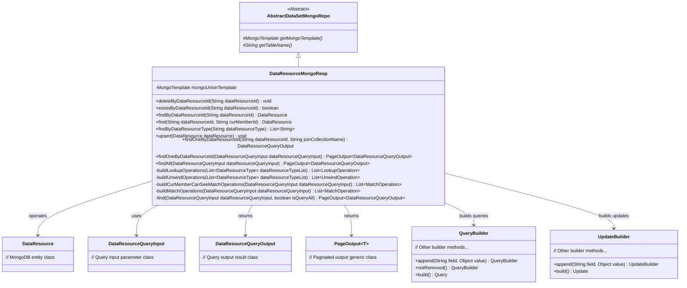

# Basic Information

|      |      |
|------|------|
| Name | DataResourceMongoReop |
| Language | .java |
| Code Path | WeFe/common/java/common-data-mongodb/src/main/java/com/welab/wefe/common/data/mongodb/repo/DataResourceMongoReop.java |
| Package Name | com.welab.wefe.common.data.mongodb.repo |
| Dependencies | ['com.welab.wefe.common.data.mongodb.constant.MongodbTable', 'com.welab.wefe.common.data.mongodb.dto.PageOutput', 'com.welab.wefe.common.data.mongodb.dto.dataresource.DataResourceQueryInput', 'com.welab.wefe.common.data.mongodb.dto.dataresource.DataResourceQueryOutput', 'com.welab.wefe.common.data.mongodb.entity.union.DataResource', 'com.welab.wefe.common.data.mongodb.util.AddFieldsOperation', 'com.welab.wefe.common.data.mongodb.util.QueryBuilder', 'com.welab.wefe.common.data.mongodb.util.UpdateBuilder', 'com.welab.wefe.common.util.JObject', 'com.welab.wefe.common.util.StringUtil', 'com.welab.wefe.common.wefe.enums.DataResourceType', 'org.apache.commons.collections4.CollectionUtils', 'org.apache.commons.lang3.StringUtils', 'org.springframework.beans.factory.annotation.Autowired', 'org.springframework.data.domain.Sort', 'org.springframework.data.mongodb.core.MongoTemplate', 'org.springframework.data.mongodb.core.aggregation', 'org.springframework.data.mongodb.core.query.Criteria', 'org.springframework.data.mongodb.core.query.Query', 'org.springframework.data.mongodb.core.query.Update', 'org.springframework.stereotype.Repository', 'java.util', 'java.util.stream.Collectors'] |
| Brief Description | The `DataResourceMongoRepo` class is a MongoDB data access layer that provides CRUD operations for data resources, including querying by ID, deletion, existence checks, combined queries, and pagination functionality. |

# Description

The `DataResourceMongoReop` class is a MongoDB data access layer component that inherits from `AbstractDataSetMongoRepo`. It operates on the `MongodbTable.Union.DATA_RESOURCE` table through `MongoTemplate`, providing basic CRUD operations and complex query functionalities for data resources. Key features include: deletion by `dataResourceId`, existence checking, single resource lookup, tag list retrieval by type, and resource save/update operations. It also supports multi-table join queries (e.g., image datasets, tabular datasets) via aggregation pipelines to implement pagination, conditional filtering, and result statistics. The query logic incorporates permission controls to validate current user visibility. The class encapsulates private methods for constructing query conditions, join table operations, and result processing.

# Class Summary

| Name   | Type  | Description |
|-------|------|-------------|
| DataResourceMongoReop | class | The DataResourceMongoRepo class is a MongoDB data access layer component that provides CRUD operations for data resources, including querying by ID, deletion, existence checking, combined queries, and pagination functionality. |

## Class DataResourceMongoReop

|      |      |
|------|------|
| Access Modifier | @Repository;public |
| Type | class |
| Name | DataResourceMongoReop |
| Description | The DataResourceMongoRepo class is a MongoDB data access layer component that provides CRUD operations for data resources, including querying by ID, deletion, existence checking, combined queries, and pagination functionality. |

### UML Class Diagram

This code implements a MongoDB data resource repository class that inherits from the abstract base class AbstractDataSetMongoRepo. Its main functionalities include CRUD operations on DataResource entities, complex aggregation queries, and pagination handling. It constructs query conditions through QueryBuilder and UpdateBuilder, supporting various query scenarios (such as querying by ID, querying by type, and joint queries). It specifically designs permission control logic (buildCurMemberCanSeeMatchOperations) and pagination mechanisms (PageOutput), executing underlying database operations via MongoTemplate. The class diagram illustrates the relationships between core classes, including inheritance, dependencies, and generic usage.

### Internal Method Call Graph

```mermaid
graph TD
    A["Class DataResourceMongoReop"]
    B["Property: MongoTemplate mongoUnionTemplate"]
    C["Method: MongoTemplate getMongoTemplate()"]
    D["Method: String getTableName()"]
    E["Method: void deleteByDataResourceId(String)"]
    F["Method: boolean existsByDataResourceId(String)"]
    G["Method: DataResource findByDataResourceId(String)"]
    H["Method: DataResource find(String, String)"]
    I["Method: List<String> findByDataResourceType(String)"]
    J["Method: void upsert(DataResource)"]
    K["Method: DataResourceQueryOutput findOneByDataResourceId(String, String)"]
    L["Method: PageOutput<DataResourceQueryOutput> findOneByDataResourceId(DataResourceQueryInput)"]
    M["Method: PageOutput<DataResourceQueryOutput> findAll(DataResourceQueryInput)"]
    N["Method: PageOutput<DataResourceQueryOutput> find(DataResourceQueryInput, boolean)"]
    O["Private Method: List<LookupOperation> buildLookupOperations(List<DataResourceType>)"]
    P["Private Method: List<UnwindOperation> buildUnwindOperations(List<DataResourceType>)"]
    Q["Private Method: List<MatchOperation> buildCurMemberCanSeeMatchOperations(DataResourceQueryInput)"]
    R["Private Method: List<MatchOperation> buildMatchOperations(DataResourceQueryInput)"]

    A --> B
    A --> C
    A --> D
    A --> E
    A --> F
    A --> G
    A --> H
    A --> I
    A --> J
    A --> K
    A --> L
    A --> M
    A --> N
    N --> O
    N --> P
    N --> Q
    N --> R
    L --> N
    M --> N
    K --> O
    K --> P
    K --> Q
```

This code defines a MongoDB data access class DataResourceMongoReop, which inherits from AbstractDataSetMongoRepo. Its main functionalities include CRUD operations for data resources, supporting queries by dataResourceId, existence checks, deletion flag updates, and joint queries. Core methods execute database operations through MongoTemplate, containing multiple private methods for building various stages of aggregation queries (Lookup, Unwind, Match, etc.). The class implements complex query logic including pagination processing, multi-table join queries, and permission control, with particular focus on data resource state management and member visibility control.

### Field List

| Name  | Type  | Description |
|-------|-------|------|
| mongoUnionTemplate | MongoTemplate | Automatically inject the MongoTemplate instance, named as mongoUnionTemplate. |

### Method List

| Name  | Type  | Description |
|-------|-------|------|
| findByDataResourceId | DataResource | Query the data resource based on the dataResourceId. If the ID is empty, return null; otherwise, construct the query conditions and return the matching undeleted results from MongoDB. |
| find | DataResource | The method retrieves data resources by ID and member ID. If the ID is empty, it returns null; otherwise, it constructs the query conditions and returns the MongoDB result. |
| buildLookupOperations | List<LookupOperation> | This method constructs a list of MongoDB Lookup operations, first adding the association with the member table, and then dynamically appending join queries for corresponding tables based on the input list of data resource types (which includes images, tables, and Bloom filters by default). The join field is data_resource_id, and the result set aliases are converted to underscore format. |
| buildUnwindOperations | List<UnwindOperation> | Construct a list of deconstruction operations, with the default being to deconstruct the `member` field. If the data resource type list is empty, it defaults to processing `ImageDataSet`, `TableDataSet`, and `BloomFilter`. Generate corresponding field names based on the types and deconstruct them, then return the operation list. |
| buildCurMemberCanSeeMatchOperations | List<MatchOperation> | Build a list of data resource matching operations visible to the current user, including filtering by resource type, name, tags, and other conditions, while checking public levels and member permissions. Support specific query conditions for image datasets and tabular datasets. |
| getTableName | String | This method overrides the parent class method and returns MongodbTable.Union.DATA_RESOURCE as the table name. |
| getMongoTemplate | MongoTemplate | Override the getMongoTemplate method to return a mongoUnionTemplate instance. |
| upsert | void | This method uses mongoUnionTemplate to save or update data resource objects. |
| buildMatchOperations | List<MatchOperation> | Build a list of matching operations to handle data resource query inputs, including conditions such as status, name, and tags. Add different matching operations based on the resource type and return the list of matching operations. |
| existsByDataResourceId | boolean | Check if a data resource with the specified ID exists. Returns false if the ID is empty; otherwise, queries MongoDB for undeleted matching records and returns the existence result. |
| findByDataResourceType | List<String> | This method queries data resources of a specified type via MongoDB, excludes the _id field and includes the tags field, ultimately returning a list of tags for all resources. |
| deleteByDataResourceId | void | Query and update the MongoDB data status to 1 based on the dataResourceId. |
| findOneByDataResourceId | DataResourceQueryOutput | The method utilizes MongoDB aggregation queries to associate data based on dataResourceId and joinCollectionName, returning a DataResourceQueryOutput result. It includes data association, conditional filtering, and field processing. |
| findOneByDataResourceId | PageOutput<DataResourceQueryOutput> | Query data resources based on input parameters and return paginated output for a single result. |
| findAll | PageOutput<DataResourceQueryOutput> | This method queries data resources based on input conditions and returns paginated results. It internally calls the find method with the parameter set to true. |
| find | PageOutput<DataResourceQueryOutput> | This method queries data resources based on input parameters, constructs aggregation operations, and returns paginated results. It includes functionalities such as association queries, filtering, sorting, and total count statistics, supporting full-data or permission-filtered queries. |

