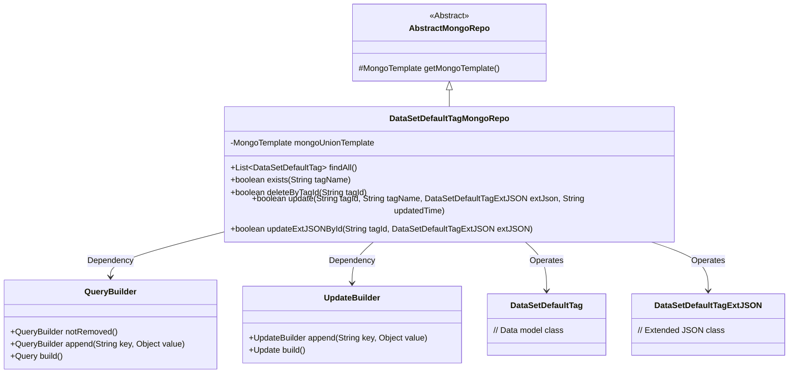
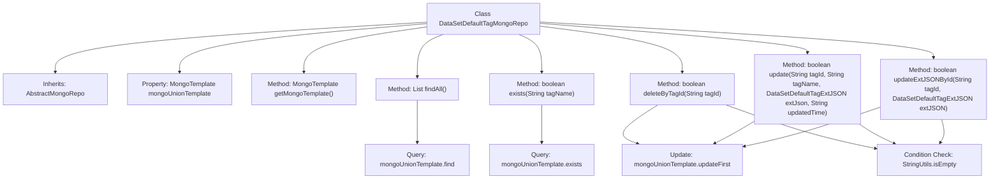

# Basic Information

|      |      |
|------|------|
| Name | DataSetDefaultTagMongoRepo |
| Language | .java |
| Code Path | WeFe/common/java/common-data-mongodb/src/main/java/com/welab/wefe/common/data/mongodb/repo/DataSetDefaultTagMongoRepo.java |
| Package Name | com.welab.wefe.common.data.mongodb.repo |
| Dependencies | ['com.mongodb.client.result.UpdateResult', 'com.welab.wefe.common.data.mongodb.entity.union.DataSetDefaultTag', 'com.welab.wefe.common.data.mongodb.entity.union.MemberAuthType', 'com.welab.wefe.common.data.mongodb.entity.union.ext.DataSetDefaultTagExtJSON', 'com.welab.wefe.common.data.mongodb.util.QueryBuilder', 'com.welab.wefe.common.data.mongodb.util.UpdateBuilder', 'org.apache.commons.lang3.StringUtils', 'org.springframework.beans.factory.annotation.Autowired', 'org.springframework.data.mongodb.core.MongoTemplate', 'org.springframework.data.mongodb.core.query.Query', 'org.springframework.data.mongodb.core.query.Update', 'org.springframework.stereotype.Repository', 'java.util.List'] |
| Brief Description | The default label MongoDB repository class for datasets provides functionalities for querying, existence checking, deletion, label updating, and extended JSON operations. |

# Description

This is a MongoDB data access class named DataSetDefaultTagMongoRepo, which inherits from AbstractMongoRepo. It utilizes MongoTemplate for database operations, with primary functionalities including: querying all undeleted DataSetDefaultTag records; checking if a specified tagName exists; deleting records by tagId (marked as deleted status); updating the tagName, extJson, and updatedTime fields of records; and separately updating the extJson field of records. All update operations return a boolean value indicating success.

# Class Summary

| Name   | Type  | Description |
|-------|------|-------------|
| DataSetDefaultTagMongoRepo | class | The DataSetDefaultTagMongoRepo class inherits from AbstractMongoRepo and uses MongoTemplate to manipulate dataset default tags. It provides functionalities such as querying all tags, checking tag existence, deleting tags, updating tag information, and extending JSON. |

## Class DataSetDefaultTagMongoRepo

|      |      |
|------|------|
| Access Modifier | @Repository;public |
| Type | class |
| Name | DataSetDefaultTagMongoRepo |
| Description | The DataSetDefaultTagMongoRepo class inherits from AbstractMongoRepo and uses MongoTemplate to manipulate dataset default tags. It provides functionalities such as querying all tags, checking tag existence, deleting tags, updating tag information, and extending JSON. |

### UML Class Diagram

Class diagram description: This diagram illustrates that the DataSetDefaultTagMongoRepo class inherits from AbstractMongoRepo and depends on QueryBuilder and UpdateBuilder to construct query and update operations. It interacts with MongoDB through MongoTemplate, primarily operating on the DataSetDefaultTag entity and its extended JSON data. The class implements CRUD-related methods including querying, existence checking, deletion, and updating, with all methods returning operation result statuses.

### Internal Method Call Graph

This code defines a MongoDB repository class named DataSetDefaultTagMongoRepo, which inherits from AbstractMongoRepo. The class provides basic CRUD operations for the DataSetDefaultTag collection, including querying all records, checking record existence, deleting records (logical deletion), updating records, and updating extended JSON fields. All database operations are executed through mongoUnionTemplate, with parameter validity checks performed before update operations. The methods primarily operate around two key fields: tagId and tagName, using QueryBuilder and UpdateBuilder to construct query and update conditions.

### Field List

| Name  | Type  | Description |
|-------|-------|------|
| mongoUnionTemplate | MongoTemplate | Use @Autowired to automatically inject the MongoTemplate instance mongoUnionTemplate. |

### Method List

| Name  | Type  | Description |
|-------|-------|------|
| deleteByTagId | boolean | This method deletes data by tag ID. It first checks if the ID is empty. If not, it constructs the query and update conditions, sets the status to 1, and returns whether the operation was successful. |
| findAll | List<DataSetDefaultTag> | Query the list of undeleted default dataset labels. |
| exists | boolean | Check if the specified tag name exists, query undeleted tags and return a boolean result. |
| getMongoTemplate | MongoTemplate | Rewrite the getMongoTemplate method to return a mongoUnionTemplate instance. |
| update | boolean | Method for updating tag information: After verifying that the tagId is not empty, construct the query and update conditions, then update the specified tag's name, extended JSON, and update time via MongoDB, returning whether the operation was successful. |
| updateExtJSONById | boolean | The method updates the extJSON field in MongoDB based on the tagId and returns whether the operation was successful. Returns false if parameter validation fails or the update fails. |

