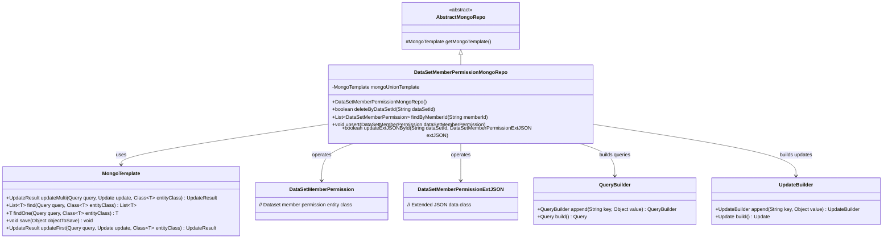
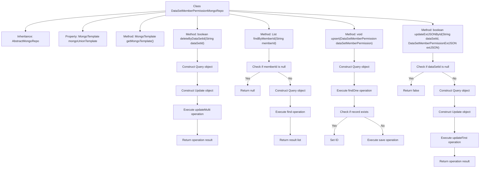

# Basic Information

|      |      |
|------|------|
| Name | DataSetMemberPermissionMongoRepo |
| Language | .java |
| Code Path | WeFe/common/java/common-data-mongodb/src/main/java/com/welab/wefe/common/data/mongodb/repo/DataSetMemberPermissionMongoRepo.java |
| Package Name | com.welab.wefe.common.data.mongodb.repo |
| Dependencies | ['com.mongodb.client.result.UpdateResult', 'com.welab.wefe.common.data.mongodb.entity.union.DataSetMemberPermission', 'com.welab.wefe.common.data.mongodb.entity.union.ext.DataSetMemberPermissionExtJSON', 'com.welab.wefe.common.data.mongodb.util.QueryBuilder', 'com.welab.wefe.common.data.mongodb.util.UpdateBuilder', 'org.apache.commons.lang3.StringUtils', 'org.springframework.beans.factory.annotation.Autowired', 'org.springframework.data.mongodb.core.MongoTemplate', 'org.springframework.data.mongodb.core.query.Query', 'org.springframework.data.mongodb.core.query.Update', 'org.springframework.stereotype.Repository', 'java.util.List'] |
| Brief Description | Dataset member permission Mongo repository class, providing delete, query, update, and insert functionalities, using MongoTemplate to operate the database. |

# Description

This is a MongoDB repository class named `DataSetMemberPermissionMongoRepo`, which inherits from `AbstractMongoRepo`. It utilizes `MongoTemplate` for database operations, with primary functionalities including: deleting records and updating status based on dataset ID, querying permission lists by member ID, inserting or updating permission records, and updating extended JSON data according to dataset ID. All operations are performed on the `DataSetMemberPermission` class.

# Class Summary

| Name   | Type  | Description |
|-------|------|-------------|
| DataSetMemberPermissionMongoRepo | class | The `DataSetMemberPermissionMongoRepo` class inherits from `AbstractMongoRepo` and utilizes `MongoTemplate` to interact with the database. It provides functionalities for deletion, querying, updating, and insertion, including deletion by `dataSetId`, querying by `memberId`, upsert operations, and updating `extJSON`. |

## Class DataSetMemberPermissionMongoRepo

|      |      |
|------|------|
| Access Modifier | @Repository;public |
| Type | class |
| Name | DataSetMemberPermissionMongoRepo |
| Description | The `DataSetMemberPermissionMongoRepo` class inherits from `AbstractMongoRepo` and utilizes `MongoTemplate` to interact with the database. It provides functionalities for deletion, querying, updating, and insertion, including deletion by `dataSetId`, querying by `memberId`, upsert operations, and updating `extJSON`. |

### UML Class Diagram

This class diagram illustrates that DataSetMemberPermissionMongoRepo inherits from AbstractMongoRepo and operates on DataSetMemberPermission and DataSetMemberPermissionExtJSON entity classes through MongoTemplate. Key functionalities include deleting records by dataset ID, querying by member ID, insert/update operations, and updating extended JSON fields. The QueryBuilder and UpdateBuilder helper classes are used to construct MongoDB query and update conditions. The overall structure demonstrates a typical repository pattern implementation of Spring Data MongoDB, encompassing CRUD operations and custom query methods.

### Internal Method Call Graph

This code represents a MongoDB data access layer implementation class, primarily handling CRUD operations for the DataSetMemberPermission entity. The class contains core methods such as delete, query, insert/update, and update extended JSON, each interacting with the database through MongoTemplate. The flowchart clearly illustrates the class structure, inheritance relationships, and the internal logic flow of each method, including key steps like parameter validation, query construction, database operations, and result returns.

### Field List

| Name  | Type  | Description |
|-------|-------|------|
| mongoUnionTemplate | MongoTemplate | Using @Autowired to automatically inject a MongoTemplate instance named mongoUnionTemplate. |

### Method List

| Name  | Type  | Description |
|-------|-------|------|
| upsert | void | This method is used to update or insert dataset member permissions. It first checks whether a record with the same ID exists. If it does, the original ID is retained, and finally, the data is saved to the database. |
| findByMemberId | List<DataSetMemberPermission> | Query the dataset permission list based on the member ID. If the ID is empty, return null; otherwise, query through MongoDB and return the result. |
| getMongoTemplate | MongoTemplate | Rewrite the getMongoTemplate method to return a mongoUnionTemplate instance. |
| deleteByDataSetId | boolean | This method deletes data by dataset ID, uses a MongoDB update operation to set the status to 1, and returns whether the operation was successful. |
| updateExtJSONById | boolean | The method `updateExtJSONById` updates the `DataSetMemberPermission` record in MongoDB by `dataSetId`, checks if the ID is non-empty, constructs the query and update operations, and returns whether the update was successful. |

