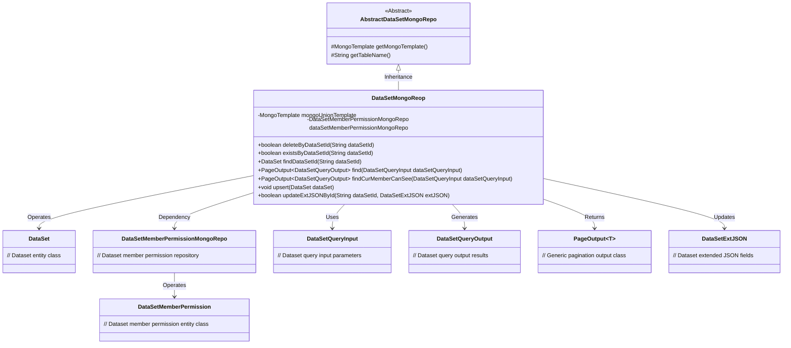

# Basic Information

|      |      |
|------|------|
| Name | DataSetMongoReop |
| Language | .java |
| Code Path | WeFe/common/java/common-data-mongodb/src/main/java/com/welab/wefe/common/data/mongodb/repo/DataSetMongoReop.java |
| Package Name | com.welab.wefe.common.data.mongodb.repo |
| Dependencies | ['com.mongodb.client.result.UpdateResult', 'com.welab.wefe.common.data.mongodb.constant.MongodbTable', 'com.welab.wefe.common.data.mongodb.dto.PageOutput', 'com.welab.wefe.common.data.mongodb.dto.dataset.DataSetQueryInput', 'com.welab.wefe.common.data.mongodb.dto.dataset.DataSetQueryOutput', 'com.welab.wefe.common.data.mongodb.entity.union.DataSet', 'com.welab.wefe.common.data.mongodb.entity.union.DataSetMemberPermission', 'com.welab.wefe.common.data.mongodb.entity.union.ext.DataSetExtJSON', 'com.welab.wefe.common.data.mongodb.util.AddFieldsOperation', 'com.welab.wefe.common.data.mongodb.util.QueryBuilder', 'com.welab.wefe.common.data.mongodb.util.UpdateBuilder', 'org.apache.commons.lang3.StringUtils', 'org.springframework.beans.factory.annotation.Autowired', 'org.springframework.data.mongodb.core.MongoTemplate', 'org.springframework.data.mongodb.core.aggregation', 'org.springframework.data.mongodb.core.query.Criteria', 'org.springframework.data.mongodb.core.query.Query', 'org.springframework.data.mongodb.core.query.Update', 'org.springframework.stereotype.Repository', 'java.util.HashMap', 'java.util.List', 'java.util.Map', 'java.util.stream.Collectors'] |
| Brief Description | The `DataSetMongoRepo` class inherits from `AbstractDataSetMongoRepo` and provides CRUD operations for datasets, including querying by ID, deletion, updating, and paginated querying of visible datasets, utilizing `MongoTemplate` to interact with MongoDB. |

# Description

The `DataSetMongoRepo` class is a MongoDB data access layer component that inherits from `AbstractDataSetMongoRepo`. It operates on datasets via `MongoTemplate`, with primary functionalities including: deleting datasets by ID, checking dataset existence, querying datasets, paginated querying of visible datasets, and updating dataset extended JSON. The class implements complex pagination query logic, supports multi-condition filtering and associated queries, and handles dataset permission control. All operations are implemented using MongoDB's query builder and aggregation framework, ensuring flexibility and efficiency in data operations.

# Class Summary

| Name   | Type  | Description |
|-------|------|-------------|
| DataSetMongoReop | class | Dataset MongoDB repository class, providing CRUD functionality for datasets, supporting conditional queries, pagination, and permission control, using MongoTemplate for database operations. |

## Class DataSetMongoReop

|      |      |
|------|------|
| Access Modifier | @Repository;public |
| Type | class |
| Name | DataSetMongoReop |
| Description | Dataset MongoDB repository class, providing CRUD functionality for datasets, supporting conditional queries, pagination, and permission control, using MongoTemplate for database operations. |

### UML Class Diagram

This code demonstrates a MongoDB-based dataset repository implementation class DataSetMongoReop, which inherits from the abstract class AbstractDataSetMongoRepo. Key functionalities include dataset CRUD operations, paginated queries (supporting both regular queries and member visibility-filtered queries), and extended field updates. By autowiring MongoTemplate and the permission repository, it implements interaction logic with MongoDB, encompassing rich query condition construction and aggregation operations. The class diagram clearly reflects inheritance relationships, dependencies, and interactions between core entity classes.

### Internal Method Call Graph

```mermaid
graph TD
    A["Class DataSetMongoReop"]
    B["Property: MongoTemplate mongoUnionTemplate"]
    C["Property: DataSetMemberPermissionMongoRepo dataSetMemberPermissionMongoRepo"]
    D["Method: getMongoTemplate()"]
    E["Method: getTableName()"]
    F["Method: deleteByDataSetId(String dataSetId)"]
    G["Method: existsByDataSetId(String dataSetId)"]
    H["Method: findDataSetId(String dataSetId)"]
    I["Method: find(DataSetQueryInput dataSetQueryInput)"]
    J["Method: findCurMemberCanSee(DataSetQueryInput dataSetQueryInput)"]
    K["Method: upsert(DataSet dataSet)"]
    L["Method: updateExtJSONById(String dataSetId, DataSetExtJSON extJSON)"]

    A --> B
    A --> C
    A --> D
    A --> E
    A --> F
    A --> G
    A --> H
    A --> I
    A --> J
    A --> K
    A --> L

    F --> F1["Check if dataSetId is null"]
    F --> F2["Build Query object"]
    F --> F3["Build Update object"]
    F --> F4["Execute updateFirst operation"]
    F --> F5["Return operation result"]

    G --> G1["Check if dataSetId is null"]
    G --> G2["Build Query object"]
    G --> G3["Execute exists operation"]
    G --> G4["Return query result"]

    H --> H1["Check if dataSetId is null"]
    H --> H2["Build Query object"]
    H --> H3["Execute findOne operation"]
    H --> H4["Return query result"]

    I --> I1["Build LookupOperation"]
    I --> I2["Build Criteria object"]
    I --> I3["Execute Aggregation operation"]
    I --> I4["Calculate total count"]
    I --> I5["Execute paginated query"]
    I --> I6["Return PageOutput"]

    J --> J1["Build LookupOperation"]
    J --> J2["Query permission list"]
    J --> J3["Build Criteria object"]
    J --> J4["Execute Aggregation operation"]
    J --> J5["Calculate total count"]
    J --> J6["Execute paginated query"]
    J --> J7["Return PageOutput"]

    K --> K1["Query existing dataset"]
    K --> K2["Set ID"]
    K --> K3["Execute save operation"]

    L --> L1["Check if dataSetId is null"]
    L --> L2["Build Query object"]
    L --> L3["Build Update object"]
    L --> L4["Execute updateFirst operation"]
    L --> L5["Return operation result"]
```

This code defines a MongoDB data access class named DataSetMongoReop, which inherits from AbstractDataSetMongoRepo. The class provides various operations on datasets, including CRUD and complex query functionalities. Key methods include deleting datasets, checking dataset existence, finding datasets, paginated dataset queries, and updating datasets. The find and findCurMemberCanSee methods implement complex aggregation queries with support for pagination and conditional filtering. The class utilizes MongoTemplate for MongoDB operations and injects other necessary components via Autowired.

### Field List

| Name  | Type  | Description |
|-------|-------|------|
| dataSetMemberPermissionMongoRepo | DataSetMemberPermissionMongoRepo | Using @Autowired to automatically inject an instance of DataSetMemberPermissionMongoRepo. |
| mongoUnionTemplate | MongoTemplate | Using @Autowired to automatically inject the MongoTemplate instance mongoUnionTemplate. |

### Method List

| Name  | Type  | Description |
|-------|-------|------|
| findCurMemberCanSee | PageOutput<DataSetQueryOutput> | Query the datasets visible to the current user, including permission checks, conditional filtering, and pagination processing, returning the dataset list and total count. |
| getMongoTemplate | MongoTemplate | Rewrite the getMongoTemplate method to return a mongoUnionTemplate instance. |
| findDataSetId | DataSet | The method queries the dataset by its ID. If the ID is empty, it returns null; otherwise, it constructs the query conditions and returns the non-deleted dataset matching the criteria in MongoDB. |
| getTableName | String | This method overrides the parent class method and returns MongodbTable.Union.DATASET as the table name. |
| existsByDataSetId | boolean | Check if the dataset with the specified ID exists. If the ID is empty, return false; otherwise, query MongoDB and return the result. |
| deleteByDataSetId | boolean | Java method: Delete data based on dataSetId, first validate non-null, then construct query and update conditions, finally execute MongoDB update operation and return whether it was successful. |
| find | PageOutput<DataSetQueryOutput> | This method queries the dataset through MongoDB aggregation, including conditional filtering, join operations, and pagination processing, returning paginated results. |
| upsert | void | The method `upsert` is used to insert or update a DataSet: it updates if an entry with the same ID exists, otherwise it inserts a new one. The result is ultimately saved to MongoDB. |
| updateExtJSONById | boolean | This method updates the extended JSON data in MongoDB using the dataset ID. It first checks the validity of the ID and returns false if invalid. If valid, it constructs the query and update operations, executes the update, and returns whether the operation was successful. |

